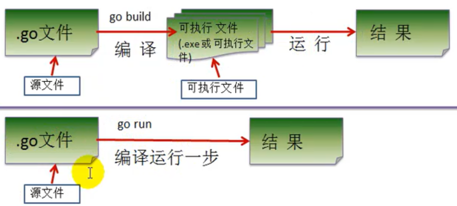

# 入门


开发步骤

- 安装vscode
- 将go代码编写到扩展名为hello.go的文件中

- 目录结构定义
  - D:\study\go-study\code\base\src\go_code\ch01_helloworld
    - main
    - package
  - 一个文件夹一个包，只能有一个main包


# helloworld（windows）

```go
// 需求：打印 "hello world"
package main
import "fmt"
func main() {
	fmt.Println("hello go");
}
```

- go 文件的后缀是.go
- package main：表示该go文件所在的包是main，在go中每个文件都必须归属一个包
- import "fmt"：引入一个包，包名fmt，引入该包后，可以使用fmt包的函数，如fmt.Println
- func：是一个关键字，表示一个函数
- main：是函数名称，定义一个主函数，程序的入口
- fmt.Println("hello go")：表示调用fmt包的函数Println输出 "hello go"


## 编译&运行

- 使用go build命令对该go进行文件编译，生成exe文件

```bash
PS D:\study\go-study\code\base\src\go_code\ch01_helloworld\main> go build hello.go
```

- 运行
  - exe文件可以放在任意文件夹下

```bash
D:\go\gopath>hello.exe
hello go

# 使用vscode进行exe执行时需要./ （默认使用的是powerShell）
PS D:\study\go-study\code\base\src\go_code\ch01_helloworld\main> .\hello.exe
hello go
```

- 也可通过go run直接运行go源文件
  - 类似执行一个脚本文件形式执行
  - 在实际生产环境中需要先编译再执行

```bash
PS D:\study\go-study\code\base\src\go_code\ch01_helloworld\main> go run hello.go
hello go
```


# helloworld（linux）

- linux开发go与windows是基本一致的
- 在运行可执行程序时，有区别，以`./文件名`运行
  - 添加./表示从当前目录下执行文件
  - 编译后生成一个与.go文件名相同的文件，但是没有后缀


# 执行流程

 

- 2种方式的区别
  - 预先编译的exe文件，可以拷贝到没有go环境的机器上执行
  - 直接使用go run命令，那么在另一个台机器上使用，则需要有go开发环境
  - 使用编译时，编译器会将运行依赖的库文件包含在可执行文件中，可执行文件变大很多


# 关于编译

- 使用`go build` 可以对go文件进行编译，同时制定可执行文件名
- 使用 `-o` 指定生成文件的名称

```bash
go build -o xx.exe .\hello.go
```


# 注意事项

- Go源文件以"go"为扩展名
- Go应用程序的执行入口是main()函数，这个是和其它编程语言（比如java/c）
- Go语言严格区分大小写
- ==每个语句后不需要分号==，如果要写在一行需要添加分号

```go
var num = 10 ; fmt.Println(num)
```

- Go编译器是一行行进行编译的，因此我们一行就写一条语句，不能把多条语句写在同一个，否则报错
- ==Go语言定义的变量或者import的包如果没有使用到，代码不能编译通过==

```go
// 需求：打印 "hello world"
package main
import "fmt"
func main() {
	fmt.Println("hello go");
	var num = 19
}
// 编译不通过
PS D:\study\go-study\code\base\src\go_code\ch01_helloworld\main> go build hello.go
# command-line-arguments
.\hello.go:6:6: num declared and not used

package main
import "fmt"
func main() {
	// fmt.Println("hello go");
	var num = 19
}

PS D:\study\go-study\code\base\src\go_code\ch01_helloworld\main> go build hello.go
# command-line-arguments
.\hello.go:3:8: imported and not used: "fmt"
```


# 注释

`// 行注释内容`

`/*块注释*/ `


# 代码风格

正确的注释和注释风格

- Go官方推荐使用行注释来注释整个方法和语句

正确的缩进和空白

- 使用一次tab操作，实现缩进,默认整体向右边移动，时候用shift+tab整体向左移
- 或者使用gofmt来进行格式化

```bash
main> gofmt .\hello.go
// 需求：打印 "hello world"
package main

import "fmt"

func main() {
        fmt.Println("hello go")
}

// 输出格式化后的文件到本身的go文件
main> gofmt -w hello.go
```


# 小结

- 每个go的文件名称可以看做是类名
- 每个文件夹看做是包名
- 每个包下只能有一个main函数
- 开头，对于独立运行的执行文件必须是package main