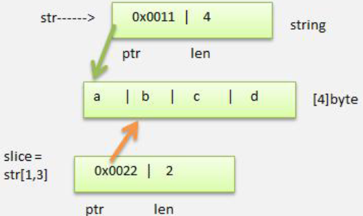

# 介绍

- 字符串就是一串固定长度的字符连接起来的字符序列

- Go的字符串是由单个字节连接起来的
- Go语言的字符串的字节使用UTF-8编码标识Unicode文本


# 使用

```go
package main
import "fmt"
func main(){
	var s string = "字符串 string"
	fmt.Println(s)
}
```


# 注意

- Go语言的字符串的字节使用UTF-8编码标识Unicode文本，这样Golang统一使用UTF-8编码，中文乱码问题不会再困扰程序员
- 字符串一旦赋值就不可更改了
- go中的字符串是不可变的

```go
var s string = "字符串 string"
s[0] = 'a' //cannot assign to s[0]
```


# 两种表示形式

- 双引号
  - 会识别转义字符
- 反引号 `
  - 以字符串的原生形式输出，包括换行和特殊字符，可以实现防止攻击、输出源代码等效果

```go
package main
import "fmt"
func main(){
	var s1 string = `字符串1
string`
	var s2 string = "字符串2\nstring"
	fmt.Println(s1)
	fmt.Println(s2)

}
// 结果
字符串1
string
字符串2
string
```


# 字符串拼接方式

```go
var s = "hello" + "world"
s += "!!!"

// 当一行字符串太长时，需要使用到多行字符串，可以如下处理
s3 := "字符串3" + 
"string"
fmt.Println(s3)

// 注意需要将 + 保留在上一行
s4 := "字符串4"
+ "string"
// 报错
invalid operation: + untyped string
```


# 关于切片

- string底层是一个byte数组，因此string也可以进行切片处理

```go
package main
import "fmt"
func main(){
	str := "hello go"
	slice := str[3:]
	fmt.Println("slice=",slice)
}
//result
slice= lo go
```

- string和切片在内存的形式，以"abcd"画出内存示意图

 

- string是不可变的，不能通过str[0]='z'方式来修改字符串，通过切片也不能更改
- 如果需要修改字符串，可以先将string->[]byte 或者 []rune->修改->重写转成string

```go
str[0] = 'z' // 编译不通过,string是不可变的

arr := []rune(str)
arr[0] = '你'
str = string(arr)
fmt.Println("str=",str)
```

