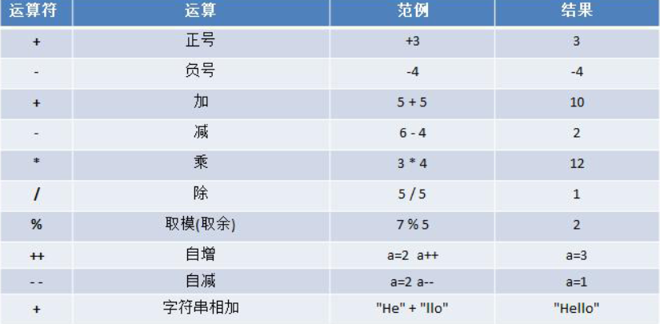
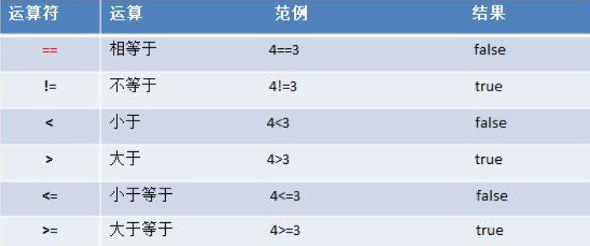
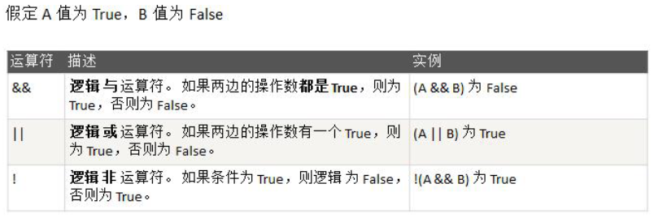
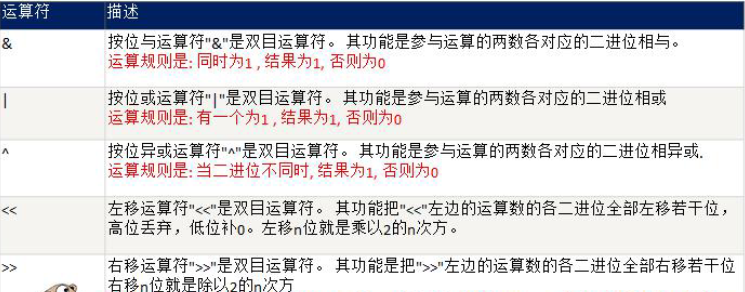
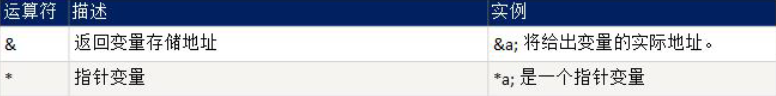
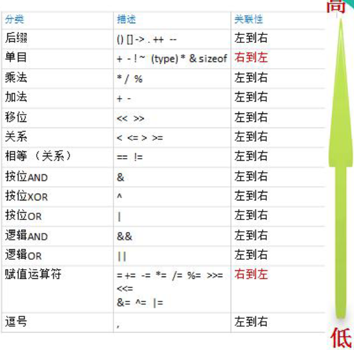

# 介绍

运算符是一种特殊的符号，用以表示数据的运算、赋值和比较等

- 算术运算符
- 赋值运算符
- 比较运算符/关系运算符
- 逻辑运算符
- 位运算符
- 其它运算符 & *

注意

- go中没有三元运算符


# 算术运算符

- 算术运算符是对数值类型的变量进行运算的
  - 如：加减乘除

 

- 使用

```go
package main
import "fmt"
func main(){

	// 如果运算的数都是整数，那么除后，去除小数部分，保留整数部分
	fmt.Println(10/4)
	
	// 同上
	var f float32 = 10 / 4
	fmt.Println(f)

	// 保留小数部分，需要使用浮点数参与运算
	var f2 float32 = 10.0 / 4
	fmt.Println(f2)

}
// 结果
2
2
2.5
```

- %的公式：a%b=a-a/b*b

```go
fmt.Println("10%3=",10%3)		//=1
fmt.Println("-10%3=",-10%3)		//=-10-(-10)/3*3=-10-(-9)=-1
fmt.Println("10%-3=",10%-3)		//=1
fmt.Println("-10%-3=",-10%-3)	//=-1
```


# 关于 ++ 和 -- 

- 与java不同的是 ++ 和 -- 只能写在变量后面，同时没有返回值
- ++ 和 -- 只能独立使用

```go
package main
import "fmt"
func main(){
	var i = 8
	var a int
	i ++ // 等价于i = i + 1
	fmt.Println("i =",i) // i 此时是9
	a = i++ // 错误 i++必须独立使用，不返回值
	if i++>0 { // 错误 i++ 必须独立使用 
		fmt.Println("ok")
	}
}
```

- 练习

```go
var i int = 1
i = i++ // 编译不通过 i++必须独立使用
fmt.Println(i)
```


# 关系运算符

关系运算符的结果都是bool型，也就是要么是true，要么是false

关系表达式经常用在if结构的条件中或循环结构的条件中

 


# 逻辑运算符

用于连接多个条件（一般来讲就是关系表达式），最终的结果也是一个bool值

 

- &&也叫短路与：如果第一个条件为false，则第二个条件不会判断，最终结果为false
- ||也叫短路或：如果第一个条件为true，则第二个条件不会判断，最终结果为true


# 赋值运算符

- 赋值运算符就是将某个运算后的值，赋给指定的变量

| 运算符 | 描述                                         | 示例                      |
| ------ | -------------------------------------------- | ------------------------- |
| =      | 简单的赋值操作，将一个表达式的值赋给一个左值 | c=a+b，将a+b的结果赋值给c |
| +=     | 相加后再赋值                                 | c+=a 等价于 c= c+a        |
| -=     | 相减后再赋值                                 | c-=a 等价于 c= c-a        |
| *=     | 相乘后再赋值                                 | `c*=a` 等价于 `c= c * a`  |
| /=     | 相除后再赋值                                 | c/=a 等价于c = c/a        |
| %=     | 求余后再赋值                                 | c%=a 等价于c = c%a        |
| <<=    | 左移后赋值                                   | c<<=2 等价于c = c<<2      |
| >>=    | 右移后赋值                                   | c>>=2 等价于c = c>>2      |
| &=     | 按位与后赋值                                 | c&=2 等价于c = c&2        |
| ^=     | 按位异或后赋值                               | c^=2 等价于 c = c^2       |
| \|=    | 按位或后赋值                                 | c\|=2 等价于c = c\|2      |


# 位运算符

 

```go
funcmain(){
    fmt.Println(2&3)
    fmt.Println(2|3)
    fmt.Println(13&7)
    fmt.Println(5|4)//?
    fmt.Println(-3^3)//?
}
```


# 其他运算符

 


# 注意

- go语言不支持三元运算符


# 优先级

 

只有单目运算符、赋值运算符是从右向左运算的

梳理了一个大概的优先级

1：括号，++,--

2：单目运算

3：算术运算符

4：移位运算

5：关系运算符

6：位运算符

7：逻辑运算符

8：赋值运算符

9：逗号