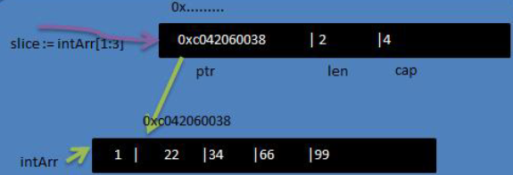
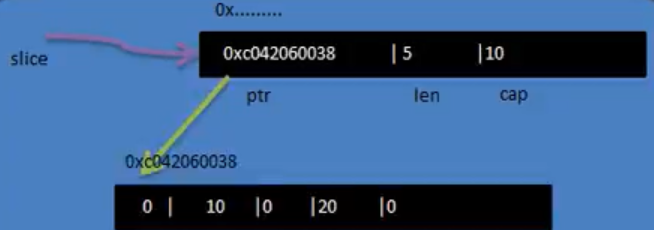
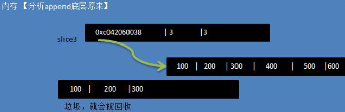
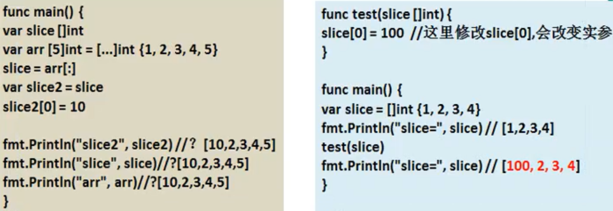

# 介绍

- 切片的英文是slice
- 切片是数组的一个引用，因此**切片是引用类型**，在进行传递时，遵守引用传递的机制
- 切片的**使用和数组类似**，遍历切片、访问切片的元素和求切片长度len(slice)都一样
- 切片的长度是可以变化的，因此切片是一个可以==动态变化数组==
- 等价于从数组中切出来一块进行处理，对切片数据操作会影响到原数组内的元素
- 切片定义的基本语法
  - var 切片名 []类型
  - 如：var a []int

```go
package main
import "fmt"
func main(){
	var intArr [5]int = [...]int{1,2,3,4,5}
	// 声明，定义一个切片，范围是[1,3)
	slice := intArr[1:3]
	fmt.Println("intArr = ",intArr)
	fmt.Println("slice 的元素是 = ",slice)
	fmt.Println("slice 的元素个数 = ",len(slice))
	fmt.Println("slice 的容量 = ",cap(slice))
}
// 结果
intArr =  [1 2 3 4 5]
slice 的元素是 =  [2 3]
slice 的元素个数 =  2
slice 的容量 =  4
```

- 切片在内存的形式
  - slice的确是一个引用类型
  - 从底层来说，其实就是一个数据结构(struct结构体)

 

- 切片的结构

```go
type slice struct{
    ptr *[2]int
    len int
    cap int
}
```


# 使用


## 方式1：通过数组

- 定义一个切片，然后让切片去引用一个已经创建好的数组

```go
var intArr [5]int = [...]int{1,2,3,4,5}
// 声明，定义一个切片，范围是[1,3)
slice := intArr[1:3]
```


## 方式2：make

- 通过make来创建切片
- 基本语法
  - type：数据类型
  - len：大小
  - cap：指定切片容量
    - 可选，如果分配了cap，要求cap>=len

```go
var 切片名 []type = make([]type,len,[cap])
```

- 示例

```go
package main
import "fmt"
func main(){
	var slice []float64 = make([]float64,5,10)
	slice[1] = 10
	slice[3] = 20
	// 对于切片必须make使用
	fmt.Println(slice)
	fmt.Println("slice size=",len(slice))
	fmt.Println("slice cap=",cap(slice))
}
// result
[0 10 0 20 0]
slice size= 5
slice cap= 10
```

- 通过make方式创建切片可以指定切片的大小和容量
- 如果没有给切片的各个元素赋值，那么就会使用默认值[int,float=>0string=>””bool=>false]
- 通过make方式创建的切片对应的数组是由make底层维护，对外不可见，即只能通过slice去访问各个元素
- 注意：只能通过slice操作这个数组，底层数组不可见

 


## 方式3：定义切片指定数组

- 定义一个切片，直接就指定具体数组，使用原理类似make的方式

```go
package main
import "fmt"
func main(){
	var slice []string = []string{"hive","spark","hadoop"}
	 fmt.Println("slice=",slice)
	 fmt.Println("slice size=",len(slice))
	 fmt.Println("slice cap=",cap(slice))
}
// result
slice= [hive spark hadoop]
slice size= 3
slice cap= 3
```


- 方式1与方式2的区别
  - 方式1：直接引用数组，数组事先存在的，可见的
  - 方式2：通过make创建切片，make会创建一个数组，由切片在底层进行维护，不可见


# 遍历

- 切片的遍历和数组一样，有2种方式


## for

```go
package main
import "fmt"
func main(){
	var arr [4]int = [...]int{1,2,3,4}
	slice := arr[1:4] // 2,3,4
	for i:=0;i<len(slice);i++ {
		fmt.Printf("slice[%v]=%v ",i,slice[i])
	}
}
// result
slice[0]=2 slice[1]=3 slice[2]=4
```


## for-range

```go
var arr [4]int = [...]int{1,2,3,4}
slice := arr[1:4] // 2,3,4
for i,v :=range slice {
   fmt.Printf("slice[%v]=%v ",i,v) 
}
```


# 注意事项

- 切片初始化时var slice=arr[startIndex:endIndex]
  - 从arr数组下标为startIndex，取到下标为endIndex的元素(不含arr[endIndex])
- 切片初始化时，仍然不能越界。范围在[0-len(arr)]之间，但是可以动态增长

```go
varslice=arr[0:end] 
//可以简写
varslice=arr[:end]

varslice=arr[start:len(arr)] 
//可以简写
varslice=arr[start:]

varslice=arr[0:len(arr)] 
//可以简写
varslice=arr[:]
```

- cap是一个内置函数，用于统计切片的容量，即最大可以存放多少个元素
- 切片定义完后，还不能使用，因为本身是一个空的，需要让其引用到一个数组，或者make一个空间供切片来使用

- 切片可以继续切片

```go
arr := [...]int{1,2,3,4}
slice := arr[1:4] // 2,3,4
slice2 := slice[0:2]
```


# append

- 用append内置函数，==对切片进行动态追加==

```go
package main
import "fmt"
func main(){
	var slice []int = []int{1,2,3}
    // 添加单个元素
	slice2 := append(slice,4,5,6)
	fmt.Println("slice2=",slice2)
	// 添加一个切片
	slice3 := append(slice,slice2...)
	fmt.Println("slice3=",slice3)
}
```

 

- 底层原理分析：创建一个新的数组进行扩容后返回
  - 切片append操作的本质就是对数组扩容
  - go底层会创建一下新的数组newArr(安装扩容后大小)
  - 将slice原来包含的元素拷贝到==新的数组newArr==
  - slice重新引用到newArr
  - 注意newArr是在底层来维护的


# copy

- 在执行copy时，要求这2个参数是切片

- 切片使用copy**内置函数**完成拷贝

```go
package main
import "fmt"
func main(){
	var from []int = []int{1,2,3,4,5}
	var to = make([]int,10)
	copy(to,from)
	fmt.Println("from=",from)
	fmt.Println("to=",to)
}
// result
from= [1 2 3 4 5]
to= [1 2 3 4 5 0 0 0 0 0]
```

- copy(para1,para2)参数的数据类型是切片

- 按照上面的代码来看,from和to的**数据空间是独立**，相互不影响
  - 如 from[0]=999，但是to[0]仍然是1


# 练习

- 判断对错

```go
var a []int = []int {1,2,3,4,5}
var slice = make([]int,1)
fmt.Println(slice)
copy(slice,a)
fmt.Println(slice)
// result 可以运行
[0]
[1] // 只拷贝了第一个元素
```

- 切片是引用类型，所以在传递时，遵守引用传递机制。看两段代码，并分析底层原理

 

- 编写一个函数fbn(nint)，要求完成
  - 可以接收一个n int
  - 能够将斐波那契的数列放到切片中
  - 提示：斐波那契的数列形式:arr[0]=1;arr[1]=1;arr[2]=2;arr[3]=3;arr[4]=5;arr[5]=8

```go
// 方式1：递归
package main
import "fmt"

var slice []int

func main(){
	slice = make([]int,10)
	fbn(10)
	fmt.Println(slice)
}

func fbn(i int) int {
	var re int
	if(i == 1 || i == 2) {
		re = 1 
	}else{
		re = fbn(i-1) + fbn(i-2)
	}
	slice[i-1] = re
	return re
}

// 方式2：循环
package main
import "fmt"

func main(){
	fmt.Println("fbn=",fbn(10))
}
func fbn(n int)([]uint64){
	slice := make([]uint64,n)
	slice[0] = 1
	slice[1] = 1
	for i := 2; i < n; i++ {
		slice[i] = slice[i-1] + slice[i-2]
	}
	return slice
}
```

