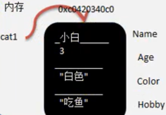
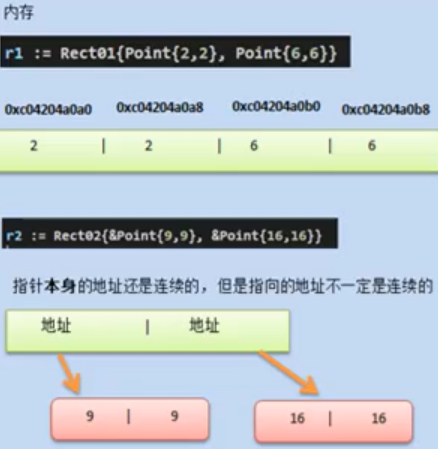

# 介绍

```go
package main
import "fmt"

// 定义一个Cat结构体
type Cat struct {
    Name string
    Age int
    Color string
    Hobby string
}

func main(){
	// 创建一个Cat的变量
	var cat Cat
	cat.Name = "小白"
	cat.Age = 3
	cat.Color = "白色"
	cat.Hobby = "吃"
	f(cat)
	fmt.Println(cat)
	fmt.Printf("cat 地址是 %p",&cat)
}

func f(cat Cat){
	cat.Name = "sss"
	fmt.Println("f",cat) // 值类型传递
}
// 结果
f {sss 3 白色 吃}
{小白 3 白色 吃}
cat 地址是 0xc042054080
```

- 结构体是自定义的数据类型，代表一类事物
- 结构体变量(实例)是具体的，实际的，代表一个具体变量


## 内存布局

- ==结构体是一个值类型==

 


# 声明语法

```go
type 结构体名称 struct{
	field1 type 
    field2 type
}

type Student struct{
    Name string //字段大写说明是公用的，可以被外部调用
    Age int//字段
    Score float32
}
```


## 字段

- 从概念或叫法上看：结构体字段=属性=field（即授课中，统一叫字段)
- 字段是结构体的一个组成部分，一般是基本数据类型、数组,也可是引用类型
  - 如Name string就是属性


# 注意事项

- 字段声明语法同变量，示例：字段名字段类型
- 字段的类型可以为：基本类型、数组或引用类型
- 在创建一个结构体变量后，如果没有给字段赋值，都对应一个零值(默认值)，规则同前面讲的一样
  - 布尔类型是false，数值是0，字符串是""
  - 数组类型的默认值和它的元素类型相关
    - 如score[3] int 则为[0,0,0]
    - ==指针，slice，和map的零值都是nil，即还没有分配空间==

```go
package main
import "fmt"

type Person struct{
	Name string
	Age int
	Scores [5]float64
	ptr *int
	slice []int
	m map[string]string
}

func main(){

	var p Person
	fmt.Println(p)

	if p.ptr == nil {
		fmt.Println("p.ptr == nil")
	}
	if p.slice == nil {
		fmt.Println("p.slice == nil")
	}
	if p.m == nil {
		fmt.Println("p.m == nil")
	}
	p.slice = make([]int,10)
	p.slice[0] = 100

	p.m = make(map[string]string)
	p.m["key"] = "value"
	
	fmt.Println(p)
}
// result
{ 0 [0 0 0 0 0] <nil> [] map[]}
p.ptr == nil
p.slice == nil
p.m == nil
{ 0 [0 0 0 0 0] <nil> [100 0 0 0 0 0 0 0 0 0] map[key:value]}
```

- 不同结构体变量的字段是独立，互不影响，一个结构体变量字段的更改，不影响另外一个,结构体是值类型

- 注意是值传递

```go
package main
import "fmt"

type Person struct{
	Name string
	Age int
	Scores [5]float64
	ptr *int
	slice []int
	m map[string]string
}

func main(){

	var p Person
	p.Name = "ss"
	p.Age = 11
	var p2 Person = p // 值传递
	p2.Name = "tt" // 修改后对原先的p没有影响
	fmt.Printf("p2 ptr= %p  p2 value = %v \n",&p2,p2)
	fmt.Printf("p ptr= %p  p value = %v \n",&p,p)
	
	var p3 *Person = &p // 引用传递
	p3.Name = "yy" // 底层转换为(*p3).Name = "yy" 对原先的p有影响
	fmt.Printf("p3 ptr= %p  p3 value = %v \n",&p3,p3)
	fmt.Printf("p ptr= %p  p value = %v \n",&p,p)

}
// result
p2 ptr= 0xc04208c070  p2 value = {tt 11 [0 0 0 0 0] <nil> [] map[]}
p ptr= 0xc04208c000  p value = {ss 11 [0 0 0 0 0] <nil> [] map[]}
p3 ptr= 0xc042076020  p3 value = &{yy 11 [0 0 0 0 0] <nil> [] map[]}
p ptr= 0xc04208c000  p value = {yy 11 [0 0 0 0 0] <nil> [] map[]}
```


# 初始化

- 方式1：直接声明

```go
var person Person
person.Name = "ss"
```

- 方式2：使用{} 
  - 推荐使用

```go
var person Person = Person{}
// 或者
p := Person{"mary",20}
```

- 方式3：&

```go
var person *Person = new (Person)
// 此时person是一个指针
(*person).Name = "smith"
person.Name = "ss" // go对该方式赋值底层做了处理，效果同上一句
```

- 方式4：{}

```go
var person *Person = &Person{}
(*person).Name = "xx" 
person.Name = "ss" // 两者操作方式等价
```

- 第3种和第4种方式返回的是**结构体指针**
  - 结构体指针访问字段的标准方式应该是
    - `(*结构体指针).字段名`
    - `如(*person).Name="tom"`
  - go做了一个简化，也支持结构体指针.字段名
    - 更加符合程序员使用的习惯
    - go编译器底层对person.Name做了转化(*person).Name


# 创建结构体变量时指定字段

- 方式1

```go
type Stu struct {
    name string
    age int
}

func main(){
    var stu1 = Stu{"ss",22} // stu1--> 指向结构体数据空间
    // 在创建结构体变量时，把字段名和字段值写在一起，可以不依赖字段的定义顺序
    var stu2 = Stu{
        name:"tt",
        age:11,
    }
}
```

- 方式2：返回结构体的指针类型

```go
var stu *Stu = &Stu{"ss",22} // stu --> 地址 --> 结构体数据[xxx,xxx]
stu2 := &Stu{
    age:11,
    name:"tt"
}
// 打印时会有&
fmt.Println(stu)
// 打印时没有&
fmt.Println(*stu)
```

- 方式1和方式2声明后的对象的使用方法一致


# 内存中的存储

- 结构体的所有字段在==内存中存储是连续==的

```go
package main
import "fmt"

type Point struct{
	x int
	y int
}

type Rect struct{
	leftUp,rightDown Point
}

type Rect2 struct{
	leftUp,rightDown *Point
}

func main(){

	r := Rect{Point{1,2},Point{3,4}}
	// r1 有4个int 在内存中分布是连续的
	fmt.Printf("r.leftUp.x 地址=%p r.leftUp.y 地址=%p r.rightDown.x 地址=%p r.rightDown.y 地址=%p \n",
		&r.leftUp.x,
		&r.leftUp.y,
		&r.rightDown.x,
		&r.rightDown.y,
	)

	r2 := Rect2{&Point{5,2},&Point{3,4}}
	// 打印地址
	fmt.Printf("r2.leftUp 本身地址=%p r2.rightDown 本身地址=%p \n",
		&r2.leftUp,
		&r2.rightDown,
	)
	// 打印指向的地址
	fmt.Printf("r2.leftUp 指向地址=%p r2.rightDown 指向地址=%p \n",
		r2.leftUp,
		r2.rightDown,
	)
	fmt.Println(
		r.leftUp.x,
		r2.leftUp.x, // 可以看做是(*(r2.leftUp)).x
	)
}
```

- 内存中分配示意图

 


# 转换

- 结构体是用户单独定义的类型，和其它类型进行转换时需要有**完全相同的字段(名字、个数和类型)**

```go
type A struct {
    Num int
}
type B struct {
    Num int
}
func main() {
    var a A
    var b B
    a = A(b) // 可以进行强转，但是结构体的字段必须要完全一致，包括名称，个数和类型
    fmt.Println(a,b)
}
```

- 结构体进行type重新定义(相当于取别名)，Golang认为是新的数据类型，但是相互间可以强转

```go
type Student struct {
    Name string
}

type Stu Student

func main(){
    var stu Student
    var stu2 Stu
    stu2 = stu // 错误，需要进行强转 stu2 = Stu(stu), 同理对于Integer进行int的别名也是一样处理
}
```


# 序列化

- struct 的每个字段写上一个tag
- 该tag可以通过**反射机制**获取，常见的使用场景就是序列化和反序列化

```go
package main
import (
	"encoding/json"
	"fmt"
)
func main(){
	stu := Student{"stt",11}
	jsonByte,err := json.Marshal(stu)
	if(err != nil){
		fmt.Println("json处理异常",err)
	}else{
		fmt.Println(string(jsonByte))
	}
}

type Student struct {
    Name string `json:"name"` // `json:"name"`  是struct tag
    Age int `json:"age"`
    skill string 
    // 如果首字母小写，那么json转换会忽略，因为等于private属性
    // 如果在json中要小写的字段，那么需要使用struct tag
}
// result
{"name":"stt","age":11}
```


# 匿名结构体

```go
var msg struct {
	Name string
    Age int
}
msg.Name = "x"
msg.Age = 1
```

