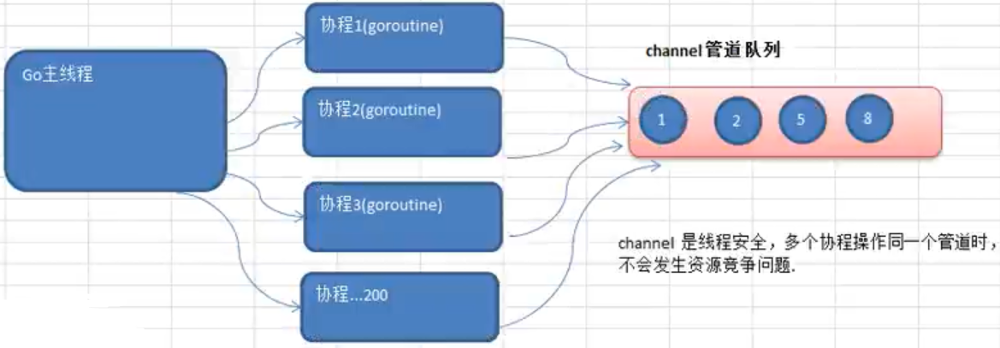

# 介绍

需求：现在要计算1-200的各个数的阶乘，并且把各个数的阶乘放入到map中。最后显示出来。要求使用goroutine完成

分析思路

- 使用goroutine来完成，效率高，但是会出现并发/并行安全问题
- 这里就提出了不同goroutine如何通信的问题

代码实现

- 使用goroutine来完成(看看使用gorotine并发完成会出现什么问题 ? 然后我们会去解决
- 在运行某个程序时，如何知道是否存在资源竞争问题
  - 方法：在编译该程序时，增加一个参数-race即可

```go
package main
import (
	"time"
	"fmt"
)

var (
	myMap = make(map[int]int,10)
)

// 计算1-200的阶乘
func main(){
	for i := 0; i < 200; i++ {
		go cal(i+1)
	}
	// 休眠10s，有可能结果没有计算完成
	time.Sleep(time.Second * 10)
	// 输出结果
	for i,v := range myMap {
		fmt.Printf("map[%v]=%v \n",i,v)
	}
}

func cal(n int){
	res := 1
	for i := 1; i <= n; i++ {
		res *= i
	}
	// 将res放入map中,会有资源竞争问题
	myMap[n] = res
}
// result
PS D:\go\gopath\src\demo\main> go run .\test.go
fatal error: concurrent map writes

goroutine 176 [running]:
runtime.throw(0x4cb176, 0x15)
        D:/go/src/runtime/panic.go:605 +0x9c fp=0xc04215df40 sp=0xc04215df20 pc=0x42997c
runtime.mapassign_fast64(0x4afac0, 0xc042088060, 0x9f, 0x43196f)
        D:/go/src/runtime/hashmap_fast.go:519 +0x3d9 fp=0xc04215dfa0 sp=0xc04215df40 pc=0x40ba49
main.cal(0x9f)
        D:/go/gopath/src/demo/main/test.go:30 +0x69 fp=0xc04215dfd8 sp=0xc04215dfa0 pc=0x498719
runtime.goexit()
        D:/go/src/runtime/asm_amd64.s:2337 +0x1 fp=0xc04215dfe0 sp=0xc04215dfd8 pc=0x451771
created by main.main
        D:/go/gopath/src/demo/main/test.go:14 +0x5f

goroutine 1 [sleep]:
time.Sleep(0x2540be400)
        D:/go/src/runtime/time.go:65 +0x145
main.main()
        D:/go/gopath/src/demo/main/test.go:17 +0x7f
exit status 2
```

- 使用go build -race，然后在执行，可以获得执行的细节

```go
PS D:\go\gopath\src\demo\main> go build -race .\test.go
PS D:\go\gopath\src\demo\main> ./test.exe
...
map[9]=362880
map[15]=1307674368000
map[21]=-4249290049419214848
map[64]=-9223372036854775808
map[134]=0
map[99]=0
map[115]=0
map[122]=0
map[146]=0
map[171]=0
map[174]=0
map[198]=0
Found 2 data race(s) // 有2个数据有竞争关系
```

- 如何解决该问题
  - 使用全局变量加锁互斥
  - 使用channel


# 使用全局变量加锁同步

- 因为没有对全局变量m加锁，因此会出现资源争夺问题，代码会出现错误，提示concurrent map writes
- 解决方案：加入互斥锁
- 数的阶乘很大，结果会越界,可将求阶乘改成sum+=uint64(i)

```go
package main
import (
	"sync"
	"time"
	"fmt"
)

var (
	myMap = make(map[int]uint64,10)
	// 声明一个全局的互斥锁
	// lock 是一个全局的互斥锁对象
	// sync 是包 synchronized 同步
	// Mutex : 互斥类型
	mapLock sync.Mutex
)

// 计算1-200的和
func main(){
	for i := 0; i < 200; i++ {
		go cal(i+1)
	}
	// 休眠10s，有可能结果没有计算完成
	time.Sleep(time.Second * 10)
	// 输出结果,显示的时候也需要加锁
	mapLock.Lock()
	for i,v := range myMap {
		fmt.Printf("map[%v]=%v \n",i,v)
	}
	mapLock.Unlock()
}

func cal(n int){
	res := uint64(1)
	for i := 1; i <= n; i++ {
		res += uint64(i)
	}
	// 加锁
	mapLock.Lock()
	myMap[n] = res
	// 解锁
	mapLock.Unlock()
}
```


# 使用channel

- 为什么使用
  - 前面使用全局变量加锁同步来解决goroutine的通讯，但不完美
  - 主线程在等待所有goroutine全部完成的时间很难确定，我们这里设置10秒，仅仅是估算
  - 如果主线程休眠时间长了，会加长等待时间，如果等待时间短了，可能还有goroutine处于工作状态，这时也会随主线程的退出而销毁
  - 通过全局变量加锁同步来实现通讯，也并不利用多个协程对全局变量的读写操作

- 什么是channel
  - channle本质就是一个数据结构-队列，长度动态伸缩
  - 数据是先进先出 FIFO
  - **线程安全，多goroutine访问时，不需要加锁**，就是说channel本身就是线程安全的
  - channel有类型的，一个string的channel只能存放string类型数据

 

- 基本使用
  - channel是引用类型
  - channel必须初始化才能写入数据，mak后才能使用
  - 管道是有类型的，intChan只能写入整数int

```go
var 变量名 chan 数据类型

举例：
var intChan chan int // 用于存放int数据的chan类型
var mapChan chan map[int]string
var pChan chan Person
var p2Chan chan *Person
```

- 示例

```go
package main
import "fmt"
func main(){
	
	// 创建一个可以存放3个int类型的管道
	var intChan chan int
	intChan = make(chan int,3)

	fmt.Printf("intChan 的值 = %v intChan本身的地址=%p \n",intChan,&intChan)

	// 向管道中写入数据
	intChan <- 10
	num := 33
	intChan <- num
	intChan <- 11
	// 不能超过其容量，在没有goroutine消费的情况下
	// intChan <- 2

	// 查看管道的容量和长度
	fmt.Printf("channel len = %v cap = %v \n",len(intChan),cap(intChan))

	// 在没有协程的情况下，如果channel的数据已经全部取出，再取出就会报告deadlock
	num1 := <- intChan
	num2 := <- intChan
	num3 := <- intChan
	// num4 := <- intChan
	fmt.Println(num1,num2,num3)
}
// result
intChan 的值 = 0xc042080080 intChan本身的地址=0xc042076018
channel len = 3 cap = 3
10 33 11
```


# 注意事项

- channel中只能存放指定的数据类型
- channel的数据放满后，就不能再放入了
- 如果从channel取出数据后，可以继续放入
- 在没有使用协程的情况下，如果channel数据取完了，再取，就会报deadlock


# 读写channel


## int类型

- 创建一个intChan，最多可以存放3个int，存入3个int，然后取出

```go
package main
import "fmt"
func main(){
 
	var intChan chan int
	intChan = make(chan int,3)

	intChan <- 1
	intChan <- 2
	intChan <- 3

	num1 := <- intChan
	num2 := <- intChan
	num3 := <- intChan

	fmt.Println(num1,num2,num3)
}
```


## map类型

- 创建一个mapChan，存放10个map[string]string

```go
package main
import "fmt"
func main(){
	var mapChan chan map[string]string
	mapChan = make(chan map[string]string,10)

	m1 := make(map[string]string)
	m1["key1"]="value1"
	m1["key2"]="value2"
	m1["key3"]="value3"
	m2 := make(map[string]string)
	m2["key1"]="value1"
	m2["key2"]="value2"
	m2["key3"]="value3"

	mapChan <- m1
	mapChan <- m2

	m3 :=<- mapChan
	m4 :=<- mapChan

	fmt.Println(m1,m2,m3,m4)
	fmt.Printf("m1 addr =%p m2 addr =%p m3 addr =%p m4 addr =%p \n",m1,m2,m3,m4)
    fmt.Println(len(mapChan),cap(mapChan))
}
//result
map[key1:value1 key2:value2 key3:value3] map[key3:value3 key1:value1 key2:value2] map[key1:value1 key2:value2 key3:value3] map[key1:value1 key2:value2 key3:value3]
m1 addr =0xc042088060 m2 addr =0xc042088090 m3 addr =0xc042088060 m4 addr =0xc042088090
0 10
```


##   结构体类型

- 创建一个catChan，存放10个Cat结构体变量

```go
package main
import "fmt"
func main(){
	catChan := make(chan Cat,10)

	cat1 := Cat{"ss",1}
	cat2 := Cat{"ss2",2}

	catChan <- cat1
	catChan <- cat2

	cat3 :=<- catChan
	cat4 :=<- catChan
	fmt.Println(cat3,cat4)
	fmt.Printf("cat1 addr =%p cat2 addr =%p cat3 addr =%p cat4 addr =%p \n",&cat1,&cat2,&cat3,&cat4)
	fmt.Println(len(catChan),cap(catChan))
}

type Cat struct {
	Name string
	Age int
}
// result 注意cat1和cat3的地址不同，但内容一致
{ss 1} {ss2 2}
cat1 addr =0xc0420523a0 cat2 addr =0xc0420523c0 cat3 addr =0xc0420523e0 cat4 addr =0xc042052400
0 10
```


## 指针类型

```go
package main
import "fmt"
func main(){
	catChan := make(chan *Cat,10)

	cat1 := Cat{"ss",1}
	cat2 := Cat{"ss2",2}

	catChan <- &cat1
	catChan <- &cat2

	cat3 :=<- catChan
	cat4 :=<- catChan
	fmt.Println(cat3,cat4)
	fmt.Printf("cat1 addr = %p \n",&cat1)
	fmt.Printf("cat3 指向的地址 = %p \n",cat3)
	fmt.Println(len(catChan),cap(catChan))
}

type Cat struct {
	Name string
	Age int
}
// result
&{ss 1} &{ss2 2}
cat1 addr = 0xc0420023e0
cat3 指向的地址 = 0xc0420023e0
0 10
```


## 任意类型

```go
package main
import "fmt"
func main(){
	var allChan chan interface{}
	allChan = make(chan interface{},10)

	allChan <- Cat{"s",1}
	allChan <- Cat{"t",2}
	allChan <- 10
	allChan <- "ss"

	// 取出
	cat1 :=<- allChan
	cat2 :=<- allChan
	v1 :=<- allChan
	v2 :=<- allChan
	fmt.Printf("cat1 type=%T cat value=%v \n",cat1,cat1)
	fmt.Println(cat1,cat2,v1,v2)

	// 调用结构体对象内部属性需要使用类型断言
	c := cat1.(Cat)
	fmt.Println(c.Name)
}

type Cat struct {
	Name string
	Age int
}
// result
cat1 type=main.Cat cat value={s 1}
{s 1} {t 2} 10 ss
s
```


# 关闭channel

- 使用内置函数close可以关闭channel，当channel关闭后，不可再向channel写数据，可以读取数据

```go
package main
import "fmt"
func main(){
	intChan := make(chan int,10)
	intChan <- 10
	intChan <- 11
	close(intChan)
	// 不能再添加数据，可以获取数据
	n := <- intChan
	fmt.Println(n)
    // 对于关闭的channel添加数据报错
	intChan <- 12
}
// result
10
panic: send on closed channel

goroutine 1 [running]:
main.main()
        D:/go/gopath/src/demo/main/test.go:11 +0x12d
exit status 2
```


# 遍历channel

- channel支持for--range的方式进行遍历，请注意两个细节
  - 在遍历时，如果channel没有关闭，则回出现deadlock的错误
  - 在遍历时，如果channel已经关闭，则会正常遍历数据，遍历完后，就会退出遍历

```go
package main
import "fmt"
func main(){
	
	intChan := make(chan int,100)
	for i := 0; i < 100; i++ {
		intChan <- i*2
	}
	// 在遍历时，如果channel没有关闭，则会出现deadlock错误
	// 在遍历时，如果channel关闭，只能在channel中读取数据，不能添加
    // 注意：遍历管道时，不能使用for i:=0;i<len(intChan);i++ {} 
	// 因为管道的大小是变化的
	close(intChan)
	for v:= range intChan {
		fmt.Println("v=",v)
	}
}
```


# 案例1

- 使用goroutine和channel协同工作
  - 开启一个writeData协程，向管道intChan中写入50个整数
  - 开启一个readData协程，从管道intChan中读取writeData写入的数据
  - 注意：writeData和readData操作的是同一个管道，管道是引用类型
  - 主线程需要等待writeData和readData协程都完成工作才能退出

```go
package main
import (
	_ "time"
	"fmt"
)
func main(){
	
	intChan := make(chan int,50)
	exitChan := make(chan bool,1)
	
	go writeData(intChan)
	go readData(intChan,exitChan)
	
	for{
		fmt.Println("------")
		// 先阻塞，readData执行完成后解除阻塞
		// ok 为true表示channel没有关闭，ok 为false表示关闭
		v,ok :=<- exitChan
		fmt.Println(v," ",ok)
		if ok && v {
			break
		}
	}

}

func writeData(intChan chan int){
	for i := 0; i < 50; i++ {
		intChan <- i
		fmt.Println("write ",i)
		// time.Sleep(time.Second)
	}
	// 关闭
	close(intChan)
}

func readData(intChan chan int,exitChan chan bool){
	for{
		v,ok :=<- intChan
		if !ok {
			break
		}
		// time.Sleep(time.Second)
		fmt.Println("read ",v)
	}
	// 读取完成
	exitChan <- true
	// close(exitChan)
}
```


# 阻塞机制

- 当只有写协程，而没有读协程，那么会发生死锁
  - 如果有读写协程，但是读的很慢也不会发生死锁

- 如果有读写协程，同时channel的容量小，那么写协程会阻塞等待读协程获取

- 如果编译器在运行时发现一个管道只有写而没有读协程，则会阻塞而dead lock

```go
package main
import (
	"time"
	"fmt"
)
func main(){
	
	intChan := make(chan int,10)
	exitChan := make(chan bool,1)
	
	go writeData(intChan)
	go readData(intChan,exitChan)
	
	for{
		fmt.Println("------")
		// 先阻塞，readData执行完成后解除阻塞
		// ok 为true表示channel没有关闭，ok 为false表示关闭
		v,ok :=<- exitChan
		fmt.Println(v," ",ok)
		if ok && v {
			break
		}
	}

}

func writeData(intChan chan int){
	for i := 0; i < 50; i++ {
		intChan <- i
		fmt.Println("write ",i)
		// time.Sleep(time.Second)
	}
	// 关闭
	close(intChan)
}

func readData(intChan chan int,exitChan chan bool){
	for{
		v,ok :=<- intChan
		if !ok {
			break
		}
		time.Sleep(time.Second)
		fmt.Println("read ",v)
	}
	// 读取完成
	exitChan <- true
	// close(exitChan)
}
```


# 案例2

要求统计1-200000的数字中，哪些是素数

思路

- 传统的方法，就是使用一个循环，循环的判断各个数是不是素数

- 使用并发/并行的方式，将统计素数的任务分配给多个(4个)goroutine去完成，完成任务时间短

```go
package main
import (
	"time"
	"fmt"
)
func main(){
	intChan := make(chan int ,100)
	primeChan := make(chan int, 100) // 放入结果
	n := 4 // 表示4个协程同时运行
	exitChan := make(chan bool,n)
	// 开启一个协程，向intChan中写入数据
	go putNum(intChan)
	// 开启n个协程，分析数据
	for i := 0; i < n; i++ {
		go primeNum(intChan,primeChan,exitChan)
	}
	// 对结果进行判断处理
	go func(){
		// 取得n个协程的结果，如果没有结果暂时会阻塞等待
		for i := 0; i < n; i++ {
			<- exitChan
		}
		// 退出，说明取得了结果
		close(primeChan)
	}()

	// 主线程打印结果
	for {
		res,ok := <- primeChan
		if !ok {
			break
		}
		fmt.Println("res=",res)
	}
	fmt.Println("end")
}

// 生产者
func putNum(intChan chan int){
	for i := 0; i < 8000; i++ {
		// 生产数据，在生产的过程中会有其他消费协程进行消费
		intChan <- i
	}
	close(intChan)
}

// 消费者
func primeNum(intChan chan int,primeChan chan int,exitChan chan bool){
	var flag bool
	for{
		time.Sleep(time.Millisecond * 10)
		num,ok := <- intChan
		if !ok {
			// intChan 关闭
			break
		}
		flag = true // 假设是素数
		for i := 2; i < num; i++ {
			if num % i == 0 {
				flag = false
				break
			}
		}
		if flag {
			fmt.Println("put num=",num)
			primeChan <- num
		}
	}
	// fmt.Println("取不到数据退出")
	exitChan <- true
}
```


# 读写控制

- 对一个channel而言，读写是该channel的属性控制

```go
package main
import "fmt"
func main(){
	// 默认情况下管道是双向的
	// 声明为只写的
	var intChan1 chan<- int
	intChan1 = make(chan int,3)
	intChan1 <- 2
	// n := <- intChan1 // 编译异常
	// fmt.Println(n)

	fmt.Println("chan=",intChan1)

	// 声明为只读的
	var intChan2 <-chan int
	// intChan2 <- 2 // 编译异常
	n2 :=<- intChan2 // 没有生产者，死锁
	fmt.Println(n2)
}
```

- 示例：实际开发中为了保证管道操作的安全性，可以在入参进行读写的控制

```go
package main
import "fmt"
func main(){
	var ch chan int
	// 默认是双向的通道
	ch = make(chan int,10)
	exitChan := make(chan struct{},2)
	go send(ch,exitChan)
	go recv(ch,exitChan)
	
	var total = 0
	for _ = range exitChan {
		total ++
		if total == 2 {
			break
		}
	}
	fmt.Println("end")
}

// 定义只写操作
func send(ch chan<- int,exitChan chan struct{}){
	for i := 0; i < 10; i++ {
		ch <- i
	}
	close(ch)
	var a struct{}
	exitChan <- a
}

// 定义只读操作
func recv(ch <-chan int,exitChan chan struct{}){
	for{
		v,ok := <-ch
		if !ok {
			break
		}
		fmt.Println(v)
	}
	var a struct{}
	exitChan <- a
}
```


# select

- 传统的方法在遍历管道时，如果不关闭会阻塞而导致deadlock
- 问题，在实际开发中，可能我们不好确定什么关闭该管道
- 可以使用select方式可以解决

```go
package main
import "fmt"
func main(){
	intChan := make(chan int,10)
	for i := 0; i < 10; i++ {
		intChan <- i
	}
	strChan := make(chan string,5)
	for i := 0; i < 5; i++ {
		strChan <- fmt.Sprintf("srt %d",i)
	}

label:
	for{
		select{
			//注意:如果intChan一直没有关闭，不会一直阻塞而deadlock
			//会自动到下一个case匹配
		case v:=<- intChan:
			fmt.Printf("from intChan %d\n",v)
		case v:=<- strChan:
			fmt.Printf("from strChan %s\n",v)
		default:
			fmt.Println("end")
			break label
		}
	}	
}
```


# 异常捕获

- goroutine中使用recover，解决协程中出现panic，导致程序崩溃问题
- 如果一个协程出现了panic，而没有捕获，会造成整个程序崩溃，使用recover进捕获

```go
package main
import (
	"time"
	"fmt"
)
func main(){
	go say()
	go test() // 由于捕获，主线程不受影响

	for i := 0; i < 10; i++ {
		fmt.Println("main ok =",i)
		time.Sleep(time.Second)
	}
}

func say(){
	for i := 0; i < 10; i++ {
		time.Sleep(time.Second)
		fmt.Println("hi go")
	}
}

func test(){
	defer func(){
		// 捕获test抛出的panic
		if err:=recover();err!=nil{
			fmt.Println("test err=",err)
		}
	}()
	var m map[int]string
	// 没有初始化会抛出异常
	m[0] = "go"
}
// result
main ok = 0
test err= assignment to entry in nil map
hi go
...
```


# 小结

- channel是一个队列，有初始大小，不会扩容
- channel默认是双向的
- 本身是一个消费者和生产者模式，如果消费者消费过快或者生产者生产过快，相应的协程会阻塞
- 如果缺失消费者，或者生产者，如生产者生产完成，生产的协程消失，在没有关闭管道的情况下，消费者会报dead lock 异常