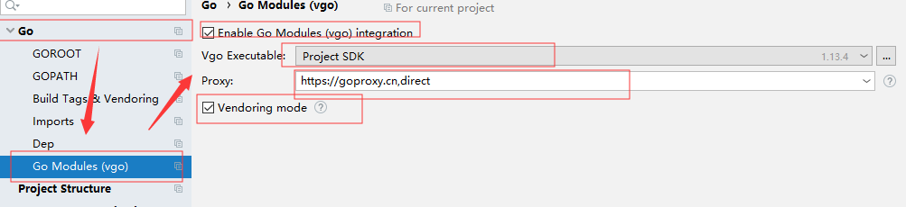

- 在gopath目录下建立如下文件夹
```sh
src
├── github.com
|      ├── golang
|      |   └── lint
|      ...
└── golang.org
       └── x
           ├── tools
           └── lint
```

- 在golang.org/x下clone

```sh
git clone https://github.com/golang/tools.git
git clone https://github.com/golang/lint.git
```

- 将 lint拷贝到github.com/golang目录下，对该lint进行编译，使用install

```sh
$ go install github.com/golang/lint/golint
go: finding module for package github.com/golang/lint/golint
go: found github.com/golang/lint/golint in github.com/golang/lint v0.0.0-20200302205851-738671d3881b
go: github.com/golang/lint/golint: github.com/golang/lint@v0.0.0-20200302205851-738671d3881b: parsing go.mod:
        module declares its path as: golang.org/x/lint
                but was required as: github.com/golang/lint
```

- 修改lint/go.mod文件，再重新执行

```sh
module github.com/golang/lint

go 1.11

require golang.org/x/tools v0.0.0-20200130002326-2f3ba24bd6e7
```

- 继续执行其他命令

```sh
$ go install github.com/ramya-rao-a/go-outline
$ go install github.com/acroca/go-symbols
$ go install golang.org/x/tools/cmd/guru
$ go install golang.org/x/tools/cmd/gorename
...
```

- 配置下载代理，在cmd中输入`SETX GO111MODULE on`

```sh
https://goproxy.cn
https://goproxy.io
```

- 配置环境变量，本地和admin用户都配置

```sh
GOPROXY=https://goproxy.cn,direct #后面加direct是cn镜像没有找到会按照默认找
```

- 如果是idea，则在设置-->Go --> Go Modules



- 更新组件应用

```sh
ctrl+shift+p # 打开配置项
Go: Install/Update Tools # 选择配置项目，全选回车
```

- 配置vscode中的gopath
  - 在File-->preferences-->settings
  - 输入gopath进行查询，得到相应的配置修改


