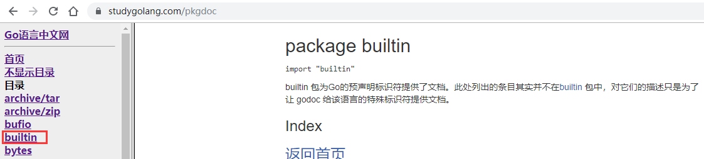

# 介绍

- Golang设计者为了编程方便，提供了一些函数，这些函数可以直接使用，称为Go的内置函数

- 文档：https://studygolang.com/pkgdoc->builtin

 


# len

- 用来求长度，比如string、array、slice、map、channel


# new 值类型分配内存

- 给基本数据类型分配内存

- 用来分配内存，主要用来分配值类型，比如int，float32，struct...返回的是指针

```go
package main
import "fmt"
func main(){
	num1 := 100
	fmt.Printf("num1 的类型%T num1的值=%v num1的地址%v \n",num1,num1,&num1)

	num2 := new(int) // *int 类型
	fmt.Printf("num2 的类型%T num2的值=%v num2的地址=%v num2指向的值=%v",num2,num2,&num2,*num2)
}
// 结果
num1 的类型int num1的值=100 num1的地址0xc04200e0a0
num2 的类型*int num2的值=0xc04200e0b8 num2的地址=0xc042004030 num2指向的值=0 // 初始指向的值是0
```


# make 引用类型分配内存

- make：用来分配内存，主要用来分配引用类型，比如channel、map、slice