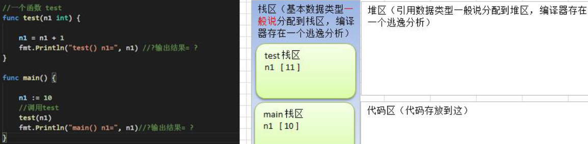

# 介绍

- 为完成某一功能的程序指令(语句)的集合,称为函数
- 分类
  - 自定义函数
  - 系统函数

- 基本语法

```go
func 函数名(形参列表) (返回值列表) {
    执行语句
    return 返回值列表
}
```

- 形参列表：表示函数输入
- 函数中的语句：表示为了实现某一功能代码块
- 函数可以有返回值，也可以没有


# 使用

- 案例：计算功能

```go
package main
import "fmt"
func main(){
	var re = cal(1,2,'+')
	fmt.Println("结果是=",re)
}
func cal(n1 float64,n2 float64,operator byte) float64 {
	var re float64
	switch operator {
	case '+':
		re = n1 + n2
	case '-':
		re = n1 - n2
	case '*':
		re = n1 * n2
	case '/':
		re = n1 / n2
	default:
		fmt.Println("操作符号错误")
	}
	return re
}
```


# 调用机制

- 在调用一个函数时，会给该函数分配一个新的空间，编译器会通过自身的处理让这个新的空间和其它的栈的空间区分开来
- 在每个函数对应的栈中，数据空间是独立的，不会混淆
- 当一个函数调用完毕(执行完毕)后，程序会销毁这个函数对应的栈空间
- 计算两个数,并返回




# return 语句

- Go函数支持返回多个值
  - 如果返回多个值，在接收时，希望忽略某个返回值，则使用 `_` 表示占位忽略
  - 如果返回值只有一个，返回类型列表外的括号可以省略

```go
func 函数名(形参列表) (返回值类型列表) {
	语句...
    return 返回值列表
}
```

- 示例：得到2个数的和和差

```go
package main
import "fmt"
func main(){
	res1,res2 := getSumAndSub(1,3)
	fmt.Println("res1=",res1," res2=",res2)

	// 使用 _ 表示占位忽略
	res3,_ := getSumAndSub(12,3)
	fmt.Println("res3=",res3)
}
func getSumAndSub(n1 int,n2 int) (int,int){
	res1 := n1 + n2
	res2 := n1 - n2
	return res1,res2
}
// 结果
res1= 4  res2= -2
res3= 15
```


# 递归调用

一个函数在函数体内又调用了本身，我们称为递归调用

- 执行一个函数时，就创建一个新的受保护的独立空间(新函数栈)
- 函数的局部变量是独立的，不会相互影响
- 递归必须向退出递归的条件逼近，否则就是无限递归
- 当一个函数执行完毕，或者遇到return，就会返回，遵守谁调用，就将结果返回给谁，同时当函数执行完毕或者返回时，该函数本身也会被系统销毁

- 示例：斐波那契数
  - 请使用递归的方式，求出斐波那契数1,1,2,3,5,8,13...
  - 给你一个整数n，求出它的斐波那契数是多少？

```go
// 当n==1||n==2,返回1
// 当n>=2,返回前面两个数的和f(n-1)+f(n-2)

package main
import "fmt"
func main(){
	res := f(6)
	fmt.Println("res=",res)
}

func f(n int) int {
	if n==1 || n ==2 {
		return 1
	}
	return f(n-1)+f(n-2)
}
```


# 注意事项

- 函数的形参列表可以是多个，返回值列表也可以是多个
- 形参列表和返回值列表的数据类型可以是值类型和引用类型
- 函数的命名遵循标识符命名规范，首字母不能是数字，首字母大写该函数可以被本包文件和其它包文件使用，类似public,首字母小写，只能被本包文件使用，其它包文件不能使用，类似privat
- 函数中的变量是局部的，函数外不生效


# 值传递与引用传递

- 基本数据类型和==数组默认都是值传递的==，即进行值拷贝。在函数内修改，不会影响到原来的值
- 如果希望函数内的变量能修改函数外的变量(指的是默认以值传递的方式的数据类型)，可以传入变量的地址&，函数内以指针的方式操作变量。从效果上看类似引用

```go
func test(n *int){
    *n = *n + 1
}
func main(){
    num := 3
    test(&num)
    fmt.Println(num) // 4
}
```

- go函数不支持重载，函数名相同参数不同也不行

- 值类型参数默认就是值传递，而引用类型参数默认就是引用传递
- 不管是值传递还是引用传递，传递给函数的都是变量的副本，不同的是，值传递的是值的拷贝，引用传递的是地址的拷贝
- 一般来说，地址拷贝效率高，因为数据量小，而值拷贝决定拷贝的数据大小，数据越大，效率越低


## 值类型

- 基本数据类型int系列
- float系列
- bool
- string
- **数组**
- 结构体struct


## 引用类型

- 指针
- slice切片
- map
- 管道channel
- interface等都是引用类型


## 特点

- 值类型默认是值传递，变量直接存储值，内存通常在栈中分配
- 引用类型默认是引用传递，变量存储的是一个地址，地址对应的空间是真正存储数据，内存通常在==堆上分配空间==，当没有任何变量引用这个地址时，该地址对应的数据空间就是一个垃圾对象，由GC回收
- 如果希望函数内的变量能修改函数外的变量，可以传入变量的地址&，函数内以指针的方式操作变量。从效果上看类似引用


# 函数作为形参传递

- go中==函数也是一种数据类型==，可赋值给一个变量，则该变量就是一个函数类型的变量
  - 通过该变量可以对函数调用

```go
package main
import "fmt"
func main(){
	fun := getSum
	fmt.Printf("fun 的类型是 %T, getSum类型是%T \n",fun,getSum)

	res := fun(1,2)
	fmt.Println("res=",res)
}

func getSum(n1 int,n2 int) int {
	return n1 + n2
}
// 结果
fun 的类型是 func(int, int) int, getSum类型是func(int, int) int
res= 3
```

- 作为形参传递，注意传递参数的类型是func类型

```go
package main
import "fmt"
func main(){
	res := myFun(getSum,1,2)
	fmt.Println("res=",res)
}

func getSum(n1 int,n2 int) int {
	return n1 + n2
}

func myFun(f func(int,int) int,n1 int,n2 int) int {
	return f(n1,n2)
}
```


# 自定义数据类型

- 基本语法

```go
type 自定义数据类型名 数据类型 // 相当于一个别名
// myInt 等价于int来使用，注意：myInt 不是 int ，如果myInt使用int类型，需要显示转换
type myInt int 

var num1 myInt = 1
var num2 int
num2 = int(num1)

type mySum func(int,int) int // mySum等价于一个函数类型 func(int,int) int
```

- 示例

```go
package main
import "fmt"
func main(){
	res := myFun(getSum,1,2)
	fmt.Println("res=",res)
}

type myFunType func(int,int) int

func getSum(n1 int,n2 int) int {
	return n1 + n2
}

func myFun(f myFunType ,n1 int,n2 int) int {
	return f(n1,n2)
}
```


# 对函数的返回值命名

```go
package main
import "fmt"
func main(){
	sum ,sub := getSumAndSub(1,2)
	fmt.Println(sum,sub)
}
// 对返回值命名，可以省略函数内部的返回值的初始化和命名
func getSumAndSub(n1 int,n2 int) (sum int,sub int){
	sum = n1 + n2
	sub = n1 - n2
	return sum,sub
}
```


# 关于 _  标识符

- _ 用于忽略返回值
- 当某个返回值不需要，可以用 _ 代替


# 可变参数

- 使用 ... 表示可变参数
- 如果一个函数的形参列表中有可变参数，则可变参数需要放在形参列表最后

```go
package main
import "fmt"
func main(){
	re := sum(1,2,3)
	fmt.Println(re)
}
// 注意：返回值有名称时，需要有括号
func sum(args ... int) (re int) {
	// args 是slice的切片
	for i:=0;i<len(args);i++ {
		re += args[i]
	}
	return re
}

func sum2(n1 int,args ... int) (re int) {
	re = n1
	for i:=0;i<len(args);i++ {
		re += args[i]
	}
	return re
}
```


# 变量的作用域

- 局部变量
  - 函数内部声明/定义的变量
  - 作用域仅限于函数内部
- 全局变量
  - 函数外部声明/定义的变量
  - 作用域在整个包都有效
  - 如果其首字母为大写，则作用域在整个程序有效

- 代码块变量
  - 如果变量是在一个代码块，比如for/if中
  - 作用域就在该代码块

```go
package main
import "fmt"

var age int =20
name:="tom" 
// syntax error: non-declaration statement outside function body
// 错误原因：name:="tome" 等价于如下2个操作，而赋值操作只能在函数中
// var name string
// name = "tom"

func main(){
	fmt.Println(name,age)
}
```


# 练习

- 请编写一个函数swap(n1*int,n2*int)可以交换n1和n2的值

```go
package main
import "fmt"
func main(){
	var n1 = 1
	var n2 = 2
	swap(&n1,&n2)
	fmt.Println(n1,n2)
}

func swap(n1,n2 *int){
	*n1,*n2 = *n2,*n1
}
```