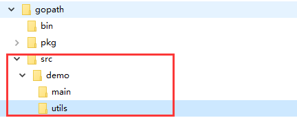

# 介绍

- 在实际的开发中，我们往往需要在不同的文件中，去调用其它文件的定义的函数，比如main.go中，去使用utils.go文件中的函数，如何实现？-》包
- 现在有两个程序员共同开发一个Go项目,程序员xiaoming希望定义函数Cal,程序员xiaoqiang也想定义函数也叫Cal。两个程序员为此还吵了起来,怎么办?-》包
- 包的本质实际上就是创建不同的文件夹，来存放程序文件
- go的每一个文件都是属于一个包的，也就是说go是以包的形式来管理文件和项目目录结构的


# 作用

- 区分相同名字的函数、变量等标识符

- 当程序文件很多时，可以很好的管理项目

- 控制函数、变量等访问范围，即作用域


# 说明

- 基本语法
  - package 包名
- 引入包的基本语法
  - import "包的路径"


# 使用

- 案例目录

 

- 注意：代码需要在GOPATH下，否则包引用不到，从GOPATH的src目录下开始
- main/test.go

```go
package main
import (
	"fmt"
	"demo/utils" // utils是文件夹的名称
)
func main(){
    // 注意此处的utils是包的名称，包名.函数名()
	var re = utils.Cal(1,2,'+')
	fmt.Printf("结果是=%.2f \n",re)
}
```

- utils/utils.go

```go
package utils

import (
	"fmt"
)

// 首字母大写，大写代表了public，可以被其他go文件引用
// 该函数可导出
func Cal(n1 float64,n2 float64,operator byte) float64 {
	var re float64
	switch operator {
	case '+':
		re = n1 + n2
	case '-':
		re = n1 - n2
	case '*':
		re = n1 * n2
	case '/':
		re = n1 / n2
	default:
		fmt.Println("操作符号错误")
	}
	return re
}
```

- package指令在文件第一行，然后是import指令
- 在import包时，路径从$GOPATH的src下开始，不用带src,编译器会自动从src下开始引入
- 为了让其它包的文件，可以访问到本包的函数，则该函数名的首字母需要大写，类似其它语言的public,这样才能跨包访问
- 在访问其它包函数，变量时，其语法是包名.函数名
- 如果包名较长，Go支持给包取别名，注意细节：取别名后，原来的包名就不能使用了


## 方式1

```go
import "包名"
```


## 方式2

```go
import (
    "包名"
    "包名"
)
```


## 别名

- 如果给包取了别名，则需要使用别名来访问该包的函数和变量

```go
import (
	别名 "包名"
)
```

- 案例

```go
package main
import (
	"fmt"
	u "demo/utils" 
)
func main(){
	var re = u.Cal(1,2,'+')
	fmt.Printf("结果是=%.2f \n",re)
}
```


# 注意

- 在给一个文件打包时，该包对应一个文件夹，比如这里的utils文件夹对应的包名就是utils

- **文件的包名通常和文件所在的文件夹名一致**，一般为小写字母

- 当一个文件要使用其它包函数或变量时，需要先引入对应的包

- 在同一包下，不能有相同的函数名（也不能有相同的全局变量名），否则报重复定义

  

# 关于编译

- 如果你要编译成一个可执行程序文件，就需要将这个包声明为main,即package main
  - main包只能有一个
  - 是语法规范
- 如果你是写一个库，包名可以自定义
- 编译时需要编译main包所在的文件夹
- 编译后生成一个默认的可执行文件，在$GOPATH目录下，可指定名称和目录

```bash
go build -o bin/my.exe demo/main
-o 表示目标文件的目录和文件名称，此时输出在GOPATH的bin目录下
demo/main 前面不使用绝对路径，默认从GOPATH的src后开始
```

