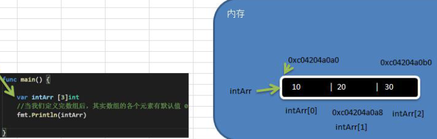
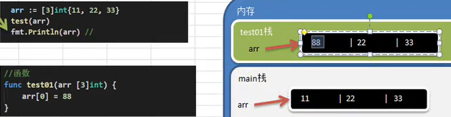
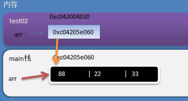
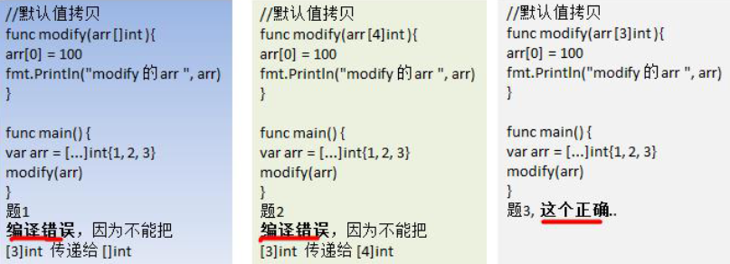
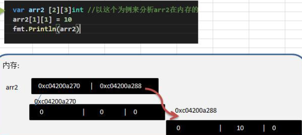

# 介绍

- 数组可以存放多个同一类型数据
- 数组也是一种数据类型
- 在Go中==数组是值类型==
  - 值传递，传递数组是复制操作

- 定义

```go
var 数组名 [数组大小]数据类型
var a [5]int
// 赋值
a[0] = 1
a[1] = 3
...

```

- 内存布局
  - 数组的地址可以通过数组名来获取 &intArr
  - 数组的第一个元素的地址，就是数组的首地址
  - 数组的各个元素的地址间隔是依据数组的类型决定，比如int64->8int32->4...



```go
package main
import "fmt"
func main(){

	// int 占8个字节
	var intArr [3]int 
	// 定义数组后，数组中每个元素的默认值是0
	fmt.Println(intArr)
	intArr[0] = 10
	intArr[1] = 20
	intArr[2] = 30
	fmt.Println(intArr)
	fmt.Printf("intArr的地址=%p \n intArr[0]的地址=%p \n intArr[1]的地址=%p \n intArr[2]的地址=%p",
		&intArr,
		&intArr[0],
		&intArr[1],
		&intArr[2],
	)
}
// 结果，输出十六进制，
// intArr与intArr[0]的地址是一致的，下标i表示每次地址偏移间隔= (i*类型字节大小)，得到另一元素的地址
[0 0 0]
[10 20 30]
intArr的地址=0xc0420560a0 
intArr[0]的地址=0xc0420560a0 
intArr[1]的地址=0xc0420560a8 
intArr[2]的地址=0xc0420560b0
```


# 使用

- 访问数组元素：使用下标
  - 数组名[下标]

- 案例：从终端输入5个元素，保存在float64中，并输出

```go
package main
import "fmt"
func main(){
	var score [5]float64
	for i := 0; i < len(score); i++ {
		fmt.Printf("请输入第%d个元素的值 \n",i+1)
		fmt.Scanln(&score[i])
	}
	for i := 0; i < len(score); i++ {
		fmt.Printf("score[%d]=%v \n",i,score[i])
	}
}
```


# 初始化

```go
package main
import "fmt"
func main(){
	var numArr01 [3]int = [3]int{1,2,3}
	fmt.Println("numArr01=",numArr01)

	var numArr02 = [3]int{4,5,6}
	fmt.Println("numArr02=",numArr02)

	// 使用 ... 表示大小以实际初始化元素个数为准
	var numArr03 = [...]int{7,8,9,10}
	fmt.Println("numArr03=",numArr03)

	// 指定下标元素的值
	var numArr04 = [...]int{1:9,0:2,3:23}
	fmt.Println("numArr04=",numArr04)

	// 使用类型推导
	strArr := [...]string{1:"hive",0:"spark",4:"kafka"}
	fmt.Println("strArr=",strArr)
}
// 结果
numArr01= [1 2 3]
numArr02= [4 5 6]
numArr03= [7 8 9 10]
numArr04= [2 9 0 23]
strArr= [spark hive   kafka]
```


# 遍历


## 方式1：常规遍历

- for i:=0;i<len(arr);i++ {...}


## 方式2：for-range遍历

- Go语言一种独有的结构，可以用来遍历访问数组的元素
- 基本语法
  - index是数组的下标
  - value 是该下标位置的值
  - index 和value 都是在for循环内部可见的局部变量
  - 遍历数组元素时，如果不想使用index，可以将index 使用 _ 代替
  - index 和 value 可以自定义名称

```go
for index,value:=range arr {
    ...
}
```

- 案例

```go
strs := [...]string{"hive","spark","hadoop"}
for i,v := range strs {
    fmt.Printf("i=%v v=%v \n",i,v)
    fmt.Printf("strs[%d]=%v \n",i,strs[i])
}
for _,v := range strs {
    fmt.Printf("v=%v \n",v)
}
```


# 注意

- 数组是多个相同类型数据的组合,一个数组一旦声明/定义了,其长度是固定的,不能动态变化
- var arr[]int这时arr就是一个slice切片
- 数组中的元素可以是任何数据类型，包括值类型和引用类型，但是不能混用
- 数组创建后，如果没有赋值，有默认值(零值)
  - 数值类型数组：默认值为0
  - 字符串数组：默认值为""
  - bool数组：默认值为false
- 数组的下标是从0开始的
- 使用数组的步骤
  - 声明数组并开辟空间
  - 给数组各个元素赋值(默认零值)
  - 使用数组

- Go的数组属值类型，在默认情况下是值传递，因此会进行==值拷贝==。数组间不会相互影响

 

- 如想在其它函数中，去修改原来的数组，可以使用==引用传递(指针方式)==

```go
func main(){
    arr := [3]int{11,22,33}
    test02(&arr)
}
func test02(arr *[3]int){
    (*arr)[0] = 88 // 
}
```

 

- 长度是数组类型的一部分，在==传递函数参数时需要考虑数组的长度==




# 二维数组

- 使用场景：如一个五子棋游戏，棋盘就是需要二维数组来表示

- 示例：输出如下图形

```go
000000
001000
020300
000000
```

- 代码

```go
package main
import "fmt"
func main(){
	var arr [4][6]int
	// 赋初始值
	arr[1][2] = 1
	arr[2][1] = 2
	arr[2][3] = 3

	// 遍历二维数组
	for i := 0; i < 4; i++ {
		for j := 0; j < 6; j++ {
			fmt.Print(arr[i][j]," ")
		}
		fmt.Println()
	}
}
```


## 初始化

- 方式1：先声明/定义,再赋值

```go
var arr2 [2][3]int
arr2[1][1] = 10
fmt.Println(arr2)
fmt.Printf("arr2[0]的地址 %p \n",&arr2[0])
fmt.Printf("arr2[1]的地址 %p \n",&arr2[1])

fmt.Printf("arr2[0][0]的地址 %p \n",&arr2[0][0])
fmt.Printf("arr2[1][0]的地址 %p \n",&arr2[1][0])
```

- 内存中布局

 

- 方式2：直接初始化
- 赋值(有默认值，比如int类型的就是0)

```go
var 数组名 [大小][大小]类型 = [大小][大小]类型{{初值..},{初值..}}
// 说明：二维数组在声明/定义时也对应有四种写法[和一维数组类似]
var 数组名 [大小][大小]类型 = [大小][大小]类型{{初值..},{初值..}}
var 数组名 [大小][大小]类型 = [...][大小]类型{{初值..},{初值..}}
var 数组名 = [大小][大小]类型{{初值..},{初值..}}
var 数组名 = [...][大小]类型{{初值..},{初值..}}

var arr [2][3]int = [2][3]int{{1,2,3},{3,4,5}}
```


## 遍历

- 双层for循环完成遍历
- for-range方式完成遍历

```go
var arr = [2][3]int{{1,2,3},{4,5,6}}
for i:=0;i<len(arr);i++ {
    for j:=0;j<len(arr[i]);j++{
        fmt.Printf("%v \t",arr[i][j])
    }
    fmt.Println()
}

for i,v := range arr {
    for j,v2 := range v {
        fmt.Printf("arr[%v][%v]=%v \t",i,j,v2)
    }
    fmt.Println()
}
```