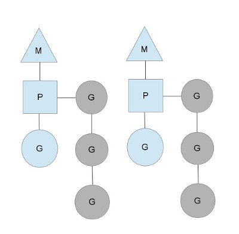

# 介绍

- 查看cpu可以执行线程数
  - 表示一个go程序可以使用NumCPU个P
  - 每一个P会被分配到一个系统线程M
  - 每一个Go程序会被赋予一个初始的G（goroutine 协程）

```go
package main
import (
	"runtime"
	"fmt"
)
func main(){
    fmt.Println(runtime.NumCPU())
}
// result
12
```

- 系统线程不断在一个core上做上下文切换
- G 不断在M上做上下文切换
- Go 调度器有2个不同的执行队列
  - 全局队列 Global Run Queue  GRQ
  - 本地队列 Local Run Queue LRQ


- goroutine有三个状态
  - 阻塞态
    - 等待系统调用，或者互斥调用
  - 就绪态
    - 等待一个M执行分配给它的指令
  - 运行态
    - 一个goroutine被交给一个M执行

- 触发go调度
  - 使用go关键字
    - 一旦创建一个goroutine，会引起go调度器进行调度
  - 垃圾回收
    - gc操作使用自己的一组goroutine来执行
    - gc过程中暂停需要访问堆空间的goroutine，而不需要访问堆空间的goroutine继续运行
  - 系统调用
  - 同步互斥操作，Lock，Unlock操作


# MPG模型

G

- 表示goroutine，存储了goroutine的执行stack信息、goroutine状态以及goroutine的任务函数等；另外G对象是可以重用的
- 它有自己的栈，instruction pointer和其他信息（正在等待的channel等等），用于调度

M

- 代表着真正的执行计算资源。在绑定有效的P后，进入调度器循环；而调度器循环的机制大致是从各种队列、P的本地队列中获取G，切换到G的执行栈上并执行G的函数，调用goexit做清理工作并回到M，如此反复。**M并不保留G状态，这是G可以跨M调度的基础**
- M可以动态创建多个
- M代表内核级线程，一个M就是一个线程，goroutine就是跑在M之上的；M是一个很大的结构，里面维护小对象内存cache（mcache）、当前执行的goroutine、随机数发生器等等非常多的信息

P

- 表示逻辑processor，P的数量决定了系统内最大可并行的G的数量（前提：系统的物理cpu核数>=P的数量）；P的最大作用还是其拥有的各种G对象队列、链表、一些cache和状态
- 维护了一个goroutine队列，里面存储了所有需要它来执行的goroutine

 

- golang提出GPM模型，在G的眼里，只有P，P保存了需要执行的那些goroutine
- 在整个go调度的层面，对外的是M，P会找到一个M，让它去与外面的线程交互，从而去真正执行程序


# 调度实现

 

从上图中看，有2个物理线程M，每一个M都拥有一个处理器P，每一个也都有一个正在运行的goroutine。
P的数量可以通过GOMAXPROCS()来设置，它其实也就代表了真正的并发度，即有多少个goroutine可以同时运行。图中灰色的那些goroutine并没有运行，而是出于ready的就绪态，正在等待被调度。P维护着这个队列（称之为runqueue），Go语言里，启动一个goroutine很容易：go function 就行，所以每有一个go语句被执行，runqueue队列就在其末尾加入一个goroutine，在下一个调度点，就从runqueue中取出（如何决定取哪个goroutine？）一个goroutine执行

当一个OS线程M0陷入阻塞时（如下图)，P转而在运行M1，图中的M1可能是正被创建，或者从线程缓存中取出

 

当MO返回时，它必须尝试取得一个P来运行goroutine，一般情况下，它会从其他的OS线程那里拿一个P过来，
如果没有拿到的话，它就把goroutine放在一个global runqueue里，然后自己睡眠（放入线程缓存里）。所有的P也会周期性的检查global runqueue并运行其中的goroutine，否则global runqueue上的goroutine永远无法执行。

另一种情况是P所分配的任务G很快就执行完了（分配不均），这就导致了这个处理器P很忙，但是其他的P还有任务，此时如果global runqueue没有任务G了，那么P不得不从其他的P里拿一些G来执行。一般来说，如果P从其他的P那里要拿任务的话，一般就拿run queue的一半，这就确保了每个OS线程都能充分的使用，如下图

 


# 调度中的问题


## G不均匀

现实情况有的goroutine运行的快，有的慢，那么势必肯定会带来的问题就是，忙的忙死，闲的闲死，go肯定不允许摸鱼的P存在，势必要榨干所有劳动力
如果你没有任务，那么，我们看到模型中还有一个**全局G队列**的存在，如本地队列已满，会一次性转移半数到全局队列。其他闲的小伙子就会从全局队列中拿；（顺便说一下，优先级是先拿下一个需要执行的，然后去本地队列中拿，再去全局队列中拿，先把自己的做完再做别人的嘛）同时如果全局都没有了，就会去抢别人的做

## 任务阻塞了

万一有个程序员启动一个goroutine去执行一个任务，然后这个任务一直睡觉（sleep）就是循环睡觉，那咋办嘛！你作为执行人，你总不能说，让它一直占用着一整个线程的资源，然后后面的goroutine都卡主了，那如果只有一个核心P，不就完蛋了？聪明的go才不会那么傻，它采用了抢占式调度来解决这个问题。只要你这个任务执行超过一定的时间（10ms），**那么这个任务就会被标识为可抢占**的，那么别的goroutine就可以抢先进来执行。只要下次这个goroutine进行函数调用，那么就会被强占，同时也会保护现场，然后重新放入P的本地队列里面等待下次执行。
谁来做的呢？
sysmon，就是这个背后默默付出的人，它是一个后台运行的监控线程，它来监控那些长时间运行的G任务然后设置可以强占的标识符。（同时顺便提一下，它还会做的一些事情，例如，释放闲置的span内存，2分钟的默认gc等）

## IO阻塞

我们经常使用goroutine还有一个场景就是网络请求和IO操作，这种阻塞的情况下，我们的G和M又会怎么做呢？
这个时候有个叫做**netpoller**的东西出现了，当每次有一个网络请求阻塞的时候，如果按照原来的方法这个时候这个请求会阻塞线程，而有了netpoller这个东西，可以将请求阻塞到goroutine。
意思是说，当阻塞出现的时候，当前goroutine会被阻塞，等待阻塞notify，而放出M去做别的g，而当阻塞恢复的时候，netpoller就会通知对应的m可以做原来的g了。
同时还要顺便提一句，当P发现没有任务的时候，除了会找本地和全局，也会去netpoll中找

 


## 系统方法调用阻塞

还有一个问题，我们自己想可能比较难想到，就是当调用一些系统方法的时候，如果系统方法调用的时候发生阻塞就比较麻烦了。下面引用一段话：
当G被阻塞在某个系统调用上时，此时G会阻塞在_Gsyscall状态，M也处于block on syscall状态，此时的M可被抢占调度：执行该G的M会与P解绑，而P则尝试与其它idle的M绑定，继续执行其它G。如果没有其它idle的M，但P的Local队列中仍然有G需要执行，**则创建一个新的M**；当系统调用完成后，G会重新尝试获取一个idle的P进入它的Local队列恢复执行，如果没有idle的P，G会被标记为runnable加入到Global队列
