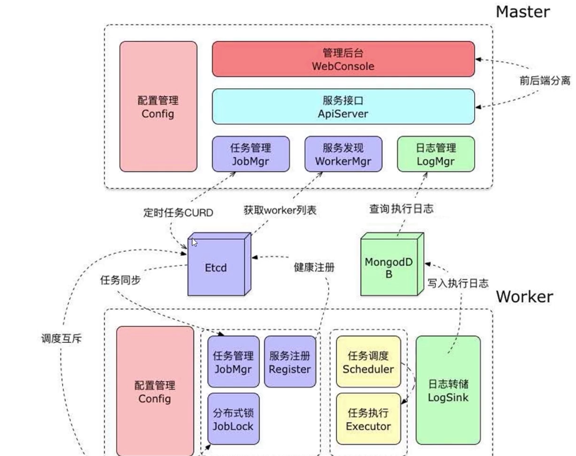

# 传统方案 crontab

- 配置服务时，需要ssh登录脚本服务器进行操作
- 服务器宕机，任务将终止调度，需要人工迁移
- 排查问题低效，无法方便查看任务状态和错误输出

# 分布式任务调度

- 可视化web后台，方便进行任务管理
- 分布式架构，集群化管理，不存在单点故障
- 追踪任务执行状态，采集任务输出，可视化log查看

## 国内开源项目

- java开发
  - 当当：elastic job
  - 点评：xxl-job
  - 个人开发：light-task-scheduler LTS
- 缺点
  - 企业内部开源，维护精力有限，积累问题多
  - 设计文档少，社区用户不友好，引入要谨慎

## 自研

- master-worker分布式结构
- etcd协调服务
  - 分布式锁
  - 服务注册与发现
  - cap理论
  - 事件广播
- 并发设计
- 异步日志
- mongodb分布式存储
- systemctl服务管理
- nginx负载均衡

  

## 环境

- mongodb 4.0.0
- etcd v3.3.8