# 介绍

- 没有对象，没有继承，多态，没有泛型，没有try/catch
- 有接口，函数式编程
- CSP并发模型（goroutine+channel）

- 项目架构

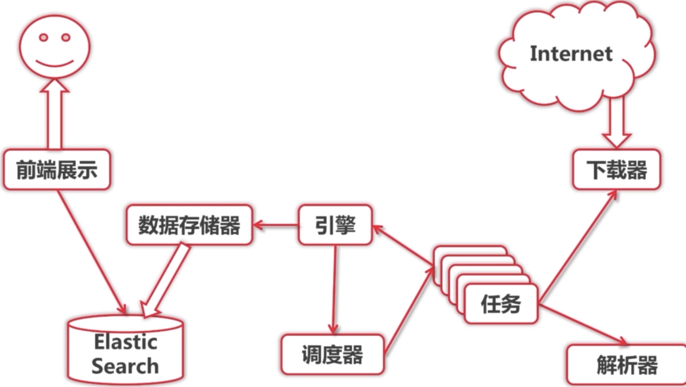 

- 下载：https://studygolang.com/dl

- 编码工具：idea+go插件，GoLand

- 创建项目
  - 注意路径在gopath的src下

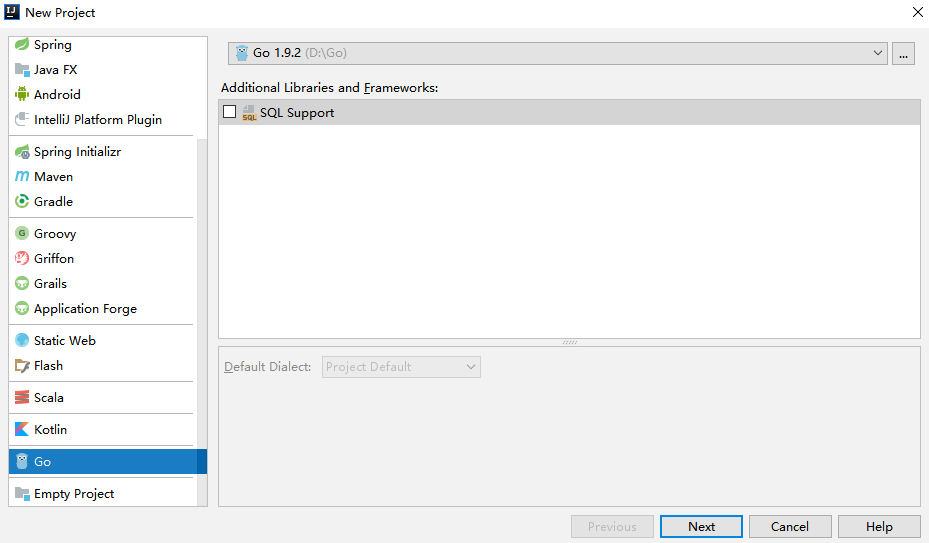  

- 创建文件

 


# 基本语法


## 变量定义（var 关键字）

- var a,b,c bool
- var s1,s2 string = "hello","world"
- 可放在函数内，或直接放在包内
- 使用var()集中定义变量
- 让编译器自动决定类型
  - var a ,b,i,s1,s2 = true,false,3,"hello","world"
- 使用:=定义变量
  - a,b,i,s1,s2 := true,false,3,"hello","world"
  - 原则是能写短就简短写
  - 只能在函数内使用

```go
// 变量初始值
func variableZeroValue() {
	var a int
	var s string
	fmt.Printf("%d %q\n",a,s)
}

// 变量赋值
func variableInitialValue() {
	var a,b int = 3,4
	var s string = "abc"
	fmt.Println(a,b,s)
}

// 类型推断
func variableTypeDeduction(){
	var a,b,c,s = 2,3,true,"df"
	fmt.Println(a,b,c,s)
}

// 第一次用变量可以使用 := 推荐
func variableShorter(){
	a,b,c,s := 2,3,true,"df"
	fmt.Println(a,b,c,s)
}

// 外部变量赋值，包内部变量
var ss = "kk"
//aa:=11 error 不允许

// 使用() 省略var的书写
var (
	aa = 3
	bb = true
)

func consts() {
	const filename string = "xx.txt"
	const a,b = 3,4 // 不指定int 那么默认是float类型
	var c int
	c = int(math.Sqrt(a*a + b*b))
	fmt.Println(filename,c)

	// 写法2
	const (
		e = 1
		f = 2
	)
}
```


## 变量类型

- bool,string
- (u)int,(u)int8,(u)int16,(u)int32,(u)int64,uintptr
  - int依据操作系统定义大小
- byte,rune
  - rune等于char
  - rune的长度32位，utf8是3字节，rune使用32字节覆盖utf-8
- float32,float64,complex64,complex128
- 验证欧拉公式

```go
func euler(){
	pow := cmplx.Pow(math.E, 1i*math.Pi)
	fmt.Println(pow)
	pow = cmplx.Exp(1i*math.Pi)+1
	fmt.Println(pow)
}
// 
(-1+1.2246467991473515e-16i)
(0+1.2246467991473515e-16i)
```


## 强制类型转换

- 只有强制转换

```go
func triangle(){
	var a,b int = 3,4
	var c int
	c = int(math.Sqrt(float64(a*a+b*b)))
	fmt.Println(c)
}
```


## 常量定义

- 名称小写，因为golang中变量大写表示public

- const filename = "abc.txt"
- const 数值类型可作为各种类型使用
- const a,b = 3,4 默认类型是float
- `var c int = int(math.Sqrt(a*a + b*b))`

```go
func consts() {
	const filename string = "xx.txt"
	const a,b = 3,4 // 不指定int 那么默认是float类型
	var c int
	c = int(math.Sqrt(a*a + b*b))
	fmt.Println(filename,c)

	// 写法2
	const (
		e = 1
		f = 2
	)
}
```


### 枚举

- 没有特殊的枚举关键字
- 使用const定义

```go
func enums(){
	const(
		cpp = 0
		java = 1
		python = 2
		golang = 3
	)
	fmt.Println(cpp,java,python,golang)
}

// 使用iota做简化，表示自增
func enums2(){
	const(
		cpp2 = iota
		_ // 表示省略，此处有+1效果
		java2
		python2
		golang2
	)

	const(
		b = 1 << (10 * iota) // 自增表达式
		kb
		mb
		gb
		tb
		pb
	)
	fmt.Println(cpp2,java2,python2,golang2)
	fmt.Println(b,kb,mb,gb,tb,pb)
}
```


## 变量小结

- 变量类型写在变量名之后
- 编译器可推测变量类型
- 没有char，只有rune（32位）
- 原始支持复数类型


## 条件语句


### if

- if的条件可以赋值
- if的条件里赋值的变量的作用域在这个if语句中

```go
const filename = "abc.txt"
func read1(){
	contents, err := ioutil.ReadFile(filename)
	if err != nil {
		fmt.Println(err)
	}else {
		fmt.Printf("%s\n",contents)
	}
}

func read2(){
	if contents, err := ioutil.ReadFile(filename);
	err != nil {
		fmt.Println(err)
	}else {
		fmt.Printf("%s\n",contents)
	}
}
```


### switch

- switch 会自动break，除非使用fallthrough
- switch后可以没有表达式

```go
func grade(score int) string {
	g := ""
	switch  {
	case score < 60:
		g = "F"
	case score < 80:
		g = "C"
	case score < 90:
		g = "B"
	case score <= 100:
		g = "A"
	default:
		panic(fmt.Sprintf("wrong score: %d",score))
	}
	return g
}
```


## 循环语句 for

- for 条件里面不要有括号
- for 条件里可以省略初始条件，结束条件，递增表达式

```go
package main

import (
	"strconv"
	"fmt"
	"os"
	"bufio"
)

// 转二进制
func convertToBin(n int) string {
	result := ""
	for; n> 0;n >>=1  {
		lsb:= n % 2
		result = strconv.Itoa(lsb)+result
	}
	return result;
}

func printFile(filename string){
	file, error := os.Open(filename)
	if error != nil {
		panic(error)
	}
	scanner := bufio.NewScanner(file)

	for scanner.Scan() {
		fmt.Println(scanner.Text())
	}

}

func main() {
	fmt.Println(convertToBin(11))
	printFile("abc.txt")
}
```


## 函数

- 函数返回多个值可以起名字
- 只用于非常简单的函数
- 对于调用者而言没有什么区别

```go
package main

import "fmt"

func eval(a,b int,op string) (int,error) {
	switch op {
	case "+":
		return a + b,nil
	case "-":
		return a - b,nil
	case "*":
		return a * b,nil
	case "/":
		return a / b,nil
	default:
		//panic("unsupported operation:"+op)
		return 0,fmt.Errorf("unsupported operation: %s",op)
	}
}

func div(a,b int) (int,int){
	return a / b, a % b
}

func main() {
	fmt.Println(eval(1,3,"e"))
	fmt.Println(div(13,3))
}
```

- 函数式编程

```go
func apply(op func(int,int) int ,a,b int) int {
	p := reflect.ValueOf(op).Pointer()
	opName := runtime.FuncForPC(p).Name()
	fmt.Printf("calling function %s with args (%d,%d)",opName, a,b)
	return op(a,b)
}

func pow(a,b int) int {
	return int(math.Pow(float64(a),float64(b)))
}

func main() {
	fmt.Println(eval(1,3,"e"))
	fmt.Println(div(13,3))
	fmt.Println(apply(pow,1,3))
	fmt.Println(apply(func(a int, b int) int {
		return a + b
	},1,2))
}
// 
0 unsupported operation: e
4 1
calling function main.pow with args (1,3)1
calling function main.main.func1 with args (1,2)3
```

- 可变参数

```go
func sum(numbers ... int) int {
	s := 0
	for i := range numbers {
		s += numbers[i]
	}
	return s
}
```


## 指针

- 指针不能运算
- 值传递？引用传递？
  - go 只有值传递，如果传递指针，那么拷贝的值是指针的地址

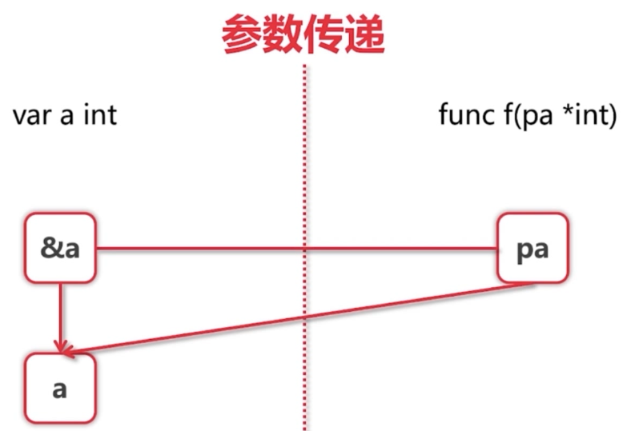  

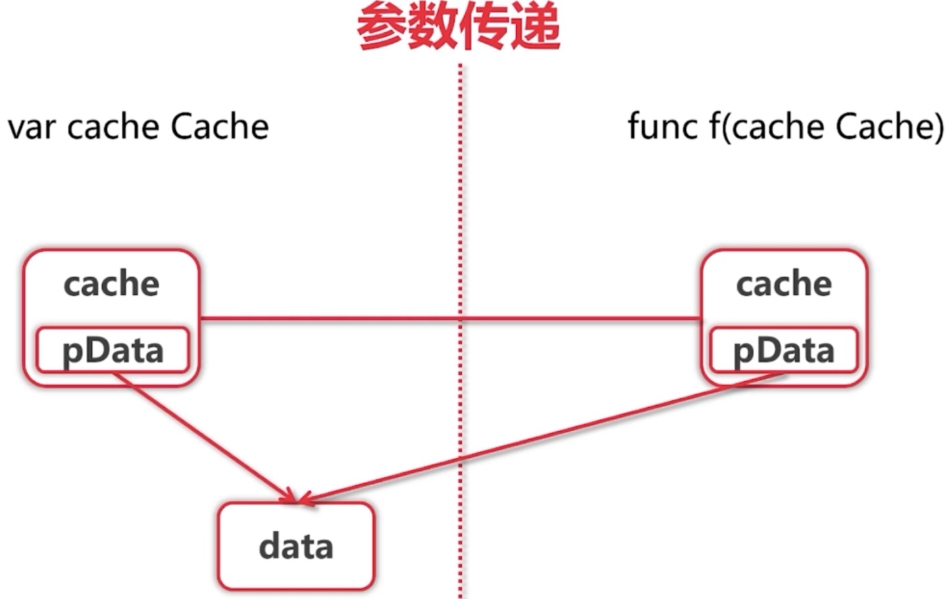 


- 如cache中只有引用参数，那么可以作为参数的传递，否则就要进行指针的传递


# 内建容器


## 数组

- [10]int和 [2]int 是不同的类型
- 调用func f(arr [10]int) 会拷贝数组
- 在go中一般不直接使用数组

```go
package main

import "fmt"

func main() {
	var arr [5]int // [0 0 0 0 0]
	arr2 := [3]int{1,2,3}
	arr3 := [...]int{1,2,3}
	fmt.Println(arr,arr2,arr3)

	var grid [4][5]int // [[0 0 0 0 0] [0 0 0 0 0] [0 0 0 0 0] [0 0 0 0 0]]
	fmt.Println(grid)

	for i:= 0;i<len(arr3);i++{
		fmt.Println(arr3[i])
	}

	for i := range arr3 {
		fmt.Println(arr3[i])
	}

	for i,v := range arr3{
		fmt.Println(i,v)
	}

	for _,v := range arr3{
		fmt.Println(v)
	}
}
```


## 切片

- 本质上是一个视图，对数组的视图

```go
package main

import "fmt"

func updateSlice(s []int){
	s[0] = 100
}

func printArr(a []int){
	fmt.Println(a)
}

func main() {
	arr:=[...]int{1,2,3,4,5,6,7,8,9,10}
	fmt.Println(arr[2:6])
	fmt.Println(arr[:6])
	fmt.Println(arr[2:])
	fmt.Println(arr[:])

	fmt.Println("------------")
	s := arr[:5]
	updateSlice(s)
	fmt.Println(s)
	fmt.Println(arr)
	printArr(arr[:])
	// 在slice基础上再slice操作
	fmt.Println("reslice")
	fmt.Println(s)
	s = s[:3]
	printArr(s)

}
// 
[3 4 5 6]
[1 2 3 4 5 6]
[3 4 5 6 7 8 9 10]
[1 2 3 4 5 6 7 8 9 10]
------------
[100 2 3 4 5]
[100 2 3 4 5 6 7 8 9 10]
[100 2 3 4 5 6 7 8 9 10]
reslice
[100 2 3 4 5]
[100 2 3]
```


### slice扩展

```go
arr := [...]int{0,1,2,3,4,5,6,7}
s1 := arr[2:6] // [2,3,4,5]
s2 := s1[3:5] // [5,6] 注意：s2取值超过了s1 范围，但是依然可以取得值
```

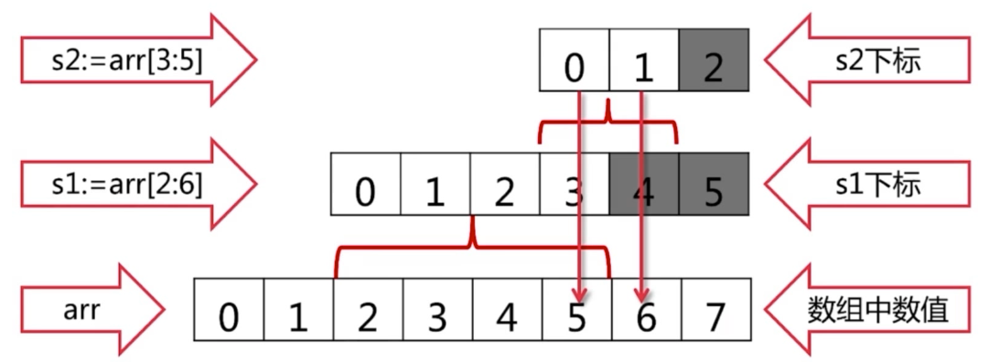 

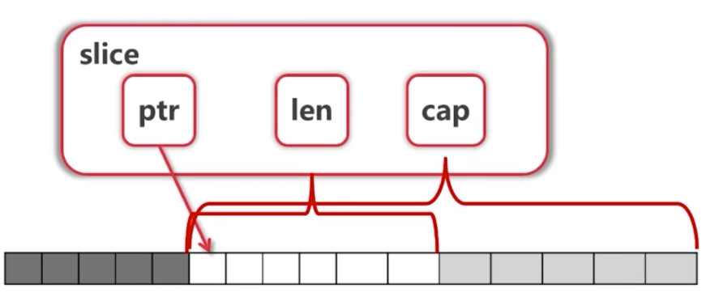 

- slice可以向后扩展，不可用向前扩展
- s[i] 不可用超越 len(s)，向后扩展不可以超宇底层数组cap(s)

```go
fmt.Printf("s=%v len(s)=%d cap(s)=%d \n",s,len(s),cap(s))
// s=[100 2 3] len(s)=3 cap(s)=10 
```


### 添加元素

- 在slice中添加元素，但是不会在原先的arr中
- 在append的时候，会生成一个新的数组，**对新的数组进行view**
- 添加元素时，如果超越cap，系统会重新分配更大的底层数组

```go
arr2:=[...]int{1,2,3,4,5,6,7,8,9,10}
s2 := arr2[2:3]
s3 := append(s2,10)
s4 := append(s3,11)
fmt.Println("s2,s3,s4",s2,s3,s4)
fmt.Println("arr",arr2)
//
s2,s3,s4 [3] [3 10] [3 10 11]
arr [1 2 3 10 11 6 7 8 9 10]
```


### 关于扩容

- 超过预定的cap时，会扩容一倍，超过cap再扩容一倍

```go
package main

import "fmt"

func printSlice(s []int){
	fmt.Printf("len = %d cap = %d\n",len(s),cap(s))
}

func main() {
	var s []int // zero value for slice is nil

	for i := 0;i<100;i++{
		printSlice(s)
		s = append(s,2*i+1)
	}
	fmt.Println(s)
}
// result
len = 0 cap = 0
len = 1 cap = 1
len = 2 cap = 2
len = 3 cap = 4
len = 4 cap = 4
len = 5 cap = 8
len = 6 cap = 8
len = 7 cap = 8
len = 8 cap = 8
len = 9 cap = 16
```


### 操作

```go
package main

import "fmt"

func printSlice(s []int){
	fmt.Printf("%v, len = %d cap = %d\n",s, len(s),cap(s))
}

func main() {
	// 关于创建
	s1 := []int{2,3,4,5}
	printSlice(s1)
	s2 := make([]int,16)
	printSlice(s2)
	s3 := make([]int,10,32)
	printSlice(s3)

	fmt.Println("copying slice")
	copy(s2,s1) // 将s1拷贝到s2
	printSlice(s2)

	fmt.Println("deleting elements from slice")
	// 删除下标为3的
	s2 = append(s2[:3],s2[4:]...)
	printSlice(s2)

	// 删除头尾
	fmt.Println("popping from front")
	front := s2[0]
	s2 = s2[1:]
	fmt.Println(front)
	printSlice(s2)

	fmt.Println("Popping from back")
	tail := s2[len(s2)-1]
	s2 = s2[:len(s2)-1]
	fmt.Println(tail)
	printSlice(s2)
}
// 
[2 3 4 5], len = 4 cap = 4
[0 0 0 0 0 0 0 0 0 0 0 0 0 0 0 0], len = 16 cap = 16
[0 0 0 0 0 0 0 0 0 0], len = 10 cap = 32
copying slice
[2 3 4 5 0 0 0 0 0 0 0 0 0 0 0 0], len = 16 cap = 16
deleting elements from slice
[2 3 4 0 0 0 0 0 0 0 0 0 0 0 0], len = 15 cap = 16
popping from front
2
[3 4 0 0 0 0 0 0 0 0 0 0 0 0], len = 14 cap = 15
Popping from back
0
[3 4 0 0 0 0 0 0 0 0 0 0 0], len = 13 cap = 15
```


## Map

- 创建：make(map[string]int)
- 获取元素：m[key]
- key不存在时，获取Value类型的初始值
- 用value,ok := m[key] 来判断是否存在key
- 用delete删除一个key
- 遍历：使用range遍历key，或者key,value对
- 不保证顺序，如果要顺序，需要手动对key进行排序
  - 将key存储在slice中，对该slice进行排序，在遍历slice通过key找到map对应的元素
- 使用len获取元素个数
- map的key
  - map使用哈希表，必须可以比较相等
  - 除了slice，map，function的内建类型都可以作为key
  - Struct类型不包含上述字段，可以作为key，编译时检查

```go
package main

import "fmt"

func main() {
	// key在map中是无序的
	m := map[string]string {
		"name":"sss",
		"course":"golang",
		"site":"sss",
	}
	fmt.Println(m)

	m2 := make(map[string]string) // m2 == empty map
	fmt.Println(m2,m2 == nil)

	var m3 map[string]int // m3 == nil
	fmt.Println(m3 == nil)

	// go 语言中的nil 是可以参与运算的，和empty map是可以混用的
	// 遍历
	fmt.Println("traversing map")

	for k,v := range m {
		fmt.Println(k,v)
	}
	for k := range m {
		fmt.Println(k)
	}
	for _,v := range m {
		fmt.Println(v)
	}

	fmt.Println("getting values")
	courseName := m["course"]
	fmt.Println(courseName)

	// 如果key不存在
	k,ok:= m["k"]
	fmt.Printf("k=%q ok=%v \n",k,ok)

	fmt.Println("deleting values")
	delete(m,"name")
	name, ok := m["name"]
	fmt.Println(name,ok)
}
// 
map[name:sss course:golang site:sss]
map[] false
true
traversing map
name sss
course golang
site sss
name
course
site
sss
golang
sss
getting values
golang
k="" ok=false 
deleting values
 false
```


## 字符 rune

- 使用range遍历pos,rune对
- 使用utf8.RuneCountInString获得字符数量
- 使用len获取字节长度
- 使用[]byte获取字节

```go
package main

import (
	"fmt"
	"unicode/utf8"
)

func main() {
	s := "go语言" // utf-8 可变长编码
	fmt.Println(len(s)) // s的byte的大小，英文1个byte，中文3个byte
	for _,b := range []byte(s) {
		fmt.Printf("%X ",b)
	}
	fmt.Println()
	for i,ch := range s {
		fmt.Printf("(%d %X)",i,ch)
	}
	fmt.Println()

	fmt.Println("rune count:",utf8.RuneCountInString(s))

	for i,ch := range []rune(s){ // 转换后rune占用的字节是4个字节
		fmt.Printf("(%d %c)",i,ch)
	}
	fmt.Println()
}
// 
8
67 6F E8 AF AD E8 A8 80 
(0 67)(1 6F)(2 8BED)(5 8A00)
rune count: 4
(0 g)(1 o)(2 语)(3 言)
```

- strings包下提供字符串操作
  - Fields，Split，join
  - Contains,Index
  - ToLower,ToUpper
  - Trim,TrimRight,TrimLeft


# 面向对象

- go只支持封装，不支持继承和多态
- go 没有class，只有struct
- 没有构造函数
  - 使用工厂函数代替构造函数
- 只有使用指针才能改变结构内容
- nil指针也可以调用方法

```go
package main

import "fmt"

type treeNode struct {
	value int
	left, right *treeNode
}

// 含有接收者，此处是传值
func (node treeNode) print(){
	fmt.Print(node)
}
// 注意指针接收者
func (node *treeNode) setValue(value int){
	node.value = value
}


// 使用工厂方法代替构造函数
func createNode(value int) *treeNode {
	return &treeNode{value:value}
}

// 遍历
func (node *treeNode) traverse(){
	if node == nil {
		return
	}
	node.left.traverse()
	node.print()
	node.right.traverse()
}

func main() {

	var root treeNode
	fmt.Println(root)

	root = treeNode{value:3}
	root.left = &treeNode{}
	root.right = &treeNode{5,nil,nil}
	root.right.left = new(treeNode)
	root.right.right = createNode(2)
	root.print()
	root.setValue(56)
	root.traverse()

	nodes := []treeNode{
		{value:3},
		{},
		{2,nil,&root},
	}
	fmt.Println(nodes)
}
```


## 值接收vs指针接收

- 要改变内容必须使用指针接收者
- 结构过大也考虑使用指针接收者
- 一致性：
  - 如果有指针接收者，最好都是指针接收者
- 值接收者
  - go语言特有


## 封装

- 名字一般使用CamelCase
- 首字母大写：public
  - 针对包
- 首字母小写：private
  - 针对包


## 包

- 每个目录一个包
- main包包含可执行的入口
- 为结构定义的方法必须在同一包内
- 可以使不同的文件

- 示例，对上个例子进行分包处理

```go
tree
--entry
----entry.go
node.go
traversal.go
```

- entry.go

```go
package main

import (
	"fmt"
	"learngo/tree"
)

func main() {

	var root tree.Node
	fmt.Println(root)

	root = tree.Node{Value:3}
	root.Left = &tree.Node{}
	root.Right = &tree.Node{5,nil,nil}
	root.Right.Left = new(tree.Node)
	root.Right.Right = tree.CreateNode(2)
	root.Print()
	root.SetValue(56)
	root.Traverse()

	nodes := []tree.Node{
		{Value:3},
		{},
		{2,nil,&root},
	}
	fmt.Println(nodes)
}
```

- node.go
  - 将名称从TreeNode改为Node，原因是包名已经是tree，在go中为了简洁，进行简化处理

```go
package tree

import "fmt"

type Node struct {
	Value int
	Left, Right *Node
}

// 含有接收者，此处是传值
func (node Node) Print(){
	fmt.Print(node)
}
// 注意指针接收者
func (node *Node) SetValue(value int){
	node.Value = value
}


// 使用工厂方法代替构造函数
func CreateNode(value int) *Node {
	return &Node{Value:value}
}
```

- Traversal.go

```go
package tree

// 遍历
func (node *Node) Traverse(){
	if node == nil {
		return
	}
	node.Left.Traverse()
	node.Print()
	node.Right.Traverse()
}
```


### 扩展已有类型：组合

- 在现有的结构体上，新增其他功能，前提是现有结构体不做变化

```go
type myTreeNode struct {
	node *tree.Node
}

func (myNode *myTreeNode) postOrder(){
	if myNode == nil || myNode.node == nil {
		return
	}

	// 左右节点必须要提取出来，否则报错
	//  cannot call pointer method on myTreeNode literal
	//  cannot take the address of myTreeNode literal
	left := myTreeNode{myNode.node.Left}
	right := myTreeNode{myNode.node.Right}
	left.postOrder()
	right.postOrder()
	myNode.node.Print()

}

func main() {

	var root tree.Node
	fmt.Println(root)

	root = tree.Node{Value:3}
	root.Left = &tree.Node{}
	root.Right = &tree.Node{5,nil,nil}
	root.Right.Left = new(tree.Node)
	root.Right.Right = tree.CreateNode(2)
	root.Print()
	root.SetValue(56)
	root.Traverse()
	fmt.Println()
	//
	//nodes := []tree.Node{
	//	{Value:3},
	//	{},
	//	{2,nil,&root},
	//}
	//fmt.Println(nodes)

	var myNode = myTreeNode{&root}
	myNode.postOrder()

}
```


### 扩展已有类型：别名

```go
package queue

type Queue []int

func (q *Queue) Push(v int) *Queue{
	// 指针接收者，接收的q和返回的q是不同的，与其他面向对象的语言不一样
	*q = append(*q,v)
	return q
}

func (q *Queue) Pop() int {
	head := (*q)[0]
	*q = (*q)[1:]
	return head
}

func (q *Queue) IsEmpty() bool {
	return len(*q) == 0
}
```

- main.go

```go
package main

import (
	"learngo/queue"
	"fmt"
)

func main() {
	q := queue.Queue{1}
	q.Push(2).Push(3)
	fmt.Println(q.Pop())
	fmt.Println(q.Pop())
	fmt.Println(q.IsEmpty())
	fmt.Println(q.Pop())
	fmt.Println(q.IsEmpty())
}
```


## GOPATH 环境变量

默认在~/go(linux)，%USERPROFILE%\go(windows)

官方推荐：所有项目和第三方库都在同一个GOPATH下

也可以将每个项目都放在不同的GOPATH下

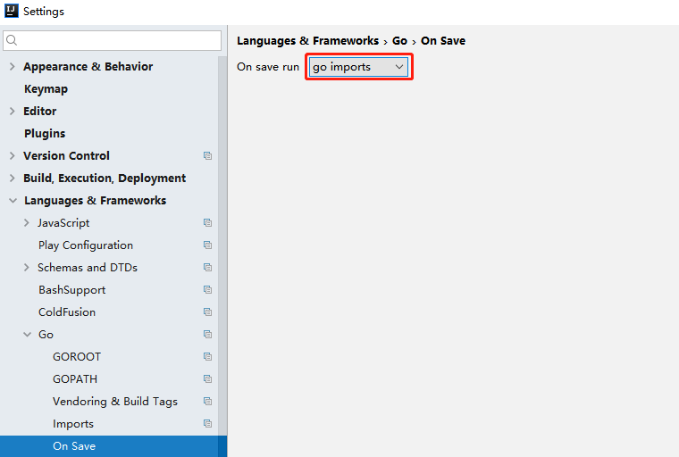 

- 使用go import 当导入新的包时，自动调用go get命令下载

- 如果go get无法下载文件，那么使用gopm获取无法下载的包

``` 
D:\go\gopath\src\learngo>go get -v github.com/gpmgo/gopm
```


### 目录结构

- src
  - git repository1
  - git repository2
- pkg
  - git repository1
  - git repository2
- bin
  - 执行文件1,2,3，...


# 面向接口

- go是一个面向接口的编程语言


## duck typing

- 描述事物的外部行为而非内部结构
- go属于结构化类型系统，类似duck typing


## 使用

```go
package main

import (
	"fmt"
)

type Person struct {
	Name string
	Age int
}

func (p Person) Say() string{
	return p.Name
}

func (p *Person) GetAge() int{ // 引用传递
	return p.Age
}

type P interface{
	Say() string
}

type M interface {
	GetAge() int
}

func main() {
	var p P
	p = Person{Name:"ss"} // 值接收者
	fmt.Println(p.Say())
	fmt.Printf("%T %v \n",p,p)

	var m M
	m = &Person{Name:"tt",Age:22} // 方法实现的是引用传递则必须传地址
	fmt.Println(m.GetAge())
	fmt.Printf("%T %v \n",m,m)
    
    // 接口转结构体对象
	pp := p.(Person) 
	fmt.Println(pp)
	mp := m.(*Person)
	fmt.Println(mp)
}
//
ss
main.Person {ss 0}  // 值接收者
22
*main.Person &{tt 22} // 对于引用传递，接口中存储的是地址
{ss 0}
&{tt 22}
```


## 转换

```go
package queue

type Queue []interface{} // 可以使任意类型

func (q *Queue) Push(v int) *Queue{
	// 指针接收者，接收的q和返回的q是不同的，与其他面向对象的语言不一样
	*q = append(*q,v)
	return q
}

func (q *Queue) Pop() int {
	head := (*q)[0]
	*q = (*q)[1:]
	return head.(int) // 转换为int
}

func (q *Queue) IsEmpty() bool {
	return len(*q) == 0
}
```


## 组合

```go
type Ainterface interface{
    Binterface
    Cinterface
}
```


## 常用系统接口

- print.go

```go
type Stringer interface{
    String() string
}
```

- io.go

```go
type Reader interface{
    Read(p []byte)(n int,err error)
}
type Writer interface{
    Write(p []byte)(n int,err error)   
}
type ReaderWriter interface{
    Reader
    Writer
}
```


# 函数式编程


## 函数式编程vs函数指针

- 函数式一等公民，参数，变量，返回值都可以是函数
- 高阶函数
- 函数->闭包


## 闭包

- 正统的函数式编程
  - 不可变性，不能有状态，只有常量和函数
  - 函数只能有一个参数

```go
package main

import "fmt"

// 写法1：闭包
func adder() func(int) int{
	sum := 0
	return func (i int) int {
		sum += i
		return sum
	}
}

// 写法2：正统函数式编程写法
type iAdder func(int) (int,iAdder)

// 没有变量，只有函数和常数
func adder2(base int) iAdder {
	return func(v int) (int,iAdder){
		return base +v,adder2(base + v)
	}
}

func main() {
	a := adder()
	a2 := adder2(0)
	for i:=0;i<10 ; i++ {
		fmt.Printf("0+1+...%d = %d \n",i,a(i))
		var r int
		r,a2 = a2(i)
		fmt.Printf("0+1+...%d = %d \n",i,r)
	}
}
```

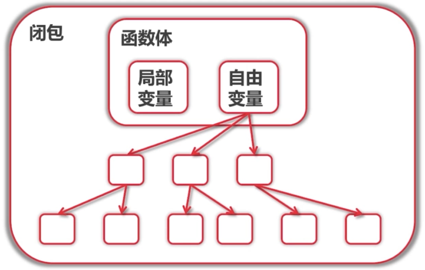 

- 在上个例子中sum是自由变量，每次调用生成一个连接关系，生成一个连接树

- python中的闭包
  - python原生支持闭包

```python
def adder():
    sum = 0
    def f(value):
        nonlocal sum
        sum += value
        return sum
    return f
```

- java中的闭包

```java
Function<Integer,Integer> addr(){
    final Holder<Integer> sum = new Holder<>(0); // 自定义一个Holder类
    return (Integer value) -> {
        sum.value += value;
        return sum.value;
    }
}
```

- 示例：斐波那契数列

```go
func fibonacci() intGen {
	a,b := 0,1
	return func() int{
		a,b = b,a+b
		return a
	}
}

type intGen func() int

// 特点：函数也可以实现接口
func (g intGen) Read(p []byte)(n int,err error){
	next := g()
	if next > 100 {
		return 0, io.EOF
	}
	s := fmt.Sprintf("%d\n",next)
	return strings.NewReader(s).Read(p)

}

func printFileContents(reader io.Reader){
	scanner := bufio.NewScanner(reader)
	for scanner.Scan(){
		fmt.Println(scanner.Text())
	}
}

func main() {
	f := fibonacci()
	printFileContents(f)
}
```

- 使用函数遍历二叉树

```go
// 通过封装函数，可以扩展遍历功能
func (node *Node) TraverseFunc(f func(*Node)) {
    if node == nil {
        return
    }
    node.Left.TraverseFunc(f)
    f(node)
    node.Right.TraverseFunc(f)
}

func (node *Node) Traverse(){
    node.TraverseFunc(func(n *Node) {
        n.Print()
    })
    fmt.Println()
}

func (node *Node) NodeCount() int{
    count := 0
    node.TraverseFunc(func(n *Node){
        count ++
    })
    return count
}
```


# 资源管理


## defer

- defer栈，先进后出
- 注意调用的顺序，特别是file的操作
- 建立什么，就调用defer
- 何时调用defer
  - Open，Close
  - Lock，Unlock
  - PrintHeader，PrintFooter

```go
package main

import "fmt"

func tryDefer(){
	defer fmt.Println(1)
	defer fmt.Println(2)
	fmt.Println(3)
    panic("error occurred")
	fmt.Println(4)
}

func main() {
	tryDefer()
}
// result
3
2 
1 // 先进后出
panic: error occurred
```


# 错误处理

- error是一个接口

```go
type error interface {
    Error() string
}
```

- 错误处理

```go
file,err := os.Open("aa.txt")
if err != nil {
    if pathError, ok := err.(*os.PathError);ok {
        fmt.Println(pathError.Err)
    }else {
        fmt.Println("unknown error",err)
    }
}
```


## 统一错误处理

- 示例：读取本地服务的内容，在浏览器上输入/list/xxx，读取xxx文件的内容

- main.go

```go
package main

import (
	"learngo/errhandling/filelistingserver/filelisting"
	"net/http"
	"os"

	"github.com/gpmgo/gopm/modules/log"
)

func main() {

	// 通过url访问文件
	http.HandleFunc("/list/", errWrapper(filelisting.HandlerFileList))

	err := http.ListenAndServe(":8888", nil)
	if err != nil {
		panic(err)
	}
}

// 给HandlerFileList方法设置一个类型，使用函数式编程，函数做为参数和返回值
type appHandler func(writer http.ResponseWriter, request *http.Request) error

// 处理异常
func errWrapper(handler appHandler) func(http.ResponseWriter, *http.Request) {
	return func(writer http.ResponseWriter, request *http.Request) {
		err := handler(writer, request)
		if err != nil {
			log.Warn("Error handling request: %s", err.Error())
			code := http.StatusOK
			switch {
			case os.IsNotExist(err):
				code = http.StatusNotFound
			case os.IsPermission(err):
				code = http.StatusForbidden
			default:
				code = http.StatusInternalServerError
			}
			http.Error(writer, http.StatusText(code), code)
		}
	}
}
```

- handler.go

```go
package filelisting

import (
	"io/ioutil"
	"net/http"
	"os"
)

func HandlerFileList(writer http.ResponseWriter, request *http.Request) error {
	path := request.URL.Path[len("/list/"):] //去除list前缀，获取文件路径
	file, error := os.Open(path)
	if error != nil {
		//panic(error)
		// 将服务器给外部显示，不友好
		//http.Error(writer,error.Error(),http.StatusInternalServerError)
		// 将异常抛出
		return error
	}
	defer file.Close()
	all, error := ioutil.ReadAll(file)
	if error != nil {
		//panic(error)
		return error
	}
	writer.Write(all)
	return nil
}
```

- 测试：http://localhost:8888/list/basic/loop.go 输出该文件


## panic

- 停止当前函数执行
- 一直向上返回，执行每一层defer
- 如果没有碰到recover，程序退出
- 少用


## recover

- 只在defer调用中使用
- 获取panic的值
- 如果无法处理，可重新panic

```go
package main

import (
	"fmt"
)

func tryRecover() {
	defer func() {
		r := recover()
		if err, ok := r.(error); ok {
			fmt.Println("error ocurred:", err)
		} else {
			panic(fmt.Sprintf("how to do? %v",r))
		}
	}()

	//panic(errors.New("this is an error"))
	//b := 0
	//a := 5/b
	//fmt.Println(a)
	panic(123) // recover后再次panic
}

func main() {
	tryRecover()
}
// 
panic: 123 [recovered]
	panic: how to do? 123

goroutine 1 [running]:
main.tryRecover.func1()
...
```

- 修改统一错误处理，更加健壮
- main.go

```go
package main

import (
	"learngo/errhandling/filelistingserver/filelisting"
	"net/http"
	"os"

	"github.com/gpmgo/gopm/modules/log"
)

func main() {

	// 通过url访问文件
	http.HandleFunc("/", errWrapper(filelisting.HandlerFileList))

	err := http.ListenAndServe(":8888", nil)
	if err != nil {
		panic(err)
	}
}

// 给HandlerFileList方法设置一个类型，使用函数式编程，函数做为参数和返回值
type appHandler func(writer http.ResponseWriter, request *http.Request) error

// 处理异常
func errWrapper(handler appHandler) func(http.ResponseWriter, *http.Request) {
	return func(writer http.ResponseWriter, request *http.Request) {
		
        // 增加recover的异常处理，针对panic的处理
		defer func() {
			r := recover()
			if r != nil {
				log.Warn("panic :%v", r)
				http.Error(writer, http.StatusText(http.StatusInternalServerError),
					http.StatusInternalServerError)
			}
		}()
        
		err := handler(writer, request)
		if err != nil {
			log.Warn("Error handling request: %s", err.Error())

			// 如果错误是userError，自定义错误
			if userErr, ok := err.(userError); ok {
				http.Error(writer,
					userErr.Message(), // 获取Message消息
					http.StatusBadRequest)
				return
			}

			code := http.StatusOK
			switch {
			case os.IsNotExist(err):
				code = http.StatusNotFound
			case os.IsPermission(err):
				code = http.StatusForbidden
			default:
				code = http.StatusInternalServerError
			}
			http.Error(writer, http.StatusText(code), code)
		}
	}
}

// 用户可见的错误，此处的userError和handler.go中的userError是不一样的
type userError interface {
	error            // 系统看 含有系统的Error方法
	Message() string // 用户看
}
```

- handler.go

```go
package filelisting

import (
	"io/ioutil"
	"net/http"
	"os"
	"strings"
)

const prefix = "/list/"

// 封装一个userError类型
type userError string

// 该方法与error接口一致
func (e userError) Error() string {
	return e.Message()
}

func (e userError) Message() string {
	return string(e)
}

func HandlerFileList(writer http.ResponseWriter, request *http.Request) error {

	if strings.Index(request.URL.Path, prefix) != 0 {
		// 返回自定义错误
		return userError("path must start with" + prefix)
	}

	path := request.URL.Path[len(prefix):] //去除list前缀，获取文件路径
	file, error := os.Open(path)
	if error != nil {
		//panic(error)
		// 将服务器给外部显示，不友好
		//http.Error(writer,error.Error(),http.StatusInternalServerError)
		// 将异常抛出
		return error
	}
	defer file.Close()
	all, error := ioutil.ReadAll(file)
	if error != nil {
		//panic(error)
		return error
	}
	writer.Write(all)
	return nil
}
```


## error vs panic

- 意料之中使用error，如文件打不开
- 意料之外使用panic，如数组越界


# 关于测试

- 多做测试，减少调试


## 传统测试

```java
@Test
public void testAdd(){
    assertEquals(4,add(1,3));
    assertEquals(2,add(0,2));
}
```

- 缺点
  - 测试数据和测试逻辑在一起
  - 出错信息不明确
  - 一旦一个数据出错，则全部结束


## 表格驱动测试

```go
test := []struct {
    a,b,c int32
}{
    {1,2,3},
    {3,4,7},
    {math.MaxInt32,1,math.MinInt32},
}
for _,test:= range tests {
    if actual := add(test.a,test.b);actual != test.c {
        ...
    }
}
```

- 分离测试数据和测试逻辑
- 明确的出错信息
- 可以部分失败
- go语法更表格驱动测试更简单


示例

```go
package test

import (
	"testing"
)

// 必须Test开头
func TestTriangle(t *testing.T){
	tests := []struct{a,b,c int}{
		{3,4,5},
		{5,12,13},
		{8,15,17},
		{12,33,4},
		{20000,30000,50000},
	}

	for _,te := range tests {
		if actual := Triangle(te.a,te.b); actual != te.c {
			t.Errorf("triangle(%d,%d) got %d expected %d",te.a,te.b,actual,te.c)
		}
	}

}
```

```go
package test

import "math"

func Triangle(a,b int) int {
	return int(math.Sqrt(float64(a*a+b*b)))
}
```

- 测试

```bash
D:\go\gopath\src\learngo\test>go test
--- FAIL: TestTriangle (0.00s)
        triangle_test.go:19: triangle(12,33) got 35 expected 4
        triangle_test.go:19: triangle(20000,30000) got 36055 expected 50000
FAIL
exit status 1
FAIL    learngo/test    0.334s
```


## 代码覆盖率

- 使用命令

```bash
go test -coverprofile=c.out
```

- 使用go tool cover 查看生成的c.out文件，会弹出一个网页显示

```bash
go tool cover -html=c.out
```


## 性能测试

```go
// 性能测试，必须Benchmark开头
func BenchmarkTriangle(b *testing.B) {
    
    b.Logf("可以自定义日志输出")
    b.ResetTimer() // 计时可以重置
    
	// 执行多少由Benchmark决定
	for i := 0; i < b.N; i++ {
		if actual := Triangle(3, 4); actual != 5 {
			b.Errorf("triangle(%d,%d) got %d expected %d", 3, 4, actual, 5)
		}
	}

}
// 
goos: windows
goarch: amd64
pkg: learngo/test
2000000000	         1.41 ns/op // 运行20亿次，每个op花费1.41ns
PASS
```

- 使用命令行

```bash
D:\go\gopath\src\learngo\test>go test -bench .
```


## 性能调优

```bash
go test -bench . -cpuprofile cpu.out
# 生成一个cpu.out的二进制文件
```

- 查看文件，需要安装Graphviz，配置环境变量

```bash
go tool pprof cpu.out

(pprof) web # 生成一个svg文件
Failed to execute dot. Is Graphviz installed? Error: exec: "dot": executable file not found in %PATH%

```

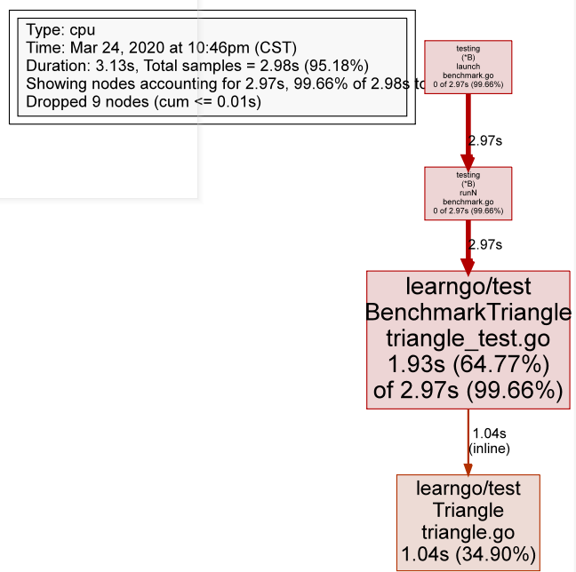 

- 框越大，耗费的时间越久


## http测试

- 测试之前的errorWrapper函数

```go
package main

import (
	"errors"
	"fmt"
	"io/ioutil"
	"learngo/errhandling/filelistingserver/filelisting"
	"net/http"
	"net/http/httptest"
	"os"
	"strings"
	"testing"
)

// 返回一个panic异常
func errPanic(writer http.ResponseWriter, request *http.Request) error {
	panic(122)
}

func errUserError(writer http.ResponseWriter, request *http.Request) error {
	return filelisting.UserError("user error")
}

func errNotFound(writer http.ResponseWriter, request *http.Request) error {
	return os.ErrNotExist
}

func errNotPermission(writer http.ResponseWriter, request *http.Request) error {
	return os.ErrPermission
}

func errUnknown(writer http.ResponseWriter, request *http.Request) error {
	return errors.New("Unknown error")
}

func noError(writer http.ResponseWriter, request *http.Request) error {
	fmt.Fprintln(writer, "no error")
	return nil
}

var tests = []struct {
	h       appHandler // 函数类型，放入函数
	code    int
	message string
}{
	{errPanic, 500, "Internal Server Error"},
	{errUserError, 400, "user error"},
	{errNotFound, 404, "Not Found"},
	{errNotPermission, 403, "Forbidden"},
	{errUnknown, 500, "Internal Server Error"},
	{noError, 200, "no error"},
}

func TestErrWrapper(t *testing.T) {
	// httptest.NewRecorder()本质上是一个responseWriter

	for _, tt := range tests {
		f := errWrapper(tt.h)
		response := httptest.NewRecorder()
		request := httptest.NewRequest(
			http.MethodGet,
			"http://www.baidu.com",
			nil,
		)
		// 将结果返回到response中
		f(response, request)

		b, _ := ioutil.ReadAll(response.Body)
		body := strings.Trim(string(b), "\n")
		if response.Code != tt.code || body != tt.message {
			t.Errorf("expect (%d ,%s) got (%d, %s)",
				tt.code, tt.message, response.Code, body)
		}
	}
}

// 使用启动一个server来测试，使用假的response和request
func TestErrWrapperInServer(t *testing.T) {

	for _, tt := range tests {
		f := errWrapper(tt.h)
		server := httptest.NewServer(http.HandlerFunc(f))
		fmt.Println(server.URL)
		resp, _ := http.Get(server.URL)

		b, _ := ioutil.ReadAll(resp.Body)
		body := strings.Trim(string(b), "\n")
		if resp.StatusCode != tt.code || body != tt.message {
			t.Errorf("expect (%d ,%s) got (%d, %s)",
				tt.code, tt.message, resp.StatusCode, body)
		}
	}
}
```

- 方式1：通过使用假的Request/Response
- 方式2：通过起一个服务器


## 文档

- 使用命令行查看方法

```bash
D:\go\gopath\src\learngo\queue>go doc Queue
type Queue []interface{}

func (q *Queue) IsEmpty() bool
func (q *Queue) Pop() int
func (q *Queue) Push(v int) *Queue
```

- 使用命令行访问帮助页面

```go
D:\go\gopath\src\learngo\queue>godoc -http :6060
```

- 访问localhost:6060

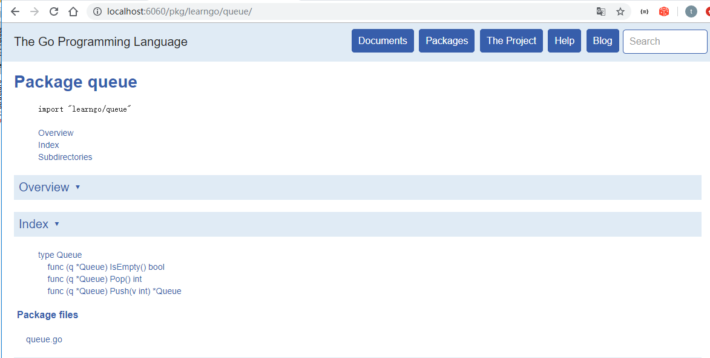

- 如果编写的方法需要demo需要编写Example，会在网页上显示成Example

```go
func ExampleQueue_Pop(){
    q:= Queue{1}
    q.Push(1)
    ...
    
    // Output: 使用Output表示输出结果
    // 1
    // 2
}
```


# goroutine 非抢占式

```go
package main

import (
	"fmt"
	"time"
)

func main() {
	for i := 0; i < 1000; i++ {
		go func(i int) { // i需要传参，否则会形成闭包，那么最终所有的goroutine的i都是1000
			fmt.Println("i=",i)
		}(i)
	}

	time.Sleep(time.Millisecond)
}
```

- 轻量级线程
- **非抢占式**多任务处理，由协程主动交出控制权
- 编译器，解释器，虚拟机层面的多任务
- 多个协程可能在一个或多个线程上运行

- 使用命令检测代码可能存在的风险

```go
go run -race goroutine.go
```


## 调度器


- 任何函数只需要加上go可以送给调度器运行
- 不需要再定义时区分是否异步函数
- 调度器在合适的点进行切换
- 使用-race来检测数据访问冲突


### goroutine可能切换的点

- I/O
  - print
- select
- channel
- 等待锁
- 函数调用（有时）
- runtime.Gosched() 手动切换的点
- ...


# channel

- channel
- buffered channel
- range 读取channel
- 理论基础：communication Sequential Process(CSP)
  - go并发基于CSP模型
  - 不要通过共享内存来通信，通过通信来共享内存

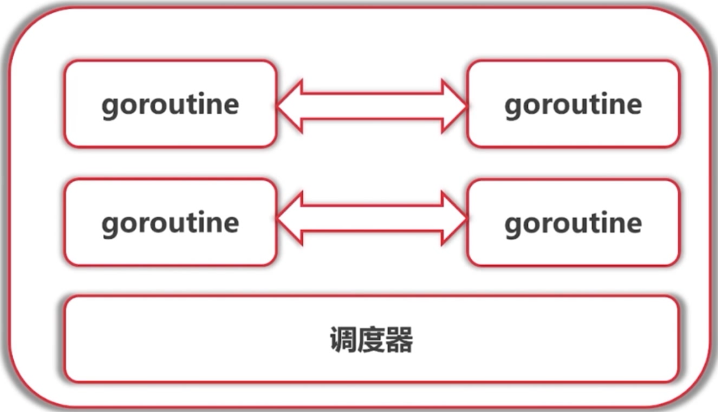 

```go
package main

import (
	"fmt"
	"time"
)

func chanDemo() {
	//var c chan int // c == nil
	c := make(chan int)

	// 接收数据
	go func() {
		for {
			n := <-c
			fmt.Println(n)
		}
	}()

	// 发送数据
	go func() {
		for {
			c <- 1
			time.Sleep(time.Millisecond)
		}
	}()

	c <- 1
	c <- 2
}

// 接收一个channel
func work(id int, c chan int) {
	for {
		n, ok := <-c
		if !ok { // 如果收不到消息则退出,当channel被close时有效，没有close则会阻塞
			break
		}
		fmt.Printf("worker %d received %d \n", id, n)
	}
	// 方式2 
	//for n:= range c {
	//	fmt.Printf("worker %d received %d \n", id, n)
	//}
}

func chanDemo2() {
	var channels [10]chan int
	for i := 0; i < 10; i++ {
		channels[i] = make(chan int)
		go work(i, channels[i])
	}

	for i := 0; i < 10; i++ {
		channels[i] <- 'a' + i
	}
	for i := 0; i < 10; i++ {
		channels[i] <- 'A' + i
	}
	time.Sleep(time.Millisecond)
}

// 返回一个channel
func createWorker(id int) chan int {
	c := make(chan int)
	go func() {
		for {
			fmt.Printf("worker %d received %c \n", id, <-c)
		}
	}()
	return c
}

func chanDemo3() {
	var channels [10]chan int
	for i := 0; i < 10; i++ {
		channels[i] = createWorker(i)
	}

	for i := 0; i < 10; i++ {
		channels[i] <- 'a' + i
	}
	for i := 0; i < 10; i++ {
		channels[i] <- 'A' + i
	}
	time.Sleep(time.Millisecond)
}

// 该chan只能收数据，<-chan表示只能发送数据
func createWorker2(id int) chan<- int {
	c := make(chan int)
	go func() {
		for {
			fmt.Printf("worker %d received %c \n", id, <-c)
		}
	}()
	return c
}

func bufferedChannel() {
	c := make(chan int, 3)
	c <- 1
	c <- 2
	c <- 3
	c <- 4 // 此时产生deadlock
}

func channlClose() {
	c := make(chan int, 3)
	go work(0, c)
	c <- 1
	c <- 2
	c <- 3
	close(c) // 关闭后会一直接收到空串，或者0
	time.Sleep(time.Millisecond)

}

func main() {
	//chanDemo3()
	channlClose()
	time.Sleep(time.Second * 1)
}
```


## 通知任务结束

- 添加一个标志位channel通知结束

```go
package main

import (
	"fmt"
)

type worker struct {
	in   chan int
	done chan bool
}

func doWork(id int, c chan int, done chan bool) {
	for n := range c {
		fmt.Printf("worker %d received %c \n", id, n)
		go func() { done <- true }() // 需要异步处理，由于要<-done多次，发送该数据后阻塞

	}
}

func createWorker(id int) worker {
	w := worker{
		in:   make(chan int),
		done: make(chan bool),
	}
	go doWork(id, w.in, w.done)
	return w
}

func chanDemo() {

	var workers [10]worker

	for i := 0; i < 10; i++ {
		workers[i] = createWorker(i)
	}
	for i, worker := range workers {
		worker.in <- 'a' + i
		//<-workers[i].done
	}
	for i, worker := range workers {
		worker.in <- 'A' + i
		//<-workers[i].done
	}

	for _, worker := range workers {
		<-worker.done // 取出后才可以继续放入值，否则阻塞
		<-worker.done
	}

}

func main() {
	chanDemo()
}
```


### waitGroup

- 使用waitGroup处理通信问题

```go
package main

import (
	"fmt"
	"sync"
)

type worker struct {
	in chan int
	wg *sync.WaitGroup
}

func doWork(id int, c chan int, wg *sync.WaitGroup) {
	for n := range c {
		fmt.Printf("worker %d received %c \n", id, n)
		wg.Done()
	}
}

func createWorker(id int, wg *sync.WaitGroup) worker {
	w := worker{
		in: make(chan int),
		wg: wg,
	}
	go doWork(id, w.in, wg)
	return w
}

func chanDemo() {

	var workers [10]worker

	var wg sync.WaitGroup

	for i := 0; i < 10; i++ {
		workers[i] = createWorker(i, &wg)
	}

	wg.Add(20) // 共20个任务
	for i, worker := range workers {
		worker.in <- 'a' + i
	}
	for i, worker := range workers {
		worker.in <- 'A' + i
	}
	// 最后等待add结束，收到所有的done
	wg.Wait()
}

func main() {
	chanDemo()
}
```

- 对上一个例子进行优化

```go
type worker struct {
	in chan int
	done func()
}

func doWork(id int, worker worker) {
	for n := range worker.in {
		fmt.Printf("worker %d received %c \n", id, n)
		worker.done()
	}
}

func createWorker(id int, wg *sync.WaitGroup) worker {
	w := worker{
		in: make(chan int),
		done: func() {
			wg.Done()
		},
	}
	go doWork(id, w)
	return w
}
```


## select 调度

- 特点
  - case中读和写的channel准备好了就输出，否则会loop
    - 注意：在没有default:的情况下，否则会直接走default分支

```go
package main

import (
	"fmt"
	"time"
	"math/rand"
)

func generator() chan int{
	out := make(chan int)
	go func() {
		i := 0
		for {
			time.Sleep(time.Duration(rand.Intn(1500))*time.Millisecond)
			out <- i
			i ++
		}
	}()
	return out
}

func main() {

	//var c1, c2 chan int // c1 and c2 = nil

	var c1,c2 = generator(),generator()

	// 非阻塞式的获取,谁先到先取谁
	for {
		select {
		case n := <-c1:
			fmt.Println("received from c1:", n)
		case n := <-c2:
			fmt.Println("received from c2:", n)
		//default:
		//	fmt.Println("no received")
		}
	}
}
```

- 改进，添加一个接收者

```go
package main

import (
	"fmt"
	"math/rand"
	"time"
)

func work(id int, c chan int) {
	for n := range c {
		fmt.Printf("worker %d received %d \n", id, n)
	}
}
func createWorker(id int) chan int {
	c := make(chan int)
	go work(id, c)
	return c
}

func generator() chan int {
	out := make(chan int)
	go func() {
		i := 0
		for {
			time.Sleep(time.Duration(rand.Intn(1500)) * time.Millisecond)
			out <- i
			i++
		}
	}()
	return out
}

func main() {
	var c1, c2 = generator(), generator()
	w := createWorker(0)
	// 非阻塞式的获取,谁先到先取谁
	for {
		select {
		case n := <-c1:
			w <- n // 缺点，执行一个case后，在放入w中会阻塞
		case n := <-c2:
			w <- n
		}
	}
}
```

- 接收者有阻塞，考虑发送是非阻塞的，接收也做成非阻塞的

```go
func main() {
	var c1, c2 = generator(), generator()
	var worker = createWorker(0)
	n := 0
	hasValue := false
	for {
		var activeWorker chan int // nil channel 会阻塞
		if hasValue {
			activeWorker = worker
		}

		select {
		case n = <-c1: //如果生成的速率过快，消耗的速率慢，n收到了1,2,3,那么最后只有3生效
			hasValue = true
		case n = <-c2:
			hasValue = true
		case activeWorker <- n:  // 如果是nil channel则不作任何操作，阻塞住，跳过case
			hasValue = false
		}
	}
}
```

- 解决上面接收的问题
  - 添加定时器进行检测

```go
func main() {
	var c1, c2 = generator(), generator()

	var worker = createWorker(0)
	// 进行缓存，不同的消耗速度
	var values []int
	// 定时器
	tm := time.After(10 * time.Second) // 10s后结束，是一个channel，10后接收到一个数据
	tick := time.Tick(time.Second)
	for {
		var activeWorker chan int // nil channel 会阻塞
		var activeValue int
		if len(values) > 0 {
			activeWorker = worker
			activeValue = values[0]
		}
		select { // select 内部有 loop ，碰到输出和写入的channel就退出
		case n := <-c1: // 不可读，则跳过case
			values = append(values, n)
		case n := <-c2:
			values = append(values, n)
		case activeWorker <- activeValue: // 如nil channel则不作任何操作，不可写跳过case
			values = values[1:]
		case <-time.After(800 * time.Millisecond): // 每次select进行一个超时统计，800ms
			fmt.Println("timeout")
		case <-tick: // 每隔1s给一个值
			fmt.Println("queue len = ", len(values)) // 每隔1s统计len
		case <-tm:
			fmt.Println("finish") // 从程序开始总的时间
			return
		}
	}
}
```

- 调度流程：该函数执行逻辑大致如下

  - 锁定scase语句中所有的channel
  - 按照随机顺序检测scase中的channel是否ready
    - 如果case可读，则读取channel中数据，解锁所有的channel，然后返回(case index)
    - 如果case可写，则将数据写入channel，解锁所有的channel，然后返回(case index)
    - 所有case都未ready，则解锁所有的channel，然后返回（default index）

  - 所有case都未ready，且没有default语句
    - 将当前协程加入到所有channel的等待队列
    - 当将协程转入阻塞，等待被唤醒

  - 唤醒后返回channel对应的case index
    - 如果是读操作，解锁所有的channel，然后返回(case index)
    - 如果是写操作，解锁所有的channel，然后返回(case index)

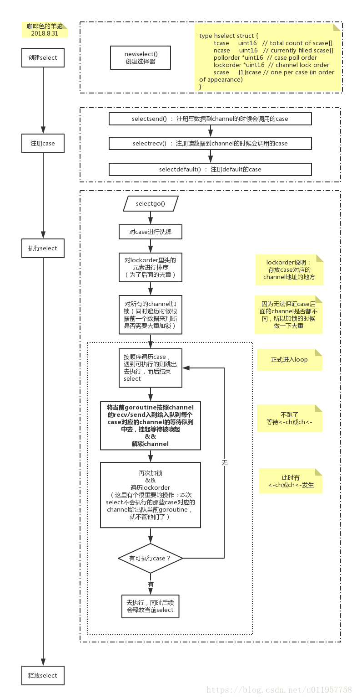 

## 传统同步机制：锁

- 很少使用
- 使用共享内存的方式
  - WaitGroup
  - Mutex
  - Cond

### Mutex

```go
package main

import (
	"fmt"
	"sync"
)

type atomicInt struct {
	value int
	lock  sync.Mutex
}

func (a *atomicInt) increment() {
	a.lock.Lock()
	defer a.lock.Unlock()
	a.value++
}

// 如果要将锁控制在代码块中，需要一个匿名函数
func (a *atomicInt) increment2() {
	func() {
		a.lock.Lock()
		defer a.lock.Unlock()
		a.value++
	}()
}

func (a *atomicInt) get() int {
	a.lock.Lock()
	defer a.lock.Unlock()
	return int(*a)
}

func main() {

	var a atomicInt
	a.increment()
	go func() {
		a.increment()
	}()

	fmt.Println(a.get())
}

// 使用go run -race atomic.go 查看风险
```


# http标准库

```go
package main

import (
	"fmt"
	"net/http"
	"net/http/httputil"
)

func main() {
	request, err := http.NewRequest(http.MethodGet,"http://www.imooc.com", nil)
	request.Header.Add("User-Agent","Mozilla/5.0 (iPhone; CPU iPhone OS 10_3 like Mac OS X) AppleWebKit/602.1.50 (KHTML, like Gecko) CriOS/56.0.2924.75 Mobile/14E5239e Safari/602.1")

	client := http.Client{
		CheckRedirect: func(
			req *http.Request,
			via []*http.Request) error {
			fmt.Println("Redirect:", req)
			return nil
		},
	}
	resp, err := client.Do(request)
	if err != nil {
		panic(err)
	}
	defer resp.Body.Close()

	s, err := httputil.DumpResponse(resp, true)
	if err != nil {
		panic(err)
	}

	fmt.Printf("%s\n", s)
}
```


## http服务器性能分析

- import _ "net/http/pprof"
- 访问/debug/pprof/
- 使用go tool pprof 分析性能，查看pprof.go 获得帮助文档

```go

```


# 其他标准库

- bufio
- log
- encoding/json
- regexp
- time
- strings
- math
- rand

查看文档

- godoc -http:8888
  - 查看本地在线文档


# 算法：广度优先算法

- 为爬虫做准备

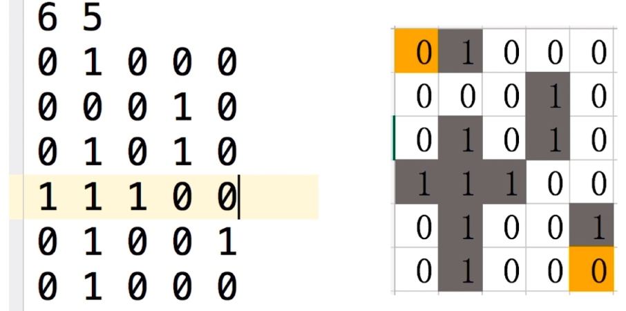 

- 左上角是入口，右下角是出口
- 通过0的点找到1的点，再遍历所有1的点找到2的点，顺序上左下右寻找

 

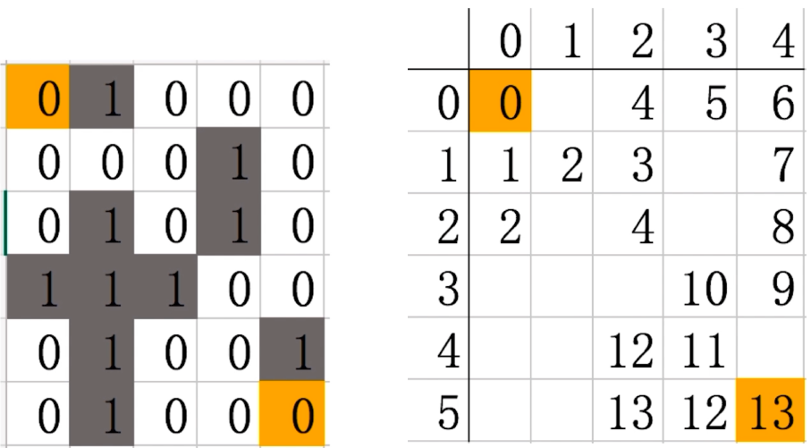 

- 使用一个队列，每次从外部访问到的点放入队列中
- 何时结束？
  - 当走到终点
  - 当所有的点遍历完成，或者队列为空
- 如何得到路径
  - 从终点开始往回走
  - 从起点到终点，是发散的，而从终点往回是收敛的，会找到较短的路径

- 输入

```go
6 5
0 1 0 0 0
0 0 0 1 0
0 1 0 1 0
1 1 1 0 0
0 1 0 0 1
0 1 0 0 0
```

- 关于探索
  - 赋值为2
  - 将赋值的点添加到队列中

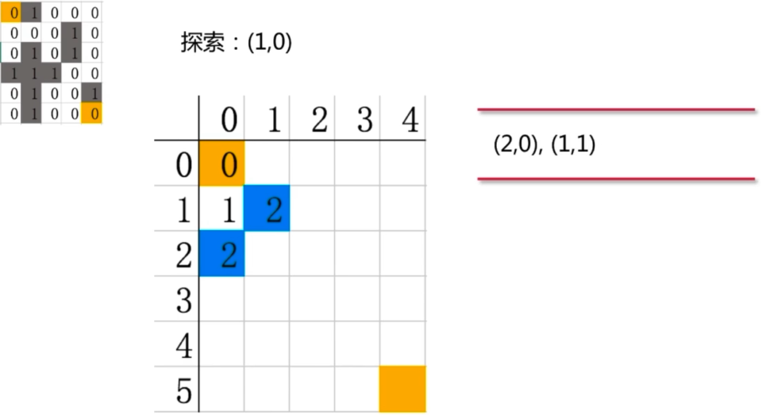 

- 实现
  - 使用循环创建二维slice
  - 使用slice创建队列
  - 使用Fscanf读取文件
  - 使用point抽象，增加可读性

```go
package main

import (
	"fmt"
	"os"
)

func main() {

	// 注意读取的maze.in文件是LF换行，否则读取时会将\r\n转换为0 \n
	maze := readMaze("maze/maze.in")

	for _, row := range maze {
		for _, val := range row {
			fmt.Printf("%3d", val)
		}
		fmt.Println()
	}

	fmt.Println("--------------")

	start := point{0, 0}
	end := point{len(maze) - 1, len(maze[0]) - 1}
	steps := walk(maze, start, end)

	for _, row := range steps {
		for _, val := range row {
			fmt.Printf("%3d", val)
		}
		fmt.Println()
	}


	fmt.Println("--------------")
	// 输出多少步可以走出，以及路线
	routes := route(steps, start, end)
	for i:= len(routes) - 1;i>=0;i--{
		fmt.Println(routes[i])
	}

}
func route(steps [][]int, start point, end point) []point {
	cur := end
	routes := []point{cur}

	for {
		nextValue := cur.valueAt(steps) - 1
		// 从周边的点遍历
		for _, dir := range dirs {
			next := cur.add(dir)
			val, ok := next.at(steps)
			if !ok{
				continue
			}
			if val == nextValue {
				routes = append(routes, next)
				cur = next
				break
			}
		}
		if cur.equals(start) {
			break
		}
	}

	return routes
}

func readMaze(filename string) [][]int {

	file, err := os.Open(filename)
	if err != nil {
		panic(err)
	}
	defer file.Close()

	var row, col int
	// 读取行和列
	fmt.Fscanf(file, "%d %d", &row, &col)

	maze := make([][]int, row) // 行
	// 列初始化
	for i := range maze {
		maze[i] = make([]int, col)
		for j := range maze[i] {
			fmt.Fscanf(file, "%d", &maze[i][j])
		}
	}
	return maze
}

type point struct {
	i, j int
}

// 读取当前节点的4个方向位置
var dirs = [4]point{
	{-1, 0}, {0, -1}, {1, 0}, {0, 1}, // 上左下右
}

func (p point) add(r point) point {
	return point{p.i + r.i, p.j + r.j}
}

// 表示p是否在grid中
// 第二个参数表示有没有值
func (p point) at(grid [][]int) (int, bool) {

	if p.i < 0 || p.i >= len(grid) {
		return 0, false
	}
	if p.j < 0 || p.j >= len(grid[p.i]) {
		return 0, false
	}
	return grid[p.i][p.j], true
}

func (p point) valueAt(grid [][]int) int {
	val, ok := p.at(grid)
	if !ok {
		panic("无效的点" + string(p.i) + " " + string(p.j))
	}
	return val
}

func (p point) equals(d point) bool {
	return p.i == d.i && p.j == d.j
}

func walk(maze [][]int, start, end point) [][]int {
	steps := make([][]int, len(maze)) // 用于填写值,走过的路径
	// 对step进行初始化，全部都是0
	// 除了起点的0，其他的0表示无效
	for i := range steps {
		steps[i] = make([]int, len(maze[i]))
	}
	// 将起点放入队列中
	Q := []point{start}

	var cur point

	for len(Q) > 0 { // 如果Q不为空，表示还有点需要探索
		cur = Q[0]
		Q = Q[1:]

		if cur.equals(end) { // 发现终点
			break
		}

		for _, dir := range dirs {
			//next := cur + dir // 没有操作符重载，需要自定义方法
			next := cur.add(dir)
			// 探索下一个节点 maze中下一个节点是0 and steps at next is 0 and next != start
			// maze 中节点为0表示可以走，steps中节点为0表示没有走过，可以走
			// next节点也不能等于start
			val, ok := next.at(maze)
			if !ok || val == 1 {
				// 说明该点不能探索
				continue
			}
			val, ok = next.at(steps)
			if !ok || val != 0 {
				// 说明走过了
				continue
			}
			if next.equals(start) {
				// 到原点了
				continue
			}
			// 获取当前在steps中的值+1
			steps[next.i][next.j] = cur.valueAt(steps) + 1
			// 将next添加到队列中
			Q = append(Q, next)
		}
	}

	if cur.equals(end) {
		fmt.Println("需要走", cur.valueAt(steps), "步到达终点")
	} else {
		fmt.Println("没有走到终点")
	}

	return steps
}
```