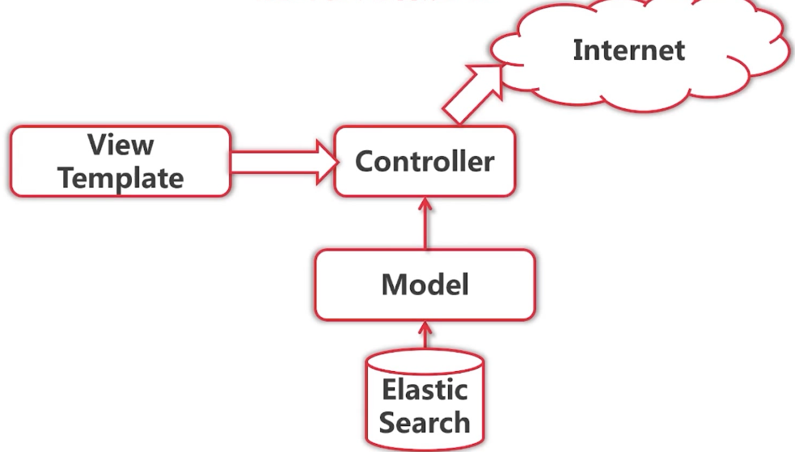
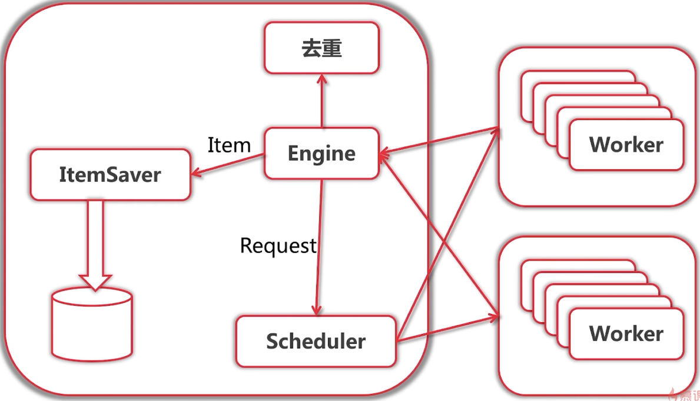

# 爬虫分类

- 通用爬虫
  - 如baidu,google
- 聚焦爬虫，从或互联网获取结构化数据，获取有价值的数据
  - 聚焦爬虫的作用，把网页转换为结构化的数据


# 项目总体结构

 

- go语言的爬虫的库
  - henrylee2cn/pholcus
  - colly
  - gocrawl
  - hu17889/go_spider

- 练习不使用爬虫库和框架
- 使用ES做数据存储
- 使用go语言的标准模板库实现http数据展示部分
- 爬虫主题
  - 爬取内容：新闻，博客，社区
  - 爬取人：qq空间，人人网，微博，微信，facebook
    - 动态网页，难以爬取
  - 求职网站，相亲网站爬取
  - 考虑隐私问题，爬取相亲网站，降低法律法规风险

- 尝试人工获取内容
  -  珍爱网
    - 通过城市列表->城市->(下一页)->用户
    - 通过用户->猜你喜欢
    - 通过已有用户id+1来猜测用户id
    - 过滤相同的用户，防止往回指向

 

   


# 单任务版爬虫

- 获取打印所有城市第一页用户的详细信息

- 需要下载扩展包

```bash
gopm get -g -v golang.org/x/text
go get golang.org/x/net/html
```

- 简单实验

```go
package main

import (
	"fmt"
	"io/ioutil"
	"net/http"
	"bufio"
	"regexp"
	"log"
	"golang.org/x/net/html/charset"
	"golang.org/x/text/encoding"
	"golang.org/x/text/encoding/unicode"
	"golang.org/x/text/transform"
)

func main() {
	resp, err := http.Get("http://www.zhenai.com/zhenghun")
	if err != nil {
		panic(err)
	}
	defer resp.Body.Close()

	if resp.StatusCode != http.StatusOK {
		fmt.Println("error: status code", resp.StatusCode)
		return
	}

	// 不做处理
	//all, err := ioutil.ReadAll(resp.Body)

	// 如果是<meta charset="GBK">编码的网页需要进行utf-8转换
	//utf8Reader := transform.NewReader(resp.Body, simplifiedchinese.GBK.NewDecoder())

	// 自动检测格式
	reader := bufio.NewReader(resp.Body)
	e := determineEncoding(reader)

	utf8Reader := transform.NewReader(reader, e.NewDecoder())
	all, err := ioutil.ReadAll(utf8Reader)

	if err != nil {
		panic(err)
	}

	fmt.Printf("%s \n", all)
	//printCityList(all)

}

// 打印城市列表
func printCityList(contents []byte) {
	compile := regexp.MustCompile(`<a href="(http://www.zhenai.com/zhenghun/[a-z0-9]+)" [^>]*>([^<]+)</a>`)
	all := compile.FindAllSubmatch(contents, -1) // [][][]byte
	for _, m := range all {
		//for _,subM := range m {
		//	fmt.Printf("%s ",subM)
		//}
		//fmt.Println()
		fmt.Printf("city:%s url:%s \n", m[2], m[1])
	}
	fmt.Println("matches found :", len(all))
}

// 确定网页的编码
func determineEncoding(reader *bufio.Reader) encoding.Encoding {
	// 读取开头1024个字节，用于DetermineEncoding方法的鉴别编码格式
	//peek是对bufio.Reader来说的，而非原始的reader，
	// 对bufio.Reader而言是从头读
	bytes, err := reader.Peek(1024)
	if err != nil {
		//panic(err)
		log.Printf("Fetcher error:%v ", err)
		return unicode.UTF8
	}
	e, _, _ := charset.DetermineEncoding(bytes, "")
	return e
}
```


 

- 解析器 Parser
  - 输入：utf-8编码的文本
  - 输出：Request{URL,对应的Parser} 列表，Item列表

 


## 正则表达式

```go
package main

import (
	"fmt"
	"regexp"
)

func main() {

	// 测试邮件
	const text = `my email is ccs@gmail.com xx@abc.com
	ffdsf sss@qq.com
	add@abc.com.cn
	`

	// 写法1
	//compile := regexp.MustCompile(".+@.+\\..+")

	// 写法2
	compile := regexp.MustCompile(`[a-zA-z0-9]+@[a-zA-z0-9.]+\.[a-zA-z0-9]+`)
	//match := compile.FindString(text) // 得到第一匹配的
	match := compile.FindAllString(text, -1) // 找到所有的 -1 表示所有
	fmt.Println(match)

	// 写法3，提取

	compile = regexp.MustCompile(`([a-zA-z0-9]+)@([a-zA-z0-9]+)(\.[a-zA-z0-9.]+)`)
	submatch := compile.FindAllStringSubmatch(text, -1)
	for _,m := range submatch {
		fmt.Println(m)
	}
}
//
[ccs@gmail.com xx@abc.com sss@qq.com add@abc.com.cn]
[ccs@gmail.com ccs gmail .com]
[xx@abc.com xx abc .com]
[sss@qq.com sss qq .com]
[add@abc.com.cn add abc .com.cn]
```


## 实现

- main.go

```go
package main
import (
	"learngo/crawler/engine"
	"learngo/crawler/zhenai/parser"
)
func main() {
	seed := engine.Request{
		Url:        "http://www.zhenai.com/zhenghun",
		ParserFunc: parser.ParseCityList,
	}
	engine.Run(seed)
}
```

- engine.go

```go
package engine

import (
	"learngo/crawler/fetcher"
	"log"
)

func Run(seeds ...Request) {
	var requests []Request
	for _, req := range seeds {
		requests = append(requests, req)
	}

	for len(requests) > 0 {

		// 获取头部request
		req := requests[0]
		// 去除头部request
		requests = requests[1:]

		log.Printf("Fetching url %s ", req.Url)

		// 对每个request进行获取数据
		body, err := fetcher.Fetch(req.Url)
		if err != nil {
			log.Printf("Fetcher error fetching url %s : %v", req.Url, err)
			continue
		}
		// 解析每个request的数据
		parseResult := req.ParserFunc(body)

		// 将解析的结果中的request再放入队列中
		requests = append(requests, parseResult.Requests...)

		// 打印每次新增的request
		for _, item := range parseResult.Items {
			log.Printf("got item %v ", item)
		}

	}
}
```

- types.go

```go
package engine

type Request struct {
	Url        string                   // 输入的url
	ParserFunc func([]byte) ParseResult // 解析函数，不同业务返回不同的解析结果
}

type ParseResult struct {
	Requests []Request
	Items    []interface{} // city中是city的名称
}

// 定义一个空的ParserFunc
func NilParser([]byte) ParseResult {
	return ParseResult{}
}

```

- fetcher.go

```go
package fetcher

import (
	"fmt"
	"io/ioutil"
	"net/http"

	"bufio"

	"log"

	"math/rand"
	"time"

	"golang.org/x/net/html/charset"
	"golang.org/x/text/encoding"
	"golang.org/x/text/encoding/unicode"
	"golang.org/x/text/transform"
)

var browserHeader = [...]string{
	"Mozilla/5.0 (Windows NT 6.3; WOW64) AppleWebKit/537.36 (KHTML, like Gecko) Chrome/39.0.2171.95 Safari/537.36",
	"Mozilla/5.0 (Macintosh; Intel Mac OS X 10_9_2) AppleWebKit/537.36 (KHTML, like Gecko) Chrome/35.0.1916.153 Safari/537.36",
	"Mozilla/5.0 (Windows NT 6.1; WOW64; rv:30.0) Gecko/20100101 Firefox/30.0",
	"Mozilla/5.0 (Macintosh; Intel Mac OS X 10_9_2) AppleWebKit/537.75.14 (KHTML, like Gecko) Version/7.0.3 Safari/537.75.14",
	"Mozilla/5.0 (compatible; MSIE 10.0; Windows NT 6.2; Win64; x64; Trident/6.0)",
	"Mozilla/5.0 (Windows; U; Windows NT 5.1; it; rv:1.8.1.11) Gecko/20071127 Firefox/2.0.0.11",
	"Opera/9.25 (Windows NT 5.1; U; en)",
	"Mozilla/4.0 (compatible; MSIE 6.0; Windows NT 5.1; SV1; .NET CLR 1.1.4322; .NET CLR 2.0.50727)",
	"Mozilla/5.0 (compatible; Konqueror/3.5; Linux) KHTML/3.5.5 (like Gecko) (Kubuntu)",
	"Mozilla/5.0 (X11; U; Linux i686; en-US; rv:1.8.0.12) Gecko/20070731 Ubuntu/dapper-security Firefox/1.5.0.12",
	"Lynx/2.8.5rel.1 libwww-FM/2.14 SSL-MM/1.4.1 GNUTLS/1.2.9",
	"Mozilla/5.0 (X11; Linux i686) AppleWebKit/535.7 (KHTML, like Gecko) Ubuntu/11.04 Chromium/16.0.912.77 Chrome/16.0.912.77 Safari/535.7",
	"Mozilla/5.0 (X11; Ubuntu; Linux i686; rv:10.0) Gecko/20100101 Firefox/10.0 ",
}

func httpGet(url string) (resp *http.Response, err error) {
	client := &http.Client{}

	// 模拟浏览器
	request, err := http.NewRequest("GET", url, nil)

	rand.Seed(time.Now().UnixNano())
	i := rand.Intn(len(browserHeader))

	request.Header.Add("User-Agent", browserHeader[i])

	return client.Do(request)
}

// 给一个URL返回一个text
func Fetch(url string) ([]byte, error) {

	// 1s一次，防止过快请求
	time.Sleep(time.Second*1)

	resp, err := httpGet(url)
	if err != nil {
		return nil, err
	}
	defer resp.Body.Close()

	if resp.StatusCode != http.StatusOK {
		return nil,
			//errors.New("") // 方式1
			fmt.Errorf("wrong status code: %d ", resp.StatusCode) // 方式2
	}

	reader := bufio.NewReader(resp.Body)
	e := determineEncoding(reader)

	utf8Reader := transform.NewReader(reader, e.NewDecoder())
	return ioutil.ReadAll(utf8Reader)
}

// 确定网页的编码
func determineEncoding(reader *bufio.Reader) encoding.Encoding {
	// 读取开头1024个字节，用于DetermineEncoding方法的鉴别编码格式
	//peek是对bufio.Reader来说的，而非原始的reader，对bufio.Reader而言是从头读
	bytes, err := reader.Peek(1024)
	if err != nil {
		//panic(err)
		log.Printf("Fetcher error:%v ", err)
		return unicode.UTF8
	}
	e, _, _ := charset.DetermineEncoding(bytes, "")
	return e
}

```

- Profile.go

```go
package model

type Profile struct {
	Name       string
	Gender     string
	Age        int
	Height     int
	Weight     int
	Income     string
	Marriage   string
	Education  string
	Occupation string
	Hokou      string
	Xinzuo     string
	House      string
	Car        string
}

```

- citylist.go

```go
package parser

import (
	"learngo/crawler/engine"
	"regexp"
)

const cityListRe = `<a href="(http://www.zhenai.com/zhenghun/[a-z0-9]+)" [^>]*>([^<]+)</a>`

// 解析城市
func ParseCityList(contents []byte) engine.ParseResult {

	compile := regexp.MustCompile(cityListRe)
	matches := compile.FindAllSubmatch(contents, -1) // [][][]byte

	result := engine.ParseResult{}

	limit := 1 // 测试，获取一个城市

	for _, m := range matches {
		result.Items = append(result.Items, "City:"+string(m[2])) // 存放城市名称

		// add
		result.Requests = append(
			result.Requests,
			engine.Request{
				Url:        string(m[1]), // 存放URL
				ParserFunc: ParseCity,
			},
		)

		limit--
		if limit == 0 {
			break
		}

	}
	return result
}
```

- city.go

```go
package parser

import (
	"learngo/crawler/engine"
	"regexp"
)

// 从城市列表的某个城市的网页中解析用户列表，得到各个用户的信息
const cityRe = `<a href="(http://album.zhenai.com/u/[0-9]+)" [^>]*>([^<]+)</a>`

// 解析城市列表，得到用户的页面
func ParseCity(contents []byte) engine.ParseResult {
	compile := regexp.MustCompile(cityRe)
	matches := compile.FindAllSubmatch(contents, -1) // [][][]byte

	result := engine.ParseResult{}

	for _, m := range matches {

		userName := string(m[2])

		result.Items = append(result.Items, "User:"+userName) // 存放用户名称

		// add
		result.Requests = append(
			result.Requests,
			engine.Request{
				Url: string(m[1]), // 存放各个用户的URL
				ParserFunc: func(contents []byte) engine.ParseResult {
					// 解析人物，将用户的名称添加，使用闭包
					return ParseProfile(contents, userName)
				},
			},
		)
	}
	return result
}
```

- profile.go

```go
package parser

import (
	"learngo/crawler/engine"
	"learngo/crawler/model"
	"regexp"
	"strconv"
)

var marriageRe = regexp.MustCompile(`<div [^>]*>([离异未婚丧偶]+)</div>`)
var ageRe = regexp.MustCompile(`<div [^>]*>([\d]+)岁</div>`)
var heightRe = regexp.MustCompile(`<div [^>]*>([\d]+)cm</div>`)
var incomeRe = regexp.MustCompile(`<div [^>]*>月收入:([^<]+)</div>`)
var educationRe = regexp.MustCompile(`<div [^>]*>([大学本科高中硕士中专]+)</div>`)
var hokouRe = regexp.MustCompile(`<div [^>]*>籍贯:([^<]+)</div>`)
var xinzuoRe = regexp.MustCompile(`<div [^>]*>(.2座[^<]+)</div>`)
var houseRe = regexp.MustCompile(`<div [^>]*>工作地:([^<]+)</div>`)
var carRe = regexp.MustCompile(`<div [^>]*>([已未买车]+)</div>`)

func ParseProfile(contents []byte, name string) engine.ParseResult {

	exStr := extractString(contents)
	exInt := extractInt(contents)

	profile := model.Profile{
		Name:      name,
		Age:       exInt(ageRe),
		Height:    exInt(heightRe),
		Income:    exStr(incomeRe),
		Marriage:  exStr(marriageRe),
		Education: exStr(educationRe),
		Hokou:     exStr(hokouRe),
		Xinzuo:    exStr(xinzuoRe),
		House:     exStr(houseRe),
		Car:       exStr(carRe),
	}

	return engine.ParseResult{
		Items: []interface{}{profile}, // 切片就一个元素
	}
}

func extractString(contents []byte) func(*regexp.Regexp) string {
	return func(re *regexp.Regexp) string {
		match := re.FindSubmatch(contents)
		if len(match) >= 2 {
			return string(match[1])
		}
		return ""
	}
}

func extractInt(contents []byte) func(*regexp.Regexp) int {
	return func(regexp *regexp.Regexp) int {
		matchString := extractString(contents)(regexp)
		if matchString != "" {
			age, err := strconv.Atoi(matchString)
			if err == nil {
				return age
			}
		}
		return -1
	}
}
```


# 并发版本爬虫

- Fetcher性能耗时最多
- Fetcher和Parser合成一个模块

 

 

- 连线是channel
- 方框是goroutine


## 方案1

 

- 问题，有阻塞

## 方案2

 


## 方案3

 

### engine

- concurrent.go

```go
package engine

import (
	"log"
)

type ConcurrentEngine struct {
	Scheduler   Scheduler
	WorkerCount int
}

func (e *ConcurrentEngine) Run(seeds ...Request) {

	out := make(chan ParseResult)

	// 设置工作的channel
	e.Scheduler.Run()

	// 初始化，将种子请求放入
	for _, req := range seeds {
		// 在in 中放入 request
		e.Scheduler.Submit(req)
	}
	// 创建多个goroutine
	// 从in中获取request，将结果返回到out
	for i := 0; i < e.WorkerCount; i++ {
		e.createWorker(e.Scheduler.WorkerChan(),out, e.Scheduler)
	}

	// 主goroutine ，从out中获取数据进行处理
	var count = 0
	for {
		result := <-out
		for _, item := range result.Items {
			log.Printf("#%d got item %v ", count, item)
			count++
		}

		// 如果submit没有单独开辟一个goroutine,那么放入多个request时，主goroutine会阻塞
		// result:=<-out 就不会执行，但是worker中会向out中放入result，则会阻塞，造成死锁
		for _, request := range result.Requests {
			e.Scheduler.Submit(request)
		}
	}

}

func (e *ConcurrentEngine) createWorker(in chan Request,out chan ParseResult, ready ReadyNotifier) {
	// 开启一个goroutine 进行爬取工作
	// 每一个worker 一个worker request channel
	go func() {
		for {
			// 说明该worker准备好了
			ready.WorkerReady(in)
			// 获取一个输入，从in中获取
			request := <-in
			result, err := doWork(request)
			if err != nil {
				continue
			}
			// 得到结果输出
			out <- result
		}
	}()
}
```

- scheduler.go

```go
package engine

type Scheduler interface {
	ReadyNotifier
	Submit(Request)
	WorkerChan() chan Request
	Run()
}

type ReadyNotifier interface {
	WorkerReady(chan Request)
}
```

- simple.go

```go
package engine

import (
	"log"
)

type SimpleEngine struct{}

func (e SimpleEngine) Run(seeds ...Request) {
	var requests []Request
	for _, req := range seeds {
		requests = append(requests, req)
	}

	for len(requests) > 0 {

		// 获取头部request
		req := requests[0]
		// 去除头部request
		requests = requests[1:]

		log.Printf("Fetching url %s ", req.Url)

		parseResult, err := doWork(req)
		if err != nil {
			continue
		}

		// 将解析的结果中的request再放入队列中
		requests = append(requests, parseResult.Requests...)

		// 打印每次新增的request
		for _, item := range parseResult.Items {
			log.Printf("got item %v ", item)
		}
	}
}
```

- types.go

```go
package engine

type Request struct {
	Url        string                   // 输入的url
	ParserFunc func([]byte) ParseResult // 解析函数，不同业务返回不同的解析结果
}

type ParseResult struct {
	Requests []Request
	Items    []interface{} // city中是city的名称
}

// 定义一个空的ParserFunc
func NilParser([]byte) ParseResult {
	return ParseResult{}
}
```

- worker.go

```go
package engine

import (
	"learngo/crawler3/fetcher"
	"log"
)

// 对页面进行访问，并返回解析结果
func doWork(req Request) (ParseResult, error) {

	log.Printf("Fetching url %s ", req.Url)

	// 对每个request进行获取数据
	body, err := fetcher.Fetch(req.Url)
	if err != nil {
		log.Printf("Fetcher error fetching url %s : %v", req.Url, err)
		return ParseResult{}, err
	}
	// 解析每个request的数据
	return req.ParserFunc(body), nil
}
```

### fetcher

- fetcher.go

```go
package fetcher

import (
	"fmt"
	"io/ioutil"
	"net/http"

	"bufio"

	"log"

	"math/rand"
	"time"

	"golang.org/x/net/html/charset"
	"golang.org/x/text/encoding"
	"golang.org/x/text/encoding/unicode"
	"golang.org/x/text/transform"
)

var browserHeader = [...]string{
	"Mozilla/5.0 (Windows NT 6.3; WOW64) AppleWebKit/537.36 (KHTML, like Gecko) Chrome/39.0.2171.95 Safari/537.36",
	"Mozilla/5.0 (Macintosh; Intel Mac OS X 10_9_2) AppleWebKit/537.36 (KHTML, like Gecko) Chrome/35.0.1916.153 Safari/537.36",
	"Mozilla/5.0 (Windows NT 6.1; WOW64; rv:30.0) Gecko/20100101 Firefox/30.0",
	"Mozilla/5.0 (Macintosh; Intel Mac OS X 10_9_2) AppleWebKit/537.75.14 (KHTML, like Gecko) Version/7.0.3 Safari/537.75.14",
	"Mozilla/5.0 (compatible; MSIE 10.0; Windows NT 6.2; Win64; x64; Trident/6.0)",
	"Mozilla/5.0 (Windows; U; Windows NT 5.1; it; rv:1.8.1.11) Gecko/20071127 Firefox/2.0.0.11",
	"Opera/9.25 (Windows NT 5.1; U; en)",
	"Mozilla/4.0 (compatible; MSIE 6.0; Windows NT 5.1; SV1; .NET CLR 1.1.4322; .NET CLR 2.0.50727)",
	"Mozilla/5.0 (compatible; Konqueror/3.5; Linux) KHTML/3.5.5 (like Gecko) (Kubuntu)",
	"Mozilla/5.0 (X11; U; Linux i686; en-US; rv:1.8.0.12) Gecko/20070731 Ubuntu/dapper-security Firefox/1.5.0.12",
	"Lynx/2.8.5rel.1 libwww-FM/2.14 SSL-MM/1.4.1 GNUTLS/1.2.9",
	"Mozilla/5.0 (X11; Linux i686) AppleWebKit/535.7 (KHTML, like Gecko) Ubuntu/11.04 Chromium/16.0.912.77 Chrome/16.0.912.77 Safari/535.7",
	"Mozilla/5.0 (X11; Ubuntu; Linux i686; rv:10.0) Gecko/20100101 Firefox/10.0 ",
}

func httpGet(url string) (resp *http.Response, err error) {
	client := &http.Client{}

	// 模拟浏览器
	request, err := http.NewRequest("GET", url, nil)

	rand.Seed(time.Now().UnixNano())
	i := rand.Intn(len(browserHeader))

	request.Header.Add("User-Agent", browserHeader[i])

	return client.Do(request)
}

// 限速
var rateLimiter = time.Tick(1000 * time.Millisecond)

// 给一个URL返回一个text
func Fetch(url string) ([]byte, error) {

	<-rateLimiter // 每s 10个

	resp, err := httpGet(url)
	if err != nil {
		return nil, err
	}
	defer resp.Body.Close()

	if resp.StatusCode != http.StatusOK {
		return nil,
			//errors.New("") // 方式1
			fmt.Errorf("wrong status code: %d ", resp.StatusCode) // 方式2
	}

	reader := bufio.NewReader(resp.Body)
	e := determineEncoding(reader)

	utf8Reader := transform.NewReader(reader, e.NewDecoder())
	return ioutil.ReadAll(utf8Reader)
}

// 确定网页的编码
func determineEncoding(reader *bufio.Reader) encoding.Encoding {
	// 读取开头1024个字节，用于DetermineEncoding方法的鉴别编码格式
	//peek是对bufio.Reader来说的，而非原始的reader，对bufio.Reader而言是从头读
	bytes, err := reader.Peek(1024)
	if err != nil {
		//panic(err)
		log.Printf("Fetcher error:%v ", err)
		return unicode.UTF8
	}
	e, _, _ := charset.DetermineEncoding(bytes, "")
	return e
}
```

- profile.go

```go
package model

type Profile struct {
	Name       string
	Gender     string
	Age        int
	Height     int
	Weight     int
	Income     string
	Marriage   string
	Education  string
	Occupation string
	Hokou      string
	Xinzuo     string
	House      string
	Car        string
}
```

### scheduler

- queued.go

```go
package scheduler

import "learngo/crawler3/engine"

type QueuedScheduler struct {
	requestChan chan engine.Request
	workerChan  chan chan engine.Request
}

func (s *QueuedScheduler) WorkerChan() chan engine.Request {
	return make(chan engine.Request)
}

func (s *QueuedScheduler) WorkerReady(w chan engine.Request) {
	s.workerChan <- w
}
func (s *QueuedScheduler) Submit(r engine.Request) {
	s.requestChan <- r
}

func (s *QueuedScheduler) Run() {

	s.requestChan = make(chan engine.Request)
	s.workerChan = make(chan chan engine.Request)

	go func() {
		var requestQ []engine.Request
		var workerQ []chan engine.Request
		for {

			var activeRequest engine.Request
			var activeWorker chan engine.Request
			// 当request 和 worker 都不为空则初始化
			if len(requestQ) > 0 && len(workerQ) > 0 {
				activeRequest = requestQ[0]
				activeWorker = workerQ[0]
			}

			select {
			case r := <-s.requestChan:
				// 将request缓存到request队列中，而非重新开辟一个goroutine
				requestQ = append(requestQ, r)
			case w := <-s.workerChan:
				// worker完成任务后，会重新到worker队列中
				workerQ = append(workerQ, w)
			case activeWorker <- activeRequest:
				// 成功将request 放入worker的chan中
				workerQ = workerQ[1:]
				requestQ = requestQ[1:]
			}
		}
	}()
}
```

- simple.go

```go
package scheduler

import "learngo/crawler3/engine"

type SimpleScheduler struct {
	workerChan chan engine.Request // 所有的worker共用一个channel
}


func (s *SimpleScheduler) WorkerChan() chan engine.Request{
	return s.workerChan
}

func (s *SimpleScheduler) WorkerReady(w chan engine.Request) {
}

func (s *SimpleScheduler) Run() {
	s.workerChan = make(chan engine.Request)
}

func (s *SimpleScheduler) Submit(r engine.Request) {
	go func() {s.workerChan <- r}()
}

func (s *SimpleScheduler) SetMasterWorkerChan(in chan engine.Request) {
	s.workerChan = in
}
```

### zhenai-parser

- city.go

```go
package parser

import (
	"learngo/crawler3/engine"
	"regexp"
)

// 从城市列表的某个城市的网页中解析用户列表，得到各个用户的信息
var profileRe = regexp.MustCompile(`<a href="(http://album.zhenai.com/u/[0-9]+)" [^>]*>([^<]+)</a>`)
var cityUrlRe = regexp.MustCompile(`href="(http://www.zhenai.com/zhenghun/[^"]+)"`)

// 解析城市列表，得到用户的页面
func ParseCity(contents []byte) engine.ParseResult {

	matches := profileRe.FindAllSubmatch(contents, -1) // [][][]byte
	result := engine.ParseResult{}

	for _, m := range matches {
		userName := string(m[2])
		result.Items = append(result.Items, "User:"+userName) // 存放用户名称
		// add
		result.Requests = append(
			result.Requests,
			engine.Request{
				Url: string(m[1]), // 存放各个用户的URL
				ParserFunc: func(contents []byte) engine.ParseResult {
					// 解析人物，将用户的名称添加，使用闭包
					return ParseProfile(contents, userName)
				},
			},
		)
	}

	// 解析其他信息，非用户信息
	matches = cityUrlRe.FindAllSubmatch(contents, -1) 

	for _, m := range matches {
		result.Requests = append(
			result.Requests,
			engine.Request{
				Url: string(m[1]),
				ParserFunc: ParseCity,
			},
		)
	}
	return result
}
```

- citylist.go

```go
package parser

import (
	"learngo/crawler3/engine"
	"regexp"
)

const cityListRe = `<a href="(http://www.zhenai.com/zhenghun/[a-z0-9]+)" [^>]*>([^<]+)</a>`

// 解析城市
func ParseCityList(contents []byte) engine.ParseResult {

	compile := regexp.MustCompile(cityListRe)
	matches := compile.FindAllSubmatch(contents, -1) // [][][]byte

	result := engine.ParseResult{}

	limit := 1 // 测试，获取一个城市

	for _, m := range matches {
		result.Items = append(result.Items, "City:"+string(m[2])) // 存放城市名称
		// add
		result.Requests = append(
			result.Requests,
			engine.Request{
				Url:        string(m[1]), // 存放URL
				ParserFunc: ParseCity,
			},
		)

		limit--
		if limit == 0 {
			break
		}

	}
	return result
}
```

- profile.go

```go
package parser

import (
	"learngo/crawler3/engine"
	"learngo/crawler3/model"
	"regexp"
	"strconv"
)

//type Profile struct {
//	Name       string
//	Gender     string
//	Age        int
//	Height     int
//	Weight     int
//	Income     string
//	Marriage   string
//	Education  string
//	Occupation string
//	Hokou      string
//	Xinzuo     string
//	House      string
//	Car        string
//}

var marriageRe = regexp.MustCompile(`<div [^>]*>([离异未婚丧偶]+)</div>`)
var ageRe = regexp.MustCompile(`<div [^>]*>([\d]+)岁</div>`)
var heightRe = regexp.MustCompile(`<div [^>]*>([\d]+)cm</div>`)
var incomeRe = regexp.MustCompile(`<div [^>]*>月收入:([^<]+)</div>`)
var educationRe = regexp.MustCompile(`<div [^>]*>([大学本科高中硕士中专]+)</div>`)
var hokouRe = regexp.MustCompile(`<div [^>]*>籍贯:([^<]+)</div>`)
var xinzuoRe = regexp.MustCompile(`<div [^>]*>(.2座[^<]+)</div>`)
var houseRe = regexp.MustCompile(`<div [^>]*>工作地:([^<]+)</div>`)
var carRe = regexp.MustCompile(`<div [^>]*>([已未买车]+)</div>`)

func ParseProfile(contents []byte, name string) engine.ParseResult {

	exStr := extractString(contents)
	exInt := extractInt(contents)

	profile := model.Profile{
		Name:      name,
		Age:       exInt(ageRe),
		Height:    exInt(heightRe),
		Income:    exStr(incomeRe),
		Marriage:  exStr(marriageRe),
		Education: exStr(educationRe),
		Hokou:     exStr(hokouRe),
		Xinzuo:    exStr(xinzuoRe),
		House:     exStr(houseRe),
		Car:       exStr(carRe),
	}

	return engine.ParseResult{
		Items: []interface{}{profile}, // 切片就一个元素
	}
}

func extractString(contents []byte) func(*regexp.Regexp) string {
	return func(re *regexp.Regexp) string {
		match := re.FindSubmatch(contents)
		if len(match) >= 2 {
			return string(match[1])
		}
		return ""
	}
}

func extractInt(contents []byte) func(*regexp.Regexp) int {
	return func(regexp *regexp.Regexp) int {
		matchString := extractString(contents)(regexp)
		if matchString != "" {
			age, err := strconv.Atoi(matchString)
			if err == nil {
				return age
			}
		}
		return -1
	}
}
```


# 数据存储

- 如何存储Items
  - 抽象出Task的概念
    - FetchTask，PersistTask 公用一个Engine，Scheduler
    - 需要创建FetchWorker，PersistWorker
    - 在本项目中过重
  - 给每个Item创建goroutine，提交给ItemSaver
    - ItemSaver的速度比Fetcher快
    - 类似SimpleScheduler的方法即可
    - 采用该方法

 


## 基本框架实现

- ItemSaver

```go
package persist

import "log"

func ItemSaver() chan interface{} {
	out := make(chan interface{})
	go func() {
		itemCount := 0
		for {
			item := <-out
			log.Printf("#%d got item %v ", itemCount, item)
			itemCount++
		}
	}()
	return out
}
```

- ConcurrentEngine修改，添加itemChan，以及开辟一个goroutine存储

```go
package engine

type ConcurrentEngine struct {
	Scheduler   Scheduler
	WorkerCount int
	ItemChan    chan interface{}
}

func (e *ConcurrentEngine) Run(seeds ...Request) {

	out := make(chan ParseResult)

	// 设置工作的channel
	e.Scheduler.Run()

	// 初始化，将种子请求放入
	for _, req := range seeds {
		// 在in 中放入 request
		e.Scheduler.Submit(req)
	}
	// 创建多个goroutine
	// 从in中获取request，将结果返回到out
	for i := 0; i < e.WorkerCount; i++ {
		e.createWorker(e.Scheduler.WorkerChan(), out, e.Scheduler)
	}

	// 主goroutine ，从out中获取数据进行处理
	for {
		result := <-out
		for _, item := range result.Items {
			//log.Printf("#%d got item %v ", count, item)
			// 开辟一个goroutine进行保存操作
			go func() { e.ItemChan <- item }()
		}

		// 如果submit没有单独开辟一个goroutine,那么放入多个request时，主goroutine会阻塞
		// result:=<-out 就不会执行，但是worker中会向out中放入result，则会阻塞，造成死锁
		for _, request := range result.Requests {
			// 去重
			if isDuplicate(request.Url) {
				continue
			}
			e.Scheduler.Submit(request)
		}
	}

}

// 用于去重
var dict = make(map[string]bool)

func isDuplicate(url string) bool {
	_, ok := dict[url]
	if ok {
		return true
	}
	dict[url] = true
	return false
}

func (e *ConcurrentEngine) createWorker(in chan Request, out chan ParseResult, ready ReadyNotifier) {
	// 开启一个goroutine 进行爬取工作
	// 每一个worker 一个worker request channel
	go func() {
		for {
			// 说明该worker准备好了
			ready.WorkerReady(in)
			// 获取一个输入，从in中获取
			request := <-in
			result, err := doWork(request)
			if err != nil {
				continue
			}
			// 得到结果输出
			out <- result
		}
	}()
}

```

- main.go

```go
package main

import (
	"learngo/crawler4/engine"
	"learngo/crawler4/scheduler"
	"learngo/crawler4/zhenai/parser"
	"learngo/crawler4/persist"
)

func main() {

	// 种子页面
	seed := engine.Request{
		Url:        "http://www.zhenai.com/zhenghun",
		ParserFunc: parser.ParseCityList,
	}

	e := engine.ConcurrentEngine{
		Scheduler:   &scheduler.QueuedScheduler{},
		WorkerCount: 10,
		ItemChan: persist.ItemSaver(),
	}

	e.Run(seed)
}
```


## docker的安装

- 下载安装包并安装
- https://www.docker.com/why-docker
  - 账号：shetengteng2019
- https://hub.docker.com/editions/community/docker-ce-desktop-windows
- http://get.daocloud.io/
  - 国内镜像
- 简单使用

```bash
# 查看版本，有client和server端
D:\go\gopath\src\learngo>docker version
Client: Docker Engine - Community
 Version:           19.03.8
 API version:       1.40
 Go version:        go1.12.17
 Git commit:        afacb8b
 Built:             Wed Mar 11 01:23:10 2020
 OS/Arch:           windows/amd64
 Experimental:      false

Server: Docker Engine - Community
 Engine:
  Version:          19.03.8
  API version:      1.40 (minimum version 1.12)
  Go version:       go1.12.17
  Git commit:       afacb8b
  Built:            Wed Mar 11 01:29:16 2020
  OS/Arch:          linux/amd64
  Experimental:     false
 containerd:
  Version:          v1.2.13
  GitCommit:        7ad184331fa3e55e52b890ea95e65ba581ae3429
 runc:
  Version:          1.0.0-rc10
  GitCommit:        dc9208a3303feef5b3839f4323d9beb36df0a9dd
 docker-init:
  Version:          0.18.0
  GitCommit:        fec3683

# 查看info
D:\go\gopath\src\learngo>docker info
Client:
 Debug Mode: false

Server:
 Containers: 0
  Running: 0
  Paused: 0
  Stopped: 0
 Images: 0
 Server Version: 19.03.8
 Storage Driver: overlay2
  Backing Filesystem: <unknown>
  Supports d_type: true
  Native Overlay Diff: true
 Logging Driver: json-file
 Cgroup Driver: cgroupfs
 Plugins:
  Volume: local
  Network: bridge host ipvlan macvlan null overlay
  Log: awslogs fluentd gcplogs gelf journald json-file local logentries splunk syslog
 Swarm: inactive
 Runtimes: runc
 Default Runtime: runc
 Init Binary: docker-init
 containerd version: 7ad184331fa3e55e52b890ea95e65ba581ae3429
 runc version: dc9208a3303feef5b3839f4323d9beb36df0a9dd
 init version: fec3683
 Security Options:
  seccomp
   Profile: default
 Kernel Version: 4.19.76-linuxkit
 Operating System: Docker Desktop
 OSType: linux
 Architecture: x86_64
 CPUs: 2
 Total Memory: 1.919GiB
 Name: docker-desktop
 ID: T4V4:B7AR:OLFG:ULBM:OJWJ:TLQM:Q3PO:C3S6:LOV7:OCMZ:PSBV:C4Y3
 Docker Root Dir: /var/lib/docker
 Debug Mode: true
  File Descriptors: 34
  Goroutines: 51
  System Time: 2020-03-29T01:58:42.407826999Z
  EventsListeners: 4
 Registry: https://index.docker.io/v1/ # 从该仓库拉取
 Labels:
 Experimental: false
 Insecure Registries:
  127.0.0.0/8
 Live Restore Enabled: false
 Product License: Community Engine
 
 # 配置完加速器 再次docker info后
 ...
  Insecure Registries:
  127.0.0.0/8
 Registry Mirrors:
  http://f1361db2.m.daocloud.io/
 Live Restore Enabled: false
 Product License: Community Engine
...
```

- 配置加速器
  - https://www.daocloud.io/mirror


- 拉取hello-world镜像

```bash
D:\go\gopath\src\learngo>docker run hello-world
Unable to find image 'hello-world:latest' locally
latest: Pulling from library/hello-world
1b930d010525: Pull complete
Digest: sha256:f9dfddf63636d84ef479d645ab5885156ae030f611a56f3a7ac7f2fdd86d7e4e
Status: Downloaded newer image for hello-world:latest

Hello from Docker!
This message shows that your installation appears to be working correctly.

To generate this message, Docker took the following steps:
 1. The Docker client contacted the Docker daemon. # 客户端连接服务器
 2. The Docker daemon pulled the "hello-world" image from the Docker Hub.
    (amd64) # 服务端pull hello-world镜像 从 docker hub
 3. The Docker daemon created a new container from that image which runs the
    executable that produces the output you are currently reading. # docker服务端创建一个容器运行一个程序，输出hello-world
 4. The Docker daemon streamed that output to the Docker client, which sent it
    to your terminal. #服务端将运行的结果输出给docker client
```

- 运行alpine镜像，最小linux镜像

```bash
D:\go\gopath\src\learngo>docker run -it alpine sh
Unable to find image 'alpine:latest' locally
latest: Pulling from library/alpine
aad63a933944: Pull complete
Digest: sha256:b276d875eeed9c7d3f1cfa7edb06b22ed22b14219a7d67c52c56612330348239
Status: Downloaded newer image for alpine:latest
/ # ls
bin    dev    etc    home   lib    media  mnt    opt    proc   root   run    sbin   srv    sys    tmp    usr    var
/ # whoami
root
/ # echo sss
sss
/ # exit
```

- 查看image

```bash
D:\go\gopath\src\learngo>docker images
REPOSITORY          TAG                 IMAGE ID            CREATED             SIZE
alpine              latest              a187dde48cd2        5 days ago          5.6MB
hello-world         latest              fce289e99eb9        15 months ago       1.84kB
```

- 运行nginx
  - -d后台运行
  - -p端口映射

```bash
D:\go\gopath\src\learngo>docker run -d -p 80:80 nginx

D:\go\gopath\src\learngo>docker ps
CONTAINER ID        IMAGE               COMMAND                  CREATED             STATUS              PORTS                NAMES
805c2b29c44c        nginx               "nginx -g 'daemon of…"   3 minutes ago       Up 3 minutes        0.0.0.0:80->80/tcp   sweet_leakey
```

- 测试访问http://localhost/

- 关闭

```bash
D:\go\gopath\src\learngo>docker kill 805c2b29c44c
```


## ES的安装

- 存储爬取的数据
- 不要创建表，配置字段等
- json格式的文档
- 使用docker安装

docker

- 容器引擎
- 打包，发布应用程序，包括系统环境，配合和依赖
- 虚拟化，沙箱机制
- 使用go编写的


- 安装ES

```bash
D:\go\gopath\src\learngo>docker run -d -p 9200:9200 elasticsearch:5.1.1

# 查看日志
D:\go\gopath\src\learngo>docker ps
CONTAINER ID        IMAGE                 COMMAND                  CREATED             STATUS              PORTS                              NAMES
ce2c0d70aa29        elasticsearch:5.1.1   "/docker-entrypoint.…"   2 minutes ago       Up 2 minutes        0.0.0.0:9200->9200/tcp, 9300/tcp   reverent_nash

D:\go\gopath\src\learngo>docker logs ce2c0d70aa29
...
[2020-03-29T03:42:54,974][INFO ][o.e.h.HttpServer         ] [sQooMQL] publish_address {172.17.0.2:9200}, bound_addresses {0.0.0.0:9200}
[2020-03-29T03:42:54,974][INFO ][o.e.n.Node               ] [sQooMQL] started
...
```

- 访问

```json
// http://localhost:9200/

{
  "name": "D_oTczP",
  "cluster_name": "elasticsearch",
  "cluster_uuid": "HTK6bLv4QWmN8O2BbefYlA",
  "version": {
    "number": "5.6.6",
    "build_hash": "7d99d36",
    "build_date": "2018-01-09T23:55:47.880Z",
    "build_snapshot": false,
    "lucene_version": "6.6.1"
  },
  "tagline": "You Know, for Search"
}
```


## ES的使用

- 使用idea的Tools:Test RESTFul Web Service工具

- <server>:9200/index/type/id
- index--> database
- type --> table

 

- 创建一个
  - post和put都可以更新和新增，使用post可以省略id

 

- 查看

 

- 查询所有
  - get:http://localhost:9200/stt/crawler/_search
- 查询指定
  - pretty返回优化格式
  - get:http://localhost:9200/stt/crawler/_search?q=golang&pretty


## go操作ES

- 使用elastic
  - go get -v gopkg.in/olivere/elastic.v5

```go
package persist

import (
	"log"
	"context"
	"gopkg.in/olivere/elastic.v5"
)

func ItemSaver() chan interface{} {
	out := make(chan interface{})
	go func() {
		itemCount := 0
		for {
			item := <-out
			log.Printf("#%d got item %v ", itemCount, item)
			itemCount++
			save(item)
		}
	}()
	return out
}

// 保存成功返回id
func save(item interface{}) (id string, err error) {
	client, err := elastic.NewClient(
		// 无法访问es内网，使用false，默认9200访问
		elastic.SetSniff(false),
	)
	if err != nil {
		return "", err
	}
	// 第一是Index操作，创建索引
	// 不设置id，系统自动分配
	resp, err := client.Index().
		Index("dating_profile").
		Type("zhenai").
		BodyJson(item).
		Do(context.Background())
	if err != nil {
		return "", err
	}

	// +v可以打印详细字段名称
	//fmt.Printf("%+v", resp)
	return resp.Id, nil
}
```

- 测试

```go
package persist

import (
	"context"
	"learngo/crawler4/model"
	"testing"

	"encoding/json"

	"gopkg.in/olivere/elastic.v5"
)

func TestSave(t *testing.T) {

	expected := model.Profile{
		Age:        11,
		Height:     111,
		Weight:     22,
		Income:     "333-33332",
		Gender:     "女",
		Name:       "安静的",
		Xinzuo:     "射手座",
		Occupation: "人事/行政",
		Marriage:   "未婚",
		House:      "已购房",
		Hokou:      "山东",
		Education:  "大学本科",
		Car:        "未购车",
	}

	// &{Index:dating_profile Type:zhenai Id:AXElFUfWDzgmNPwEevfu 
    // Version:1 Result:created Shards:0xc042144720
	// SeqNo:0 PrimaryTerm:0 Status:0 ForcedRefresh:false Created:true}
	id, err := save(expected)
	if err != nil {
		panic(err)
	}

	// 获取es中的该数据，判断是一致
	// TODO try to start up elastic search
	// here using docker go client
	client, err := elastic.NewClient(
		elastic.SetSniff(false),
	)
	if err != nil {
		panic(err)
	}
	resp, err := client.Get().
		Index("dating_profile").
		Type("zhenai").
		Id(id).
		Do(context.Background())

	if err != nil {
		panic(err)
	}
	//t.Logf("%+v", resp)
	// source中存储了对象的json
	t.Logf("%s", resp.Source)

	var actual model.Profile
	err = json.Unmarshal(*resp.Source, &actual)
	if err != nil {
		panic(err)
	}

	if actual != expected {
		t.Errorf("got %v expected %v", actual, expected)
	}
}
```


## 存储功能实现

- id不重复，获取url中id

```go
package persist

import (
	"log"
	"context"
	"learngo/crawler4/engine"
	"errors"
	"gopkg.in/olivere/elastic.v5"
)

func ItemSaver(index string) (chan engine.Item, error) {

	client, err := elastic.NewClient(
		// 无法访问es内网，使用false，默认9200访问
		elastic.SetSniff(false),
	)
	if err != nil {
		return nil, err
	}

	out := make(chan engine.Item)
	go func() {
		itemCount := 0
		for {
			item := <-out
			log.Printf("#%d got item %v ", itemCount, item)
			itemCount++
			_, err := save(client, item,index)
			if err != nil {
				log.Print("item saver : error saving item %v: %v", item, err)
			}
		}
	}()
	return out, nil
}

// 保存成功返回id
func save(client *elastic.Client, item engine.Item,index string) (id string, err error) {

	if item.Type == "" {
		return "", errors.New("must supply Type")
	}

	indexSerivce := client.Index()
	if item.Id != "" {
		indexSerivce.Id(item.Id)
	}

	// 第一是Index操作，创建索引
	resp, err := indexSerivce.
		Index("dating_profile").
		Type(item.Type).
		BodyJson(item).
		Do(context.Background())

	if err != nil {
		return "", err
	}

	// +v可以打印详细字段名称
	//fmt.Printf("%+v", resp)
	return resp.Id, nil
}

```

- main.go

```go
package main

import (
	"learngo/crawler4/engine"
	"learngo/crawler4/persist"
	"learngo/crawler4/scheduler"
	"learngo/crawler4/zhenai/parser"
)

func main() {

	saver, err := persist.ItemSaver("dating_profile")

	if err != nil {
		panic(err)
	}

	e := engine.ConcurrentEngine{
		Scheduler:   &scheduler.QueuedScheduler{},
		WorkerCount: 10,
		ItemChan:    saver,
	}

	// 种子页面
	seed := engine.Request{
		Url:        "http://www.zhenai.com/zhenghun",
		ParserFunc: parser.ParseCityList,
	}

	e.Run(seed)
}
```

- profile.go

```go
package parser

import (
	"learngo/crawler4/engine"
	"learngo/crawler4/model"
	"regexp"
	"strconv"
)

var marriageRe = regexp.MustCompile(`<div [^>]*>([离异未婚丧偶]+)</div>`)
var ageRe = regexp.MustCompile(`<div [^>]*>([\d]+)岁</div>`)
var heightRe = regexp.MustCompile(`<div [^>]*>([\d]+)cm</div>`)
var incomeRe = regexp.MustCompile(`<div [^>]*>月收入:([^<]+)</div>`)
var educationRe = regexp.MustCompile(`<div [^>]*>([大学本科高中硕士中专]+)</div>`)
var hokouRe = regexp.MustCompile(`<div [^>]*>籍贯:([^<]+)</div>`)
var xinzuoRe = regexp.MustCompile(`<div [^>]*>(.2座[^<]+)</div>`)
var houseRe = regexp.MustCompile(`<div [^>]*>工作地:([^<]+)</div>`)
var carRe = regexp.MustCompile(`<div [^>]*>([已未买车]+)</div>`)

var idUrlRe = regexp.MustCompile(`http://album.zhenai.com/u/([\d]+)`)

func ParseProfile(contents []byte, url string, name string) engine.ParseResult {

	exStr := extractString(contents)
	exInt := extractInt(contents)

	profile := model.Profile{
		Name:      name,
		Age:       exInt(ageRe),
		Height:    exInt(heightRe),
		Income:    exStr(incomeRe),
		Marriage:  exStr(marriageRe),
		Education: exStr(educationRe),
		Hokou:     exStr(hokouRe),
		Xinzuo:    exStr(xinzuoRe),
		House:     exStr(houseRe),
		Car:       exStr(carRe),
	}

	return engine.ParseResult{
		Items: []engine.Item{
			{
				Url:     url,
				Id:      extractString([]byte(url))(idUrlRe), // 从url中获取
				Type:    "zhenai",
				Payload: profile,
			},
		},
	}
}

func extractString(contents []byte) func(*regexp.Regexp) string {
	return func(re *regexp.Regexp) string {
		match := re.FindSubmatch(contents)
		if len(match) >= 2 {
			return string(match[1])
		}
		return ""
	}
}

func extractInt(contents []byte) func(*regexp.Regexp) int {
	return func(regexp *regexp.Regexp) int {
		matchString := extractString(contents)(regexp)
		if matchString != "" {
			age, err := strconv.Atoi(matchString)
			if err == nil {
				return age
			}
		}
		return -1
	}
}
```


# 展示

 

- 模板引擎
- 服务器端生成最终网页
- 适合做后台或者维护页面
- html/template
  - 取值
  - 循环
  - 选择
  - 函数调用


## 模板库

```html
<!DOCTYPE html>
<html lang="en" >

<head>
    <meta charset="UTF-8">
    <script src="https://cdnjs.cloudflare.com/ajax/libs/modernizr/2.8.3/modernizr.min.js" type="text/javascript"></script>
    <link rel="stylesheet" href="https://cdnjs.cloudflare.com/ajax/libs/normalize/5.0.0/normalize.min.css">
    <link rel="stylesheet" href="css/style.css">
</head>

<body>

<div id="demo">
    <div align="middle">
        <form method="get">
            <input type="text" maxlength="100" style="width: 500px" value="{{.Query}}" name="q">
            <button type="submit">搜索</button>
        </form>
    </div>
    <!--模板库方法的调用需要有个空格-->
    <h2>共为你找到相关结果约为{{.Hits}}个。显示从{{.Start}}起共{{len .Items}}个。</h2>

    <!-- Responsive table starts here -->
    <!-- For correct display on small screens you must add 'data-title' to each 'td' in your table -->
    <div class="table-responsive-vertical shadow-z-1">
        <!-- Table starts here -->
        <table id="table" class="table table-striped table-hover table-mc-indigo">
            <tbody>
            <!--range 表示循环-->
            {{range .Items}}
            <tr>
                <td><a href="{{.Url}}">{{.Payload.Name}}</a></td>
                <!--with 表示读取-->
                {{with .Payload}}
                <td>{{.Gender}}</td>
                <td>{{.Age}}</td>
                <td>{{.Height}}cm</td>
                <td>{{.Weight}}kg</td>
                <td>{{.Income}}</td>
                <td>{{.Education}}</td>
                <td>{{.Occupation}}</td>
                <td>{{.Hokou}}</td>
                <td>{{.Xinzuo}}</td>
                <td>{{.House}}</td>
                <td>{{.Car}}</td>
                {{end}}
            </tr>
            {{else}}
            <div>没有找到相关用户</div>
            {{end}}
            </tbody>
        </table>
        <div align="middle">
            {{if ge .PrevFrom 0}}
            <a href="search?q={{.Query}}&from={{.PrevFrom}}">上一页</a>
            {{end}}
            <a href="search?q={{.Query}}&from={{.NextFrom}}">下一页</a>
        </div>
    </div>

</div>
</body>
<script src='http://cdnjs.cloudflare.com/ajax/libs/jquery/2.1.3/jquery.min.js'></script>
<script  src="js/index.js"></script>
</html>
```

- 测试

```go
package frontend

import (
	"html/template"
	"learngo/crawler4/frontend/model"
	common "learngo/crawler4/model"
	"os"
	"testing"
	"learngo/crawler4/engine"
)

func TestTemplate(t *testing.T) {

	// 必须合法，否则panic
	template := template.Must(
		template.ParseFiles("template.html"))

	page := model.SearchResult{
		Hits: 123,
	}

	item := engine.Item{
		Url:  "http://www.baidu.com",
		Type: "zhenai",
		Id:   "100082",
		Payload: common.Profile{
			Age:        11,
			Height:     111,
			Weight:     22,
			Income:     "333-33332",
			Gender:     "女",
			Name:       "安静的",
			Xinzuo:     "射手座",
			Occupation: "人事/行政",
			Marriage:   "未婚",
			House:      "已购房",
			Hokou:      "山东",
			Education:  "大学本科",
			Car:        "未购车",
		},
	}

	for i:= 0;i<10;i++{
		page.Items = append(page.Items,item)
	}

	// os.Stdout向控制台输出
	err := template.Execute(os.Stdout, page)
	if err != nil {
		panic(err)
	}
	// 输出为文件
	out, err := os.Create("template.test.html")
	err = template.Execute(out, page)
	if err != nil {
		panic(err)
	}
}
```

## controller

- searchHandler.go

```go
package controller

import (
	"learngo/crawler4/frontend/view"
	"net/http"

	"strconv"
	"strings"

	"context"
	"learngo/crawler4/engine"
	"learngo/crawler4/frontend/model"
	"reflect"

	"regexp"

	"gopkg.in/olivere/elastic.v5"
)

type SearchResultHandler struct {
	view   view.SearchResultView // 渲染的view
	client *elastic.Client       // 获取数据的es客户端
}

// 生成handler
func CreateSearchResultHandler(template string) SearchResultHandler {

	// handler包含es客户端
	client, err := elastic.NewClient(
		elastic.SetSniff(false))

	if err != nil {
		panic(err)
	}

	return SearchResultHandler{
		view:   view.CreateSearchResultView(template), // 配置view
		client: client,                                // 配置客户端
	}
}

// 实现net/http/server.go接口
func (handler SearchResultHandler) ServeHTTP(w http.ResponseWriter, req *http.Request) {

	// 实现 localhost:8888/search?q=男 已购房&from=20

	// 获取查询参数
	q := strings.TrimSpace(req.FormValue("q"))

	from, err := strconv.Atoi(req.FormValue("from"))
	if err != nil {
		from = 0
	}
	//fmt.Fprintf(w, "q=%s, from=%d", q, from)

	// 查询结果
	pageInfo, err := handler.getSearchResult(q, from)
	if err != nil {
		http.Error(w, err.Error(), http.StatusBadRequest)
	}
	// 渲染结果
	handler.Render(w, pageInfo)
}

// 将查询的结果给视图渲染
func (handler SearchResultHandler) Render(w http.ResponseWriter, re model.SearchResult) {
	err := handler.view.Render(w, re)
	if err != nil {
		http.Error(w, err.Error(), http.StatusBadRequest)
	}
}

// 查询结果
func (handler SearchResultHandler) getSearchResult(q string, from int) (model.SearchResult, error) {

	var result model.SearchResult

	// 调用es进行查询
	resp, err := handler.client.
		Search("dating_profile").
		Query(elastic.NewQueryStringQuery(rewriteQueryString(q))).
		From(from).Do(context.Background())

	if err != nil {
		return result, err
	}

	result.Query = q // 用于回显查询
	result.Hits = resp.TotalHits()
	result.Start = from
	result.Items = resp.Each(reflect.TypeOf(engine.Item{}))
	result.PrevFrom = result.Start - len(result.Items)
	result.NextFrom = result.Start + len(result.Items)

	//fmt.Printf("%+v",resp)
	//fmt.Println(result.Items)
	// 如果Items的类型是engine.Items 则使用
	//for _,v := range resp.Each(reflect.TypeOf(engine.Item{})){
	//	item := v.(engine.Item)
	//	result.Items = append(result.Items,item)
	//}

	return result, nil
}

// 针对Payload.Age:(>30) 的类型的Es查询，在搜索框中输入Age:(>30) 达到相同的效果
func rewriteQueryString(q string) string {
	re := regexp.MustCompile(`([A-Z][a-z]*):`)
	return re.ReplaceAllString(q, "Payload.$1:")
}
```


## model

```go
package model

type SearchResult struct {
	Hits     int64
	Start    int
	Query    string
	PrevFrom int
	NextFrom int
	Items    []interface{}
}
```


## view

```go
package view

import (
	"html/template"
	"io"
	"learngo/crawler4/frontend/model"
)

type SearchResultView struct {
	template *template.Template
}

func CreateSearchResultView(filename string) SearchResultView {
	return SearchResultView{
		// 返回带有模板的视图
		template.Must(template.ParseFiles(filename)),
	}
}

func (s SearchResultView) Render(w io.Writer, data model.SearchResult) error {
	// 将数据给视图模板，并给模板中的变量赋值，最后输出到w中
	return s.template.Execute(w, data)
}
```


html

```html
<!DOCTYPE html>
<html lang="en" >

<head>
    <meta charset="UTF-8">
    <script src="https://cdnjs.cloudflare.com/ajax/libs/modernizr/2.8.3/modernizr.min.js" type="text/javascript"></script>
    <link rel="stylesheet" href="https://cdnjs.cloudflare.com/ajax/libs/normalize/5.0.0/normalize.min.css">
    <link rel="stylesheet" href="css/style.css">
</head>

<body>

<div id="demo">
    <div align="middle">
        <form method="get">
            <input type="text" maxlength="100" style="width: 500px" value="{{.Query}}" name="q">
            <button type="submit">搜索</button>
        </form>
    </div>
    <!--模板库方法的调用需要有个空格-->
    <h2>共为你找到相关结果约为{{.Hits}}个。显示从{{.Start}}起共{{len .Items}}个。</h2>

    <!-- Responsive table starts here -->
    <!-- For correct display on small screens you must add 'data-title' to each 'td' in your table -->
    <div class="table-responsive-vertical shadow-z-1">
        <!-- Table starts here -->
        <table id="table" class="table table-striped table-hover table-mc-indigo">
            <tbody>
            <!--range 表示循环-->
            {{range .Items}}
            <tr>
                <td><a href="{{.Url}}">{{.Payload.Name}}</a></td>
                <!--with 表示读取-->
                {{with .Payload}}
                <td>{{.Gender}}</td>
                <td>{{.Age}}</td>
                <td>{{.Height}}cm</td>
                <td>{{.Weight}}kg</td>
                <td>{{.Income}}</td>
                <td>{{.Education}}</td>
                <td>{{.Occupation}}</td>
                <td>{{.Hokou}}</td>
                <td>{{.Xinzuo}}</td>
                <td>{{.House}}</td>
                <td>{{.Car}}</td>
                {{end}}
            </tr>
            {{else}}
            <div>没有找到相关用户</div>
            {{end}}
            </tbody>
        </table>
        <div align="middle">
            {{if ge .PrevFrom 0}}
            <a href="search?q={{.Query}}&from={{.PrevFrom}}">上一页</a>
            {{end}}
            <a href="search?q={{.Query}}&from={{.NextFrom}}">下一页</a>
        </div>
    </div>

</div>
</body>
<script src='http://cdnjs.cloudflare.com/ajax/libs/jquery/2.1.3/jquery.min.js'></script>
<script  src="js/index.js"></script>
</html>
```


## 测试

```go
package view

import (
	"html/template"
	"learngo/crawler4/engine"
	"learngo/crawler4/frontend/model"
	common "learngo/crawler4/model"
	"os"
	"testing"
)

func TestTemplate(t *testing.T) {

	// 必须合法，否则panic
	template := template.Must(
		template.ParseFiles("template.html"))

	page := model.SearchResult{
		Hits: 123,
	}

	item := engine.Item{
		Url:  "http://www.baidu.com",
		Type: "zhenai",
		Id:   "100082",
		Payload: common.Profile{
			Age:        11,
			Height:     111,
			Weight:     22,
			Income:     "333-33332",
			Gender:     "女",
			Name:       "安静的",
			Xinzuo:     "射手座",
			Occupation: "人事/行政",
			Marriage:   "未婚",
			House:      "已购房",
			Hokou:      "山东",
			Education:  "大学本科",
			Car:        "未购车",
		},
	}

	for i := 0; i < 10; i++ {
		page.Items = append(page.Items, item)
	}

	// os.Stdout向控制台输出
	err := template.Execute(os.Stdout, page)
	if err != nil {
		panic(err)
	}

	// 输出为文件
	out, err := os.Create("template.test.html")
	err = template.Execute(out, page)
	if err != nil {
		panic(err)
	}
}

func TestSearchResultRender(t *testing.T) {

	view := CreateSearchResultView("template.html")

	page := model.SearchResult{
		Hits: 123,
	}

	item := engine.Item{
		Url:  "http://www.baidu.com",
		Type: "zhenai",
		Id:   "100082",
		Payload: common.Profile{
			Age:        11,
			Height:     111,
			Weight:     22,
			Income:     "333-33332",
			Gender:     "女",
			Name:       "安静的",
			Xinzuo:     "射手座",
			Occupation: "人事/行政",
			Marriage:   "未婚",
			House:      "已购房",
			Hokou:      "山东",
			Education:  "大学本科",
			Car:        "未购车",
		},
	}

	for i := 0; i < 10; i++ {
		page.Items = append(page.Items, item)
	}

	// 输出为文件
	out, err := os.Create("template.test.html")

	err = view.Render(out, page)
	if err != nil {
		panic(err)
	}
}
```


## 启动

```go
package main

import (
	"learngo/crawler4/frontend/controller"
	"net/http"
)

func main() {

	// 针对css js文件进行处理，文件服务
	// fileServer，如果有index.html则会直接展示 / 访问 对应的是index.html
	http.Handle("/", http.FileServer(http.Dir("crawler4/frontend/view")))

	// 对处理的请求分配handler
	http.Handle(
		"/search",
		controller.CreateSearchResultHandler("crawler4/frontend/view/template.html"),
	)

	err := http.ListenAndServe(":8888", nil)
	if err != nil {
		panic(err)
	}
}
```


# 分布式爬虫

- 多个节点
  - 容错性
  - 可扩展性
    - 增加节点
  - 固有分布性
    - 有些业务固有的分布的特性
- 消息传递
  - 节点具有私有存储
  - 易于开发
  - 可扩展性
  - 并行计算
  - 方法
    - REST
    - RPC
      - 函数调用，数据序列化
    - 中间件
      - 存储消息
      - 一对多发布
      - MQ
- 完成特定需求

 

- 对外：REST
- 模块内部：RPC
- 模块之间：中间件，REST


## 分布式 vs 微服务

- 分布式：指导节点之间如何通信

- 微服务：鼓励按业务划分模块

- 微服务架构通过分布式架构来实现

  

## 多层架构 vs 微服务架构

- 微服务架构具有更多的服务
- 微服务通常需要配合自动化测试，部署，服务发现等
- 倾向于微服务架构


## 目前的问题

- 限流问题

  - 单节点可以承受的流量有限
  - 将worker放在不同的节点

- 去重问题

  - url去重，单机性能问题

- 数据存储问题

  - 固有分布式

  

### 限流问题

- 创建多个节点，多个work可以在一个节点上

 


### 去重问题

- 单节点能承受的去重数据量有限

- 无法保存之前去重结果，保存在内存中

- 基于key-value Store (如redis)进行分布式去重

  - 引擎engine模块调用一个去重服务，但是如果engine卡住则会影响整个服务的进程
  - 将去重工作给worker进行调用，那么worker卡住不会影响整个服务进程，多开几个worker的goroutine

   


### 存储问题

- 存储部分的结构，技术栈和爬虫部分区分很大
- 进一步优化需要特殊的ES技术背景
- 固有分布式

  


## 本项目架构

- 解决限流问题，多个worker
- 解决存储问题
- 分布式去重，以后处理，简单

 

- 每个方框是一个节点


## channel到分布式

 

- 远程调用，一般都是耗时长的，可以使用goroutine调用一个goroutine进行远程的调用，等待返回


### 关于RPC

- jsonrpc
  - go原生支持
- grpc
  - 使用protobuf
- Thrift
  - 类似grpc

 

- 自有协议
  - docker/libchan
  - NATS streaming
  - gocircuit
  - 根据自己的需求

 


## jsonrpc的使用

- 约定方法第一参数是方法的入参，第二个参数是方法的返回值，同时第二个参数是指针类型

### 服务端

```go
package rpcdemo // 如果是rpc会与标准库冲突
import "errors"

type DemoService struct{}

type Args struct {
	A, B int
}

// Div方法时除法功能
// rpc 对参数有要求，result一定要是指针类型
// 第一个参数是输入，第二个参数是输出
// 要求符合rpc的要求
func (DemoService) Div(args Args, result *float64) error {
	if args.B == 0 {
		return errors.New("division by zero")
	}

	*result = float64(args.A) / float64(args.B)
	return nil
}
```

- main.go

```go
package main

import (
	"learngo/rpc"
	"log"
	"net"
	"net/rpc"
	"net/rpc/jsonrpc"
)

func main() {

	rpc.Register(rpcdemo.DemoService{})

	listener, error := net.Listen("tcp", ":1234")

	if error != nil {
		panic(error)
	}

	for {
		conn, error := listener.Accept()
		if error != nil {
			log.Printf("accept error: %v", error)
			continue
		}
		// 处理连接的数据
		go jsonrpc.ServeConn(conn)
	}
}
```

- 测试

```bash
telnet localhost 1234
# 输入
{"method","abc.def"}
# 返回无该方法
# 输入，其中id是给客户端查看的，输入多少返回多少
{"method":"DemoService.Div","params":[{"A":3,"B":4}],"id":1}
```


### 客户端

```go
package main

import (
	"fmt"
	rpcdemo "learngo/rpc"
	"net"
	"net/rpc/jsonrpc"
)

func main() {

	conn, err := net.Dial("tcp", ":1234")
	if err != nil {
		panic(err)
	}
	client := jsonrpc.NewClient(conn)

	var result float64
	err = client.Call(
		"DemoService.Div",
		rpcdemo.Args{10, 3},
		&result,
	)
	fmt.Println(result, err)

	var result2 float64
	err = client.Call(
		"DemoService.Div",
		rpcdemo.Args{10, 0},
		&result2,
	)
	fmt.Println(result2, err)
}
// result
3.3333333333333335 <nil>
0 division by zero
```


## 实现

- 查看代码


### itemsaver

- 实现itemsaver端的分布式保存

```go
package persist

import (
	"log"
	"context"
	"learngo/crawler/engine"
	"errors"
	"gopkg.in/olivere/elastic.v5"
)

func ItemSaver(index string) (chan engine.Item, error) {

	client, err := elastic.NewClient(
		// 无法访问es内网，使用false，默认9200访问
		elastic.SetSniff(false),
	)
	if err != nil {
		return nil, err
	}

	out := make(chan engine.Item)
	go func() {
		itemCount := 0
		for {
			item := <-out
			log.Printf("#%d got item %v ", itemCount, item)
			itemCount++
			_, err := Save(client, item, index)
			if err != nil {
				log.Print("item saver : error saving item %v: %v", item, err)
			}
		}
	}()
	return out, nil
}

// 保存成功返回id
func Save(client *elastic.Client, item engine.Item, index string) (id string, err error) {

	if item.Type == "" {
		return "", errors.New("must supply Type")
	}

	indexSerivce := client.Index()
	if item.Id != "" {
		indexSerivce.Id(item.Id)
	}

	// 第一是Index操作，创建索引
	resp, err := indexSerivce.
		Index(index).
		Type(item.Type).
		BodyJson(item).
		Do(context.Background())

	if err != nil {
		return "", err
	}

	// +v可以打印详细字段名称
	//fmt.Printf("%+v", resp)
	return resp.Id, nil
}

```


### 解析器序列化

- 对worker进行分布式，那么对于入参的Request需要中的ParseFunc需要进行序列化操作
- 自定义解析器进行序列化和反序列化
- 需要处理函数的序列化和反序列化

```go
type Request struct {
	Url        string                   // 输入的url
	ParserFunc func([]byte) ParseResult // 解析函数，不同业务返回不同的解析结果 ,如何在网络上传输，需要进行序列化
}
```

- 

```go
package worker

import (
	"errors"
	"fmt"
	"learngo/crawler/engine"
	"learngo/crawler/zhenai/parser"
	"learngo/crawler_distributed/config"
	"log"
)

// 定义序列化结构体
// {"ParseCityList",nil},{"ParseProfile",userName}
type SerializedParser struct {
	Name string // FunctionName
	Args interface{}
}

type Request struct {
	Url    string
	Parser SerializedParser // 可以在网络中传递，需要将该Request与engine的Request进行转换
}

type ParseResult struct { // 该ParseResult 和 engine的ParseResult进行转换
	Items    []engine.Item
	Requests []Request
}

// 将engine.Request 转换为 Request
// 序列化
func SerializeRequest(r engine.Request) Request {
	name, args := r.Parser.Serialize()
	return Request{
		Url: r.Url,
		Parser: SerializedParser{
			Name: name,
			Args: args,
		},
	}
}

func SerializeResult(r engine.ParseResult) ParseResult {
	result := ParseResult{
		Items: r.Items,
	}
	for _, req := range r.Requests {
		result.Requests = append(result.Requests, SerializeRequest(req))
	}
	return result
}

// 反序列化
func DeserializeRequest(r Request) (engine.Request, error) {

	parser, error := deserializeParser(r.Parser)
	if error != nil {
		return engine.Request{}, error
	}
	return engine.Request{
		Url:    r.Url,
		Parser: parser,
	}, nil
}

func DeserializeResult(r ParseResult) engine.ParseResult {
	result := engine.ParseResult{
		Items: r.Items,
	}
	for _, req := range r.Requests {
		request, err := DeserializeRequest(req)
		if err != nil {
			log.Printf("error deserializing request: %v", err)
			continue
		}
		result.Requests = append(result.Requests, request)
	}
	return result
}

func deserializeParser(p SerializedParser) (engine.Parser, error) {
	//方式1： 将parser的名字注册到map中，然后通过map查找parser
	//方式2：
	switch p.Name {
	case config.ParseCityList:
		return engine.NewFuncParser(parser.ParseCityList, config.ParseCityList), nil
	case config.ParseCity:
		return engine.NewFuncParser(parser.ParseCity, config.ParseCity), nil
	case config.NilParser:
		return engine.NilParser{}, nil
	case config.ProfileParser:
		username, ok := p.Args.(string)
		if ok {
			return parser.NewProfileParser(username), nil
		} else {
			return nil, fmt.Errorf("invalid arg: %v", p.Args)
		}
	default:
		return nil, errors.New("unknown parser name: " + p.Name)
	}
}
```


 


# 总结

 

- 进一步工作
  - 爬取更多的网站，使用css选择器/xpath分析数据
  - 对抗反爬技术、遵循robots协议
  - 模拟登陆，爬取动态网页
  - 分布式去重
  - 优化elasticSearch查询质量
  - 优化用户的查询体验
  - 爬取照片，动态展示
  - 大数据，AI
  - 使用脚本进行部署

- try/catch/finally
  - 太多错误被当做异常
  - 很多c++项目组本身禁用try/catch
  - 正确的使用try/catch处理错误，导致代码混乱
  - try/catch 在产品代码中并不能减少开发人员负担
  - go中对error的完全控制

- 泛型
  - 泛型作为模板类型
    - 实际想实现duck typing
    - go 满足
  - 泛型约束类型
    - 本身非常复杂，类型通配符，covariance问题
    - go本身自带强类型的slice，map，channel
    - 使用type assertion ，go generate 实现自己的泛型

- go语言没有的元素，在实际项目中不要想着如何模拟，而是用go的特性去实现，否则很复杂


# 问题

```bash
gopm get -g -v golang.org/x/text # 报错


up gopm.io: getaddrinfow: This is usually a temporary error during hostname resolution and means that the local server did not receive a response from an authoritativ
e server.

# 解决
cd ~/goPath/src/golang.org/x

git clone https://github.com/golang/text.git
```


 