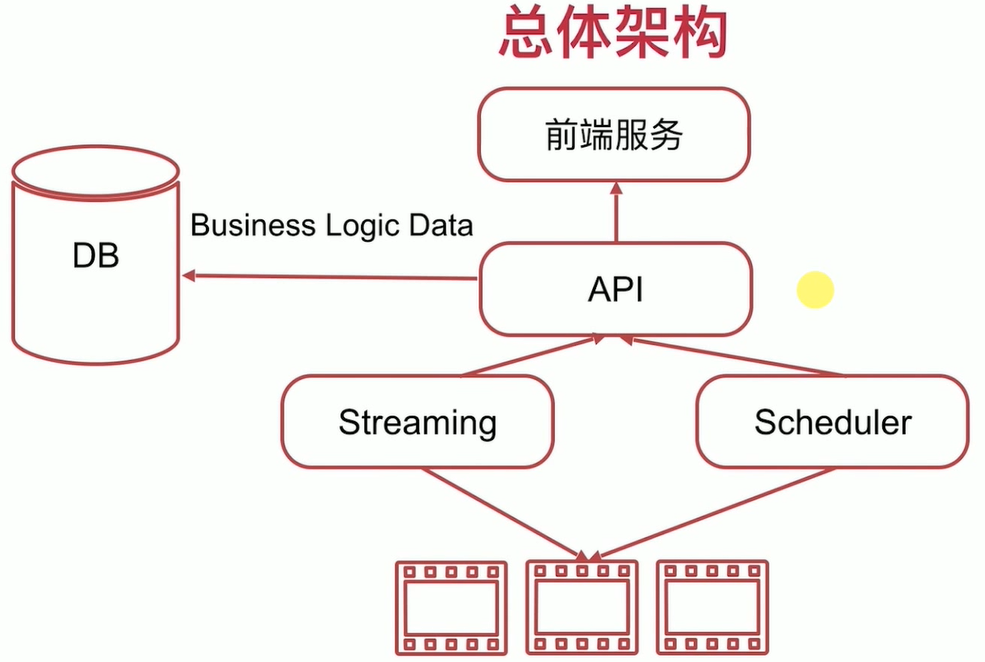
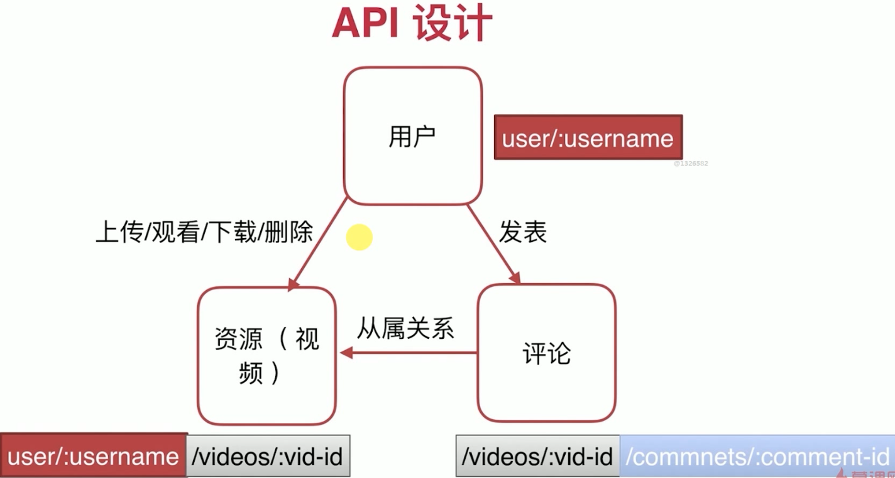
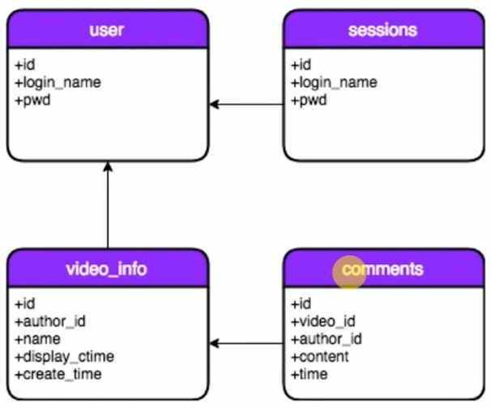
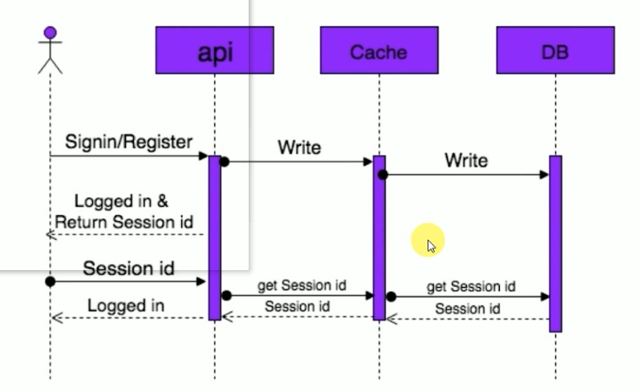
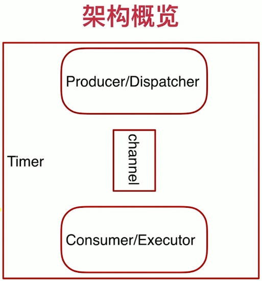

- 选择go
  - 完整的golang开发链
    - tool
    - test
    - benchmark
    - builtin
    - ...
  - 部署简单
    - complie once，run everywhere
  - 良好的native http库，以及模板引擎，无需第三方框架
  - 优秀的并发模型
- go 工具链的使用
  - build
  - install
  - fmt等
- go test和go bench


# 总体架构

 

# API

- 功能
  - 与前端通信，将用户信息以及评论信息存储到db中

- 统一接口
- 无状态
- 可缓存
- 分层
- cs模式

设计原则

- 以url风格设计api
- 通过不同的method类型区分对资源的crud
- 返回码符合http资源描述的规定

设计

 


## 用户

- 创建，注册用户
  - URL:/user
  - Method:POST
  - SC:201,400,500（创建成功，bad request，内部错误）
- 用户登录
  - URL:/user/:username
  - Method:POST
  - SC:200,400,500
- 获取用户基本信息
  - URL:/user/:username
  - Method:GET
  - SC:200,400,401,403,500
    - 401没有通过验证
    - 403通过验证，没有权限
- 用户注销
  - URL:/user/:username
  - Method:DELETE
  - SC:204,400,401,403,500
    - 204表示成功，但是没有content


## 资源

- list all videos
  - URL:/user/:username/videos
  - Method:GET
  - SC:200,400,500

- get one video
  - URL:/user/:username/videos/:vid-id
  - Method:GET
  - SC:200,400,500
- delete one video
  - URL:/user/:username/videos/:vid-id
  - Method:DELETE
  - SC:204,400,401,403,500


## 评论

- show comments
  - URL:/videos/:vid-id/comments
  - Method:GET
  - SC:200,400,500
- post a comment
  - URL:/videos/:vid-id/comments
  - Method:POST
  - SC:201,400,500
- delete a comment
  - URL:/videos/:vid-id/comment/:comment-id
  - Method:DELETE
  - SC:204,400,401,403,500
  - 有权限控制，发布人才能删除


## 调试

```sh
\note\go-study\code\video-server\api-server> go install
```

- 在


# 数据库

 


## 用户

- users

```sql
create table users(
	id INT UNSIGNED PRIMARY KEY AUTO_INCREMENT,
    login_name VARCHAR(64) UNIQUE KEY,
    pwd TEXT
)
```


## 资源

- 使用uuid

```sql
create table video_info(
	id VARCHAR(64) PRIMARY KEY NOT NULL, #使用uuid
    author_id INT UNSIGNED,
    name TEXT,
    display_ctime TEXT, #用于显示
    create_time DATETIME DEFAULT CURRENT_TIMESTAMP
)
```


## 评论

```sql
create table comments(
	id VARCHAR(64) PRIMARY KEY NOT NULL, /*使用uuid*/
    video_id VARCHAR(64),
    author_id INT UNSIGNED,
    content TEXT,
    time DATETIME DEFAULT CURRENT_TIMESTAMP
)
```


## sessions

- 简单的session机制，存储sessionid以及超时时间，从cookie中获取
- 后期使用jwt进行替代

```sql
create table sessions(
	session_id VARCHAR(255) PRIMARY KEY NOT NULL,
    TTL VARCHAR(255) , /*过期时间*/
    login_name VARCHAR(64)
)
```

 


# Streaming

- 功能
  - 播放视频
  - 上传视频

- 保持长连接，多路长连接，需要添加流控


# Scheduler

- 异步任务
- 延时删除视频
  - soft delete
  - 有些视频需要审计
- 包含
  - RESTful的http server
  - Timer
  - 生产者消费者模型下的task runner

 

